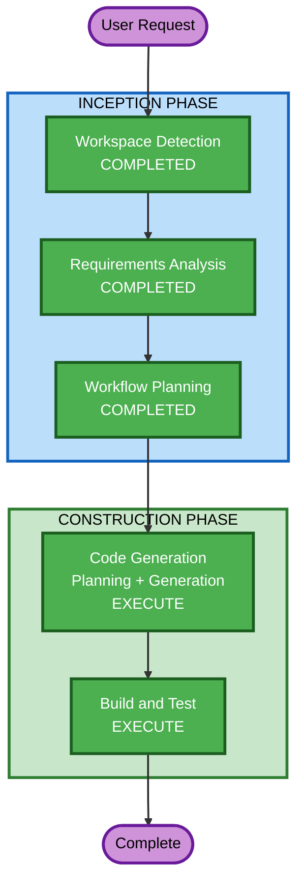

# Execution Plan

## Detailed Analysis Summary

### Change Impact Assessment
- **User-facing changes**: Yes — entirely new CLI tool
- **Structural changes**: N/A — greenfield
- **Data model changes**: No — reads process list at runtime, no persistence
- **API changes**: No — CLI tool, no API
- **NFR impact**: Yes — performance (animation smoothness), security (process killing)

### Risk Assessment
- **Risk Level**: Low — isolated CLI tool, no infrastructure, no external dependencies beyond Go stdlib + 1 TUI library
- **Rollback Complexity**: Easy — single binary, no state
- **Testing Complexity**: Moderate — terminal interaction is hard to unit test, but core logic is testable

## Workflow Visualization

## Phases to Execute

### INCEPTION PHASE
- [x] Workspace Detection (COMPLETED)
- [x] Requirements Analysis (COMPLETED)
- [x] Workflow Planning (COMPLETED)
- [x] Reverse Engineering - SKIP
  - **Rationale**: Greenfield project, no existing code
- [x] User Stories - SKIP
  - **Rationale**: Single user (the developer/sysadmin), clear interaction model, no personas needed
- [x] Application Design - SKIP
  - **Rationale**: Single-component CLI app, no service layer or multi-component architecture
- [x] Units Generation - SKIP
  - **Rationale**: Single unit of work — one Go binary

### CONSTRUCTION PHASE
- [ ] Functional Design - SKIP
  - **Rationale**: Business logic is straightforward (process list, animate, click-to-kill). No complex data models or algorithms.
- [ ] NFR Requirements - SKIP
  - **Rationale**: NFRs already captured in requirements.md (performance, security, platform compat). No additional assessment needed.
- [ ] NFR Design - SKIP
  - **Rationale**: No NFR patterns beyond what's in requirements. Security rules are input validation + error handling, handled directly in code.
- [ ] Infrastructure Design - SKIP
  - **Rationale**: CLI tool with no infrastructure. Single binary deployment.
- [ ] Code Generation - EXECUTE (ALWAYS)
  - **Rationale**: Implementation planning and code generation needed
- [ ] Build and Test - EXECUTE (ALWAYS)
  - **Rationale**: Build instructions and test plan needed

### OPERATIONS PHASE
- [ ] Operations - PLACEHOLDER

## Estimated Timeline
- **Total Stages to Execute**: 2 (Code Generation + Build and Test)
- **Estimated Duration**: ~30 minutes of AI-DLC interaction

## Success Criteria
- **Primary Goal**: Working `pidshoot` binary that animates processes and allows mouse-click killing
- **Key Deliverables**: Go source code, go.mod, build instructions, test instructions
- **Quality Gates**: Compiles successfully, passes linting, security rules satisfied
