# pidshooter — Package & Architecture Diagram

*Updated 2026-07-31. Full hexagonal architecture: pure-core domain (game/movement/process/score), a
core/handler intent gateway, an application/event dispatcher, contract ports split by concern
(inbound/outbound subpackages), infrastructure adapters, a cobra-based entrypoint adapter, and a
GameService application service that owns the game loop.*

---

## Package layout

```
cmd/pidshooter/
└── main.go                             composition root — wires all dependencies, no logic

internal/
├── core/                               pure domain — no infrastructure imports
│   ├── game/
│   │   ├── game.go                     Config · Game · Snapshot · New() · Start() · State() · IsRunning() · Stop() · Targets() · Speed() · Throttle() · TimeLimit() · TimeLeft() · ConfirmTarget() · Confirm() · Snapshot()
│   │   ├── loop.go                     Update() · Kill() · moveOrDie() · allTargetsDead()
│   │   ├── state.go                    Lifecycle (Pending/Running/Stopped) · state (atomic wrapper)
│   │   ├── stats.go                    Stats · Kills() · FreedMem() · HighScore() · SetHighScore() · RecordKill()
│   │   ├── timer.go                    Timer · NewTimer() · Start() · Expired() · Remaining() · SecondsLeft() · LimitSeconds() · StartTime()
│   │   ├── confirmation.go             Confirmer (interface) · Confirmation · NewConfirmation() · Pending() · Request() · Accept() · Cancel()
│   │   └── target.go                   Target · TargetState · TargetSnapshot · NewTarget() · Tag() · Update() · IsDead()/IsAlive()/IsKilling() · IsHitAt() · Kill() · Snapshot()
│   ├── movement/
│   │   ├── bounds.go                   Bounds · NewBounds() · Bounce()
│   │   ├── motion.go                   Vector · Motion · NewMotion() · Move()
│   │   └── throttle.go                 Throttler (interface) · NewThrottle() · MinSpeed · MaxSpeed · SpeedStep
│   ├── process/
│   │   └── process.go                  Info (interface) · NewInfo() · Find() · Validate() · ErrNoPatterns · MinPatternLength · MaxPatternLength
│   ├── handler/
│   │   └── input.go                    InputHandler (interface) · Handler · NewHandler() · OnQuit() · OnYes() · OnNo() · OnSpeedUp() · OnSpeedDown() · OnClickAt()
│   └── score/
│       └── score.go                    Board · Entry · Add() · HighScore() · PrintHighScore() · PrintScores()
├── application/
│   ├── contract/
│   │   ├── inbound/
│   │   │   └── gameplay.go             GamePlay (interface) · GamePlayConfig
│   │   └── outbound/
│   │       ├── input.go                InputEvent (interface) · ClickEvent · KeyEvent · KeyCode · InputSource (interface)
│   │       ├── process.go              ProcessInfo · Lister · Killer · Process (interface = Lister + Killer)
│   │       ├── store.go                ScoreStore (interface)
│   │       └── ui.go                   FrameState · TargetViewState · HUDState · StatusState · ConfirmViewState · Renderer (interface)
│   ├── event/
│   │   └── input.go                    Dispatcher · NewDispatcher() · Dispatch()
│   └── service/
│       ├── game.go                     GameService · NewGameService() · Play() · runLoop() · applyKills() · drainEvents() · kill() · buildFrame()
│       ├── converter.go                toProcessInfo() · toProcessInfos()
│       └── validation.go               validateSearchPatterns() · validateProcessName()
├── entrypoint/                         driving adapter — calls the application service
│   └── cli/
│       └── cli.go                      CLI · NewCLI() · Run() · buildCommand() (cobra) · play() · validate()
├── infrastructure/                     driven adapters — called by the application service
│   ├── osprocess/
│   │   └── osprocess.go                Process · NewProcess()  (List · OwnPid · LookupName · Kill, via `ps`)
│   ├── scorefilestore/
│   │   └── score_file_store.go         Store · NewStore()
│   └── tcellui/
│       └── tcellui.go                  UI · NewUI()  (implements Renderer + InputSource)
├── testutil/
│   ├── capture/
│   │   └── capture.go                  Output() · Stderr()  (stdout/stderr capture helpers)
│   └── fake/
│       ├── process.go                  Process  (test double for outbound.Process)
│       ├── store.go                    Store    (test double for outbound.ScoreStore)
│       ├── renderer.go                 Renderer (test double for outbound.Renderer)
│       ├── inputsource.go              InputSource · NewInputSource()  (test double for outbound.InputSource)
│       └── input_handler.go            InputHandler  (test double for handler.InputHandler)
└── util/
    └── util.go                         FormatBytes()
```

---

## Class diagram

Types, their fields/methods, and relationships across packages. Visibility follows Go conventions: `+` = exported, `-` = unexported.

```mermaid
classDiagram
    direction TB

    %% ── application/contract/inbound ─────────────────────────────────────────

    class GamePlay {
        <<contract/inbound · interface>>
        +Play(cfg GamePlayConfig) error
    }

    class GamePlayConfig {
        <<contract/inbound>>
        +Patterns []string
        +ConfirmMode bool
        +Speed float64
        +TimeLimit int
    }

    %% ── application/contract/outbound ────────────────────────────────────────

    class InputEvent {
        <<contract/outbound · interface>>
        -isInputEvent()
    }

    class ClickEvent {
        <<contract/outbound>>
        +X, Y int
    }

    class KeyEvent {
        <<contract/outbound>>
        +Key KeyCode
        +Ch rune
    }

    class KeyCode {
        <<contract/outbound · enum>>
        KeyNone
        KeyEscape
        KeyCtrlC
        KeyCtrlZ
    }

    class InputSource {
        <<contract/outbound · interface>>
        +Events() chan InputEvent
    }

    class ProcessInfo {
        <<contract/outbound>>
        +Pid int
        +Name string
        +Rss int64
    }

    class Lister {
        <<contract/outbound · interface>>
        +List() []ProcessInfo, error
        +OwnPid() int
    }

    class KillerPort {
        <<contract/outbound · interface · Killer>>
        +LookupName(pid int) string, error
        +Kill(pid int) bool, error
    }

    class ProcessPort {
        <<contract/outbound · interface · Process>>
        Lister
        KillerPort
    }

    class ScoreStore {
        <<contract/outbound · interface>>
        +Load() Board, error
        +Save(board Board) error
    }

    class FrameState {
        <<contract/outbound>>
        +Targets []TargetViewState
        +HUD HUDState
        +StatusBar StatusState
    }

    class TargetViewState {
        <<contract/outbound>>
        +X, Y int
        +Tag string
        +Killing bool
    }

    class HUDState {
        <<contract/outbound>>
        +FreedMem int64
        +Kills int
        +HighScore int
    }

    class StatusState {
        <<contract/outbound>>
        +Alive int
        +Speed float64
        +TimeLimit int
        +TimeLeft int
        +Confirming *ConfirmViewState
    }

    class ConfirmViewState {
        <<contract/outbound>>
        +PID int
        +Name string
    }

    class Renderer {
        <<contract/outbound · interface>>
        +Init() error
        +Cleanup()
        +Size() int, int
        +Render(state FrameState)
    }

    ClickEvent ..|> InputEvent
    KeyEvent   ..|> InputEvent
    ProcessPort --|> Lister      : embeds
    ProcessPort --|> KillerPort  : embeds
    InputSource --> InputEvent : produces
    FrameState *-- "0..*" TargetViewState : Targets
    StatusState *-- "0..1" ConfirmViewState : Confirming

    %% ── core/movement ─────────────────────────────────────────────────────────

    class Vector {
        <<core/movement · motion.go>>
        +X, Y float64
    }

    class Motion {
        <<core/movement · motion.go>>
        +Position Vector
        +Velocity Vector
        +NewMotion(bounds, tagWidth) Motion
        +Move(bounds, speed, tagWidth)
    }

    class Bounds {
        <<core/movement · bounds.go>>
        -width, height int
        +NewBounds(w, h int) Bounds
        +Bounce(pos, vel *Vector, tagWidth float64)
    }

    class Throttler {
        <<core/movement · interface · throttle.go>>
        +Speed() float64
        +Increase()
        +Decrease()
    }

    class throttle {
        <<core/movement · unexported impl>>
        -speed float64
        +NewThrottle(speed) Throttler
    }

    Motion *-- "2" Vector : Position, Velocity
    throttle ..|> Throttler : implements
    Motion ..> Bounds : bounces via

    %% ── core/process ─────────────────────────────────────────────────────────

    class ProcessInfoIface {
        <<core/process · interface · Info>>
        +Pid() int
        +Name() string
        +Rss() int64
        +IsProtected() bool
    }

    class info {
        <<core/process · unexported impl>>
        -pid int
        -name string
        -rss int64
        +NewInfo(pid, name, rss) Info
    }

    info ..|> ProcessInfoIface : implements

    %% ── core/handler ─────────────────────────────────────────────────────────

    class InputHandlerIface {
        <<core/handler · interface · InputHandler>>
        +OnQuit()
        +OnYes() *Target
        +OnNo()
        +OnSpeedUp()
        +OnSpeedDown()
        +OnClickAt(x, y int) *Target
    }

    class Handler {
        <<core/handler · input.go>>
        -g *Game
        +NewHandler(g *Game) InputHandler
    }

    Handler ..|> InputHandlerIface : implements
    Handler --> Game : g

    %% ── core/game — lifecycle & config ───────────────────────────────────────

    class Lifecycle {
        <<core/game · enum · state.go>>
        Pending
        Running
        Stopped
    }

    class Config {
        <<core/game · game.go>>
        +Confirm bool
        +Speed float64
        +TimeLimit int
    }

    class Game {
        <<core/game · game.go>>
        -cfg Config
        -state state
        -timer Timer
        -confirm Confirmation
        -throttle movement.Throttler
        -processes []process.Info
        -targets []*Target
        Stats
        +New(processes, cfg) *Game
        +Start(w, h int)
        +State() Lifecycle
        +IsRunning() bool
        +Stop()
        +StartTime() time.Time
        +Targets() []*Target
        +Speed() float64
        +Throttle() Throttler
        +TimeLimit() int
        +TimeLeft() int
        +ConfirmTarget() *Target
        +Confirm() Confirmer
        +Snapshot() Snapshot
        +Update(w, h int)
        +Kill(t *Target)
    }

    class Snapshot {
        <<core/game · game.go>>
        +Targets []TargetSnapshot
        +Alive int
    }

    class Stats {
        <<core/game · stats.go>>
        -kills int
        -freedMem int64
        -highScore int
        +Kills() int
        +FreedMem() int64
        +HighScore() int
        +SetHighScore(n int)
        +RecordKill(rss int64)
    }

    class Timer {
        <<core/game · timer.go>>
        -limit time.Duration
        -start time.Time
        +NewTimer(limitSeconds) Timer
        +Start()
        +Expired() bool
        +Remaining() time.Duration
        +SecondsLeft() int
        +LimitSeconds() int
        +StartTime() time.Time
    }

    class Confirmer {
        <<core/game · interface · confirmation.go>>
        +Pending() bool
        +Request(t *Target) *Target
        +Accept() *Target
        +Cancel()
    }

    class Confirmation {
        <<core/game · confirmation.go>>
        -target *Target
        -confirm bool
        +NewConfirmation(confirm bool) Confirmation
    }

    Confirmation ..|> Confirmer : implements
    Game *-- Stats        : embeds
    Game *-- Timer         : timer
    Game *-- Confirmation  : confirm
    Game --> Throttler     : throttle
    Game --> Lifecycle     : state
    Game "1" *-- "0..*" Target : targets
    Game ..> Snapshot      : returns

    %% ── core/game — target ───────────────────────────────────────────────────

    class Target {
        <<core/game · target.go>>
        process.Info
        movement.Motion
        +State TargetState
        +KillAnimationTick int
        +NewTarget(info, bounds) *Target
        +Tag() string
        +Update(bounds, speed float64)
        +IsDead() bool
        +IsAlive() bool
        +IsKilling() bool
        +IsHitAt(x, y int) bool
        +Kill() bool
        +Snapshot() TargetSnapshot
    }

    class TargetSnapshot {
        <<core/game · target.go>>
        +X, Y int
        +Tag string
        +Killing bool
    }

    class TargetState {
        <<core/game · enum · target.go>>
        Alive
        Killing
        Dead
    }

    Target *-- ProcessInfoIface : embeds
    Target *-- Motion           : embeds
    Target --> TargetState      : State
    Confirmation --> Target     : target
    InputHandlerIface ..> Target : returns

    %% ── core/score ───────────────────────────────────────────────────────────

    class Board {
        <<core/score · score.go>>
        +Scores []Entry
        +Add(entry Entry)
        +HighScore() int
        +PrintHighScore(kills int)
        +PrintScores()
    }

    class Entry {
        <<core/score · score.go>>
        +Kills int
        +FreedMem int64
        +Speed float64
        +Time int
        +Duration float64
        +Date time.Time
    }

    Board "1" *-- "0..*" Entry : owns

    %% ── application/event ────────────────────────────────────────────────────

    class Dispatcher {
        <<application/event · input.go>>
        -h handler.InputHandler
        +NewDispatcher(h) *Dispatcher
        +Dispatch(ev InputEvent) *Target
    }

    Dispatcher --> InputHandlerIface : h
    Dispatcher ..> InputEvent        : consumes
    Dispatcher ..> Target            : returns

    %% ── application/service ──────────────────────────────────────────────────

    class GameService {
        <<application/service · game.go>>
        -process outbound.Process
        -store outbound.ScoreStore
        -renderer outbound.Renderer
        -events outbound.InputSource
        -kills chan *Target
        +NewGameService(process, store, renderer, events) *GameService
        +Play(cfg GamePlayConfig) error
        -findProcesses(patterns) []process.Info, error
        -loadScoreBoard() *Board, bool
        -recordScore(cfg, board, kills, freedMem, duration, persist)
        -printResults(kills, freedMem, duration, board)
        -newGame(cfg, processes, board) *Game
        -runLoop(g) time.Time, error
        -applyKills(g)
        -drainEvents(d, done)
        -kill(target) bool, error
    }

    GameService ..|> GamePlay          : implements
    GameService --> ProcessPort        : process
    GameService --> ScoreStore         : store
    GameService --> Renderer           : renderer
    GameService --> InputSource        : events
    GameService ..> Game               : creates
    GameService ..> Dispatcher         : creates
    GameService ..> Handler            : creates (NewHandler)
    GameService ..> Board              : loads/saves
    GameService ..> FrameState         : builds

    %% ── infrastructure/tcellui ───────────────────────────────────────────────

    class TcellUI {
        <<infrastructure/tcellui · UI>>
        -screen tcell.Screen
        -ch chan InputEvent
        -done chan struct
        +NewUI(screen tcell.Screen) *UI
        +Init() error
        +Cleanup()
        +Size() int, int
        +Render(state FrameState)
        +Events() chan InputEvent
    }

    TcellUI ..|> Renderer      : implements
    TcellUI ..|> InputSource   : implements

    %% ── infrastructure/osprocess ─────────────────────────────────────────────

    class OsProcess {
        <<infrastructure/osprocess · Process>>
        -psPath string
        +NewProcess() outbound.Process, error
        +List() []ProcessInfo, error
        +OwnPid() int
        +LookupName(pid int) string, error
        +Kill(pid int) bool, error
    }

    OsProcess ..|> ProcessPort : implements

    %% ── infrastructure/scorefilestore ────────────────────────────────────────

    class FileStore {
        <<infrastructure/scorefilestore · Store>>
        -path string
        +NewStore() *Store
        +Load() *Board, error
        +Save(board *Board) error
    }

    FileStore ..|> ScoreStore : implements

    %% ── entrypoint/cli ───────────────────────────────────────────────────────

    class CLI {
        <<entrypoint/cli · CLI>>
        -service GamePlay
        -out, errOut io.Writer
        -confirm bool
        -speed float64
        -timeLimit int
        +NewCLI(service GamePlay) *CLI
        +Run(args []string) error
        -buildCommand() *cobra.Command
        -play(cmd, args) error
    }

    CLI --> GamePlay       : calls Play()
    CLI ..> GamePlayConfig : builds
```



---

## Package dependency graph

```
cmd/pidshooter
    ├─ entrypoint/cli
    │       ├─ application/contract/inbound   (GamePlay, GamePlayConfig)
    │       ├─ core/movement                  (MinSpeed, MaxSpeed for flag validation)
    │       └─ core/process                   (Validate, ErrNoPatterns via cobra command)
    ├─ infrastructure/tcellui
    │       └─ application/contract/outbound  (InputEvent, ClickEvent, KeyEvent, KeyCode, FrameState, HUDState, StatusState, Renderer, InputSource)
    ├─ infrastructure/osprocess
    │       └─ application/contract/outbound  (ProcessInfo, Process — satisfied structurally, no port import needed beyond types)
    ├─ infrastructure/scorefilestore
    │       └─ core/score                     (Board, Entry)
    └─ application/service
            ├─ application/contract/inbound   (GamePlay, GamePlayConfig)
            ├─ application/contract/outbound  (Process, ScoreStore, Renderer, InputSource, FrameState, HUDState, StatusState, ConfirmViewState)
            ├─ application/event               (Dispatcher, NewDispatcher)
            ├─ core/game                       (Game, New, Config, Target)
            ├─ core/handler                    (InputHandler, NewHandler)
            ├─ core/process                    (Info, Find, Validate)
            ├─ core/score                      (Board, Entry)
            └─ util

application/event
    ├─ application/contract/outbound          (InputEvent, ClickEvent, KeyEvent, KeyCode)
    ├─ core/game                              (Target — return type)
    └─ core/handler                           (InputHandler)

core/handler
    └─ core/game                              (Game, Target, Confirmer)

core/game
    ├─ core/movement                          (Bounds, Motion, Throttler, NewThrottle, NewBounds)
    └─ core/process                           (Info)

application/contract/outbound
    └─ core/score                             (Board — referenced by ScoreStore)

core/* imports nothing from application, infrastructure, or entrypoint.
Infrastructure packages satisfy contract interfaces via Go structural typing — no import of
application/contract required beyond the shared data types.
```

---

## Call flow

```
main()
└─ run()
     ├─ osprocess.NewProcess()              → outbound.Process  (ps-backed Lister + Killer)
     ├─ scorefilestore.NewStore()           → outbound.ScoreStore  (JSON file at ~/.config/pidshooter/)
     ├─ tcell.NewScreen()
     ├─ tcellui.NewUI(screen)               → *tcellui.UI  (outbound.Renderer + InputSource)
     ├─ service.NewGameService(proc, store, ui, ui)
     └─ cli.NewCLI(svc).Run(os.Args[1:])
              └─ buildCommand().Execute()   [cobra]
                   └─ play(cmd, args)
                        ├─ validate(args, speed, timeLimit)  → process.Validate + movement.MinSpeed/MaxSpeed checks
                        └─ service.Play(inbound.GamePlayConfig{…})   [GameService implements GamePlay]
                             ├─ findProcesses(patterns)
                             │     ├─ validateSearchPatterns(patterns)
                             │     ├─ process.List()                 [outbound.Process → osprocess]
                             │     └─ process.Find(infos, patterns, ownPid)  → []core/process.Info
                             ├─ loadScoreBoard()                     [ScoreStore → scorefilestore]
                             ├─ newGame(cfg, processes, board)        → game.New(…) → *game.Game
                             └─ runLoop(g)
                                  ├─ renderer.Init()                 [Renderer → tcellui: screen.Init + poll goroutine]
                                  ├─ g.Start(w, h)                   → Pending → Running, spawns targets
                                  ├─ go: signal → g.Stop()            [SIGINT/SIGTERM/SIGTSTP]
                                  ├─ event.NewDispatcher(handler.NewHandler(g))
                                  └─ 20 FPS ticker loop ──────────────────────────────────────────────────┐
                                        ├─ applyKills(g)             drains async kill results → g.Kill(t)│
                                        ├─ drainEvents(evt, done)    [InputSource → tcellui channel]      │
                                        │     └─ evt.Dispatch(ev)    → handler.On*(...) → *Target or nil  │
                                        │           └─ hit: go s.kill(target)                             │
                                        │                 ├─ verify: process.LookupName(pid)  [race-safe re-check]
                                        │                 ├─ validateProcessName(expected, actual)        │
                                        │                 ├─ process.Kill(pid)             [outbound.Process → osprocess]
                                        │                 └─ success: s.kills <- target                   │
                                        ├─ g.Update(w, h)            → Timer.Expired / Target.Update per target
                                        └─ renderer.Render(buildFrame(g)) [FrameState snapshot → tcellui] ─┘
                             ├─ recordScore(cfg, board, kills, freedMem, duration, persist)
                             │     └─ store.Save(board)               [ScoreStore → scorefilestore]
                             └─ printResults(kills, freedMem, duration, board)
                                  ├─ board.PrintHighScore(kills)
                                  └─ board.PrintScores()
```

---

## Exported surface per package

| Package | Exported identifiers |
|---|---|
| `application/contract/inbound` | `GamePlay`, `GamePlayConfig` |
| `application/contract/outbound` | `InputEvent`, `ClickEvent`, `KeyEvent`, `KeyCode`, `KeyNone`, `KeyEscape`, `KeyCtrlC`, `KeyCtrlZ`, `InputSource`, `ProcessInfo`, `Lister`, `Killer`, `Process`, `ScoreStore`, `FrameState`, `TargetViewState`, `HUDState`, `StatusState`, `ConfirmViewState`, `Renderer` |
| `application/event` | `Dispatcher`, `NewDispatcher` |
| `application/service` | `GameService`, `NewGameService` |
| `core/game` | `Config`, `Game`, `New`, `Snapshot`, `Lifecycle`, `Pending`, `Running`, `Stopped`, `Stats`, `Timer`, `NewTimer`, `Confirmer`, `Confirmation`, `NewConfirmation`, `Target`, `NewTarget`, `TargetSnapshot`, `TargetState`, `Alive`, `Killing`, `Dead`, `KillAnimationDuration` |
| `core/movement` | `Bounds`, `NewBounds`, `Vector`, `Motion`, `NewMotion`, `Throttler`, `NewThrottle`, `MinSpeed`, `MaxSpeed`, `SpeedStep` |
| `core/process` | `Info`, `NewInfo`, `Find`, `Validate`, `ErrNoPatterns`, `MinPatternLength`, `MaxPatternLength` |
| `core/handler` | `InputHandler`, `Handler`, `NewHandler` |
| `core/score` | `Board`, `Entry` |
| `entrypoint/cli` | `CLI`, `NewCLI` |
| `infrastructure/tcellui` | `UI`, `NewUI` |
| `infrastructure/osprocess` | `Process`, `NewProcess` |
| `infrastructure/scorefilestore` | `Store`, `NewStore` |
| `testutil/fake` | `Process`, `Store`, `Renderer`, `InputSource`, `NewInputSource`, `InputHandler` |
| `testutil/capture` | `Output`, `Stderr` |
| `util` | `FormatBytes` |
