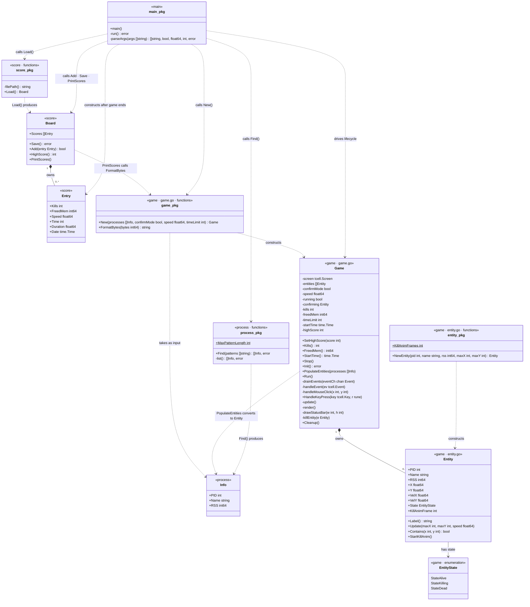

# pidshooter — Package & Class Diagram

The project is split into four Go packages. The diagram maps every exported type, its fields, and its methods, plus the package-level functions. Visibility follows Go conventions: `+` = exported, `-` = unexported.



---

## Package dependency graph

```
cmd/pidshooter (main)
    ├── internal/game
    │       └── internal/process   (game.PopulateEntities takes process.Info)
    ├── internal/process
    └── internal/score
            └── internal/game      (score.Board.PrintScores calls game.FormatBytes)
```

`score` importing `game` for `FormatBytes` is a design smell — score is a leaf package that should not depend on game. Moving `FormatBytes` to a shared `internal/format` package, or inlining the formatting in `score`, would break the cycle.

---

## Relationships explained

| From | To | Kind | Description |
|---|---|---|---|
| `Entity` | `EntityState` | association | Each entity holds one state value |
| `Game` | `Entity` | composition | Game owns and manages the entity slice |
| `Game` | `Info` | dependency | `PopulateEntities` converts `process.Info` records into `Entity` objects |
| `Board` | `Entry` | composition | Board owns the ordered list of score records |
| `Board` | `game_pkg` | dependency | `PrintScores` calls `game.FormatBytes` to render memory strings |
| `entity_pkg` | `Entity` | factory | `NewEntity` constructs an Entity with random position and velocity |
| `game_pkg` | `Game` | factory | `New` constructs a Game from process list and config |
| `process_pkg` | `Info` | producer | `Find` / `list` discover and return process records |
| `score_pkg` | `Board` | producer | `Load` deserialises the on-disk JSON into a Board |
| `main_pkg` | `process_pkg` | calls | `run()` calls `Find()` to get the initial process list |
| `main_pkg` | `game_pkg` | calls | `run()` calls `New()` then drives the full game lifecycle |
| `main_pkg` | `score_pkg` | calls | `run()` calls `Load()` before the game |
| `main_pkg` | `Board` | calls | `run()` calls `Add`, `Save`, `PrintScores` after the game |

---

## Call flow — `run()` in main.go

```
main()
  └─ run()
       ├─ parseArgs(os.Args[1:])               → []patterns, confirmMode, speed, timeLimit
       ├─ process.Find(patterns)               → []process.Info
       ├─ score.Load()                         → *score.Board
       ├─ game.New(processes, ...)             → *game.Game
       ├─ g.SetHighScore(board.HighScore())
       ├─ g.Init()                             creates tcell.Screen
       ├─ defer g.Cleanup()
       ├─ g.PopulateEntities(processes)        []process.Info → []game.Entity
       ├─ go signal handler → g.Stop()         goroutine: SIGINT/SIGTERM/SIGTSTP
       ├─ g.Run()  ◄── blocks at 20 FPS ──────────────────────────────────────────┐
       │     ├─ goroutine: screen.PollEvent() → eventCh                           │
       │     └─ loop while g.running:                                             │
       │           ├─ drainEvents(eventCh)                                        │
       │           │     └─ handleEvent()                                         │
       │           │           ├─ handleMouseClick() → killEntity()               │
       │           │           └─ HandleKeyPress()   → killEntity() / g.Stop()   │
       │           ├─ update()      moves entities, checks time limit / all-dead  │
       │           └─ render()      draws entities + HUD, calls FormatBytes()     │
       │                                                                          ─┘
       ├─ g.Cleanup()                          restores terminal (explicit call)
       ├─ score.Entry{Kills, FreedMem, ...}
       ├─ board.Add(entry)
       ├─ board.Save()
       └─ board.PrintScores()                  calls game.FormatBytes internally
```

---

## Key exported surface per package

| Package | Exported types | Exported functions / constructors |
|---|---|---|
| `process` | `Info` | `Find()` |
| `score` | `Entry`, `Board` | `Load()` |
| `game` | `Entity`, `EntityState`, `Game` | `New()`, `FormatBytes()`, `NewEntity()` |
| `main` | — | `main()` |
