# pidshooter — Package & Architecture Diagram

*Updated 2026-07-06. Full hexagonal architecture: pure-core domain, application/contract port interfaces, infrastructure adapters, entrypoint adapter, and a GameRunner application service that owns the game loop.*

---

## Package layout

```
cmd/pidshooter/
└── main.go                             composition root — wires all dependencies, no logic

internal/
├── core/                               pure domain — no infrastructure imports
│   ├── game/
│   │   ├── game.go                     Game (pure state machine) · KillRequest · New() · Init() · Running() · Stop()
│   │   ├── loop.go                     Update() · Frame() · CompleteKill() · timeRemaining()
│   │   ├── event_handler.go            HandleEvent() · handleMouseClick() · handleKeyPress()
│   │   ├── frame.go                    Frame · TargetView · HUDState · StatusState · ConfirmState
│   │   ├── input.go                    InputEvent · ClickEvent · KeyEvent · ResizeEvent · KeyCode
│   │   ├── session.go                  Session · RecordKill() · accessors
│   │   └── target.go                   Target · Vector · TargetState · NewTarget() · Label() · Update() · Contains() · StartKillAnim()
│   ├── process/
│   │   └── process.go                  Info struct · MinPatternLength · MaxPatternLength
│   └── score/
│       └── score.go                    Board · Entry · Add() · HighScore() · PrintHighScore() · PrintScores()
├── application/
│   ├── contract/
│   │   ├── inbound.go                  GameService (interface) · Config
│   │   └── outbound.go                 Renderer · EventSource · ProcessKiller · Finder · Store
│   └── runner.go                       GameRunner · NewGameRunner() · Play() · runLoop() · drainEvents()
├── entrypoint/                         driving adapter — calls the application service
│   └── cli/
│       └── cli.go                      CLI · New() · Run() · parseArgs()
├── infrastructure/                     driven adapters — called by the application service
│   ├── osprocess/
│   │   └── osprocess.go                Finder · Killer · NewFinder() · NewKiller()
│   ├── scorefilestore/
│   │   └── score_file_store.go         Store · NewStore()
│   └── tcellui/
│       └── tcellui.go                  UI · New()  (implements Renderer + EventSource)
├── testutil/
│   ├── capture/
│   │   └── capture.go                  Output() · Stderr()  (stdout/stderr capture helpers)
│   └── fake/
│       ├── finder.go                   Finder  (test double)
│       ├── killer.go                   Killer  (test double)
│       └── store.go                    Store   (test double)
└── util/
    └── util.go                         FormatBytes()
```

---

## Class diagram

Types, their fields/methods, and relationships across packages. Visibility follows Go conventions: `+` = exported, `-` = unexported.

```mermaid
classDiagram
    direction TB

    %% ── application/contract ─────────────────────────────────────────────────

    class GameServiceIface {
        <<contract · interface · GameService>>
        +Play(cfg Config) error
    }

    class Config {
        <<contract>>
        +Patterns []string
        +ConfirmMode bool
        +Speed float64
        +TimeLimit int
    }

    class Renderer {
        <<contract · interface>>
        +Init() error
        +Cleanup()
        +Size() int, int
        +Render(frame game.Frame)
    }

    class EventSource {
        <<contract · interface>>
        +Events() chan game.InputEvent
    }

    class ProcessKiller {
        <<contract · interface>>
        +Kill(pid int, name string) error
    }

    class Finder {
        <<contract · interface>>
        +List() []process.Info, error
        +Find(patterns []string) []process.Info, error
    }

    class Store {
        <<contract · interface>>
        +Load() Board, error
        +Save(board Board) error
    }

    %% ── core/game — data types ───────────────────────────────────────────────

    class Frame {
        <<core/game · frame.go>>
        +Targets []TargetView
        +HUD HUDState
        +StatusBar StatusState
    }

    class InputEvent {
        <<core/game · interface>>
        -inputEvent()
    }

    class ClickEvent {
        <<core/game>>
        +X, Y int
    }

    class KeyEvent {
        <<core/game>>
        +Key KeyCode
        +Ch rune
    }

    class ResizeEvent {
        <<core/game>>
    }

    class KeyCode {
        <<core/game · enum>>
        KeyNone
        KeyEscape
        KeyCtrlC
        KeyCtrlZ
    }

    ClickEvent  ..|> InputEvent
    KeyEvent    ..|> InputEvent
    ResizeEvent ..|> InputEvent
    Frame *-- "0..*" TargetView : Targets
    EventSource --> InputEvent : produces

    %% ── core/game — state machine ────────────────────────────────────────────

    class KillRequest {
        <<core/game · game.go>>
        +Target *Target
    }

    class Game {
        <<core/game · game.go>>
        -processes []process.Info
        -targets []*Target
        -confirmMode bool
        -speed float64
        -timeLimit int
        -running atomic.Bool
        -confirming *Target
        Session
        +New(processes, confirmMode, speed, timeLimit) *Game
        +Init(w, h int)
        +Running() bool
        +Stop()
        +Update(w, h int)
        +Frame() Frame
        +HandleEvent(ev InputEvent) *KillRequest
        +CompleteKill(t *Target)
    }

    class Session {
        <<core/game · session.go>>
        -kills int
        -freedMem int64
        -highScore int
        -startTime time.Time
        +Kills() int
        +FreedMem() int64
        +StartTime() time.Time
        +SetHighScore(n int)
        +RecordKill(rss int64)
    }

    class Target {
        <<core/game · target.go>>
        +Info process.Info
        +Position Vector
        +Velocity Vector
        +State TargetState
        +KillAnimFrame int
        +NewTarget(info, maxX, maxY int) *Target
        +Label() string
        +Update(maxX, maxY int, speed float64)
        +Contains(x, y int) bool
        +StartKillAnim()
    }

    class Vector {
        <<core/game · target.go>>
        +X, Y float64
    }

    class TargetState {
        <<core/game · enumeration>>
        Alive
        Killing
        Dead
    }

    Game *-- Session       : embeds
    Game "1" *-- "0..*" Target : targets
    Game ..> KillRequest   : returns
    Target *-- Vector      : Position
    Target *-- Vector      : Velocity
    Target --> TargetState : State

    %% ── core/process ─────────────────────────────────────────────────────────

    class ProcessInfo {
        <<core/process · struct · Info>>
        +Pid int
        +Name string
        +Rss int64
    }

    %% ── core/score ───────────────────────────────────────────────────────────

    class Board {
        <<core/score · score.go>>
        +Scores []Entry
        +Add(entry Entry)
        +HighScore() int
        +PrintHighScore(kills int)
        +PrintScores()
    }

    class Entry {
        <<core/score · score.go>>
        +Kills int
        +FreedMem int64
        +Speed float64
        +Time int
        +Duration float64
        +Date time.Time
    }

    Board "1" *-- "0..*" Entry : owns

    %% ── application/runner.go ────────────────────────────────────────────────

    class GameRunner {
        <<application · runner.go>>
        -finder Finder
        -killer ProcessKiller
        -store Store
        -renderer Renderer
        -events EventSource
        +NewGameRunner(finder, killer, store, renderer, events) *GameRunner
        +Play(cfg Config) error
        -runLoop(g *Game) error
        -drainEvents(g *Game)
    }

    GameRunner ..|> GameServiceIface   : implements
    GameRunner --> Finder              : finder
    GameRunner --> ProcessKiller       : killer
    GameRunner --> Store               : store
    GameRunner --> Renderer            : renderer
    GameRunner --> EventSource         : events
    GameRunner ..> Game                : creates

    %% ── infrastructure/tcellui ───────────────────────────────────────────────

    class TcellUI {
        <<infrastructure/tcellui · UI>>
        -screen tcell.Screen
        -ch chan InputEvent
        -done chan struct
        +New(screen tcell.Screen) *UI
        +Init() error
        +Cleanup()
        +Size() int, int
        +Render(frame Frame)
        +Events() chan InputEvent
    }

    TcellUI ..|> Renderer      : implements
    TcellUI ..|> EventSource   : implements

    %% ── infrastructure/osprocess ─────────────────────────────────────────────

    class OsFinder {
        <<infrastructure/osprocess · Finder>>
        +NewFinder() contract.Finder, error
        +List() []process.Info, error
        +Find(patterns []string) []process.Info, error
    }

    class OsKiller {
        <<infrastructure/osprocess · Killer>>
        +NewKiller() contract.ProcessKiller, error
        +Kill(pid int, name string) error
    }

    OsFinder ..|> Finder        : implements
    OsKiller ..|> ProcessKiller : implements

    %% ── infrastructure/scorefilestore ────────────────────────────────────────

    class FileStore {
        <<infrastructure/scorefilestore · Store>>
        -path string
        +NewStore() *Store
        +Load() *Board, error
        +Save(board *Board) error
    }

    FileStore ..|> Store : implements

    %% ── entrypoint/cli ───────────────────────────────────────────────────────

    class CLI {
        <<entrypoint/cli · CLI>>
        -service GameService
        +New(service GameService) *CLI
        +Run(args []string) error
        -parseArgs(args []string) Config, error
    }

    CLI --> GameServiceIface : calls Play()
    CLI ..> Config           : builds
```



---

## Package dependency graph

```
cmd/pidshooter
    ├─ entrypoint/cli
    │       └─ application/contract        (GameService, Config, MaxPatternLength via core/process)
    ├─ infrastructure/tcellui
    │       └─ core/game                   (Frame, InputEvent, ClickEvent, KeyEvent, ResizeEvent, KeyCode)
    ├─ infrastructure/osprocess
    │       ├─ application/contract        (Finder, ProcessKiller — satisfied structurally, no import needed)
    │       └─ core/process                (Info, MinPatternLength, MaxPatternLength)
    ├─ infrastructure/scorefilestore
    │       └─ core/score                  (Board, Entry)
    └─ application
            ├─ application/contract        (Finder, ProcessKiller, Renderer, EventSource, Store, Config)
            ├─ core/game                   (Game, New, Frame, InputEvent, KillRequest)
            ├─ core/score                  (Board, Entry)
            └─ util

application/contract
    ├─ core/game                           (Frame, InputEvent — data types referenced by interface signatures)
    ├─ core/process                        (Info — referenced by Finder)
    └─ core/score                          (Board — referenced by Store)

core/* imports nothing from application, infrastructure, or entrypoint.
Infrastructure packages satisfy contract interfaces via Go structural typing — no import of application/contract required.
```

---

## Call flow

```
main()
└─ run()
     ├─ osprocess.NewFinder()              → contract.Finder  (ps + filter)
     ├─ osprocess.NewKiller()              → contract.ProcessKiller  (ps name-check + SIGKILL)
     ├─ scorefilestore.NewStore()          → contract.Store  (JSON file at ~/.config/pidshooter/)
     ├─ tcell.NewScreen()
     ├─ tcellui.New(screen)               → *tcellui.UI  (contract.Renderer + EventSource)
     ├─ application.NewGameRunner(finder, killer, store, ui, ui)
     └─ cli.New(service).Run(os.Args[1:])
              ├─ parseArgs()              → patterns, confirmMode, speed, timeLimit
              └─ service.Play(contract.Config{…})          [GameRunner implements GameService]
                   ├─ finder.Find(patterns)                [Finder → osprocess]
                   │     └─ validate() → List() → filter() → []process.Info
                   ├─ fmt.Printf("Found N process(es)…")
                   ├─ store.Load()                         [Store → scorefilestore]
                   ├─ game.New(processes, …)               → *game.Game
                   ├─ g.SetHighScore(board.HighScore())
                   └─ runLoop(g)
                        ├─ renderer.Init()                 [Renderer → tcellui: screen.Init + poll goroutine]
                        ├─ g.Init(w, h)                    → populates targets, sets startTime
                        ├─ go: signal → g.Stop()           [SIGINT/SIGTERM/SIGTSTP]
                        └─ 20 FPS ticker loop ─────────────────────────────────────────────────┐
                              ├─ drainEvents(g)            [EventSource → tcellui channel]     │
                              │     └─ g.HandleEvent(ev)   → *KillRequest or nil               │
                              │           ├─ hit: killer.Kill(pid, name)  [ProcessKiller → osprocess]
                              │           └─ success: g.CompleteKill(target)                   │
                              ├─ g.Update(w, h)            → Target.Update() per target        │
                              └─ renderer.Render(g.Frame()) [Frame snapshot → tcellui]        ─┘
                   ├─ board.Add(score.Entry{…})
                   ├─ store.Save(board)                    [Store → scorefilestore]
                   ├─ fmt.Printf("Game Over!…")
                   ├─ board.PrintHighScore(kills)
                   └─ board.PrintScores()
```

---

## Exported surface per package

| Package | Exported identifiers |
|---|---|
| `application/contract` (inbound) | `GameService`, `Config` |
| `application/contract` (outbound) | `Renderer`, `EventSource`, `ProcessKiller`, `Finder`, `Store` |
| `core/game` | `Game`, `KillRequest`, `New`, `Session`, `Target`, `Vector`, `NewTarget`, `TargetState`, `Alive`, `Killing`, `Dead`, `KillAnimFrames`, `Frame`, `TargetView`, `HUDState`, `StatusState`, `ConfirmState`, `InputEvent`, `ClickEvent`, `KeyEvent`, `ResizeEvent`, `KeyCode`, `KeyNone`, `KeyEscape`, `KeyCtrlC`, `KeyCtrlZ` |
| `core/process` | `Info`, `MinPatternLength`, `MaxPatternLength` |
| `core/score` | `Board`, `Entry` |
| `application` | `GameRunner`, `NewGameRunner` |
| `infrastructure/tcellui` | `UI`, `New` |
| `infrastructure/osprocess` | `Finder`, `Killer`, `NewFinder`, `NewKiller` |
| `infrastructure/scorefilestore` | `Store`, `NewStore` |
| `entrypoint/cli` | `CLI`, `New` |
| `testutil/fake` | `Finder`, `Killer`, `Store` |
| `testutil/capture` | `Output`, `Stderr` |
| `util` | `FormatBytes` |
