# pidshooter — Package & Architecture Diagram

*Updated 2026-08-20. Full hexagonal architecture: pure-core domain (game/movement/process/score), a
core/game `Input` intent gateway, an application/event dispatcher, contract ports split by concern
(inbound/outbound subpackages), infrastructure adapters, a cobra-based entrypoint adapter, and an
application layer split into three focused services — `game`, `process`, `score` — composed by a
top-level `Runner` that implements the `inbound.Runner` port.*

---

## Package layout

```
cmd/pidshooter/
└── main.go                             composition root — wires all dependencies, no logic

internal/
├── core/                               pure domain — no infrastructure imports
│   ├── game/
│   │   ├── session.go                  Config · Session · NewSession() · Start() · Update() · IsRunning() · Stop() · StartTime() · Throttle() · Targets() · AvailableTargets() · TimeLimit() · TimeLeft() · PendingConfirm() · RequestConfirm()
│   │   ├── lifecycle.go                lifecycle (enum: pending/running/stopped) · atomicLifecycle
│   │   ├── timer.go                    timer · newTimer() · Start() · Expired() · Remaining() · SecondsLeft() · LimitSeconds() · StartTime()
│   │   ├── confirmation.go             confirmation · newConfirmation() · Pending() · Request() · Accept() · Cancel()
│   │   ├── roster.go                   roster · newRoster() · spawn() · move() · allDead() · hitAt() · available()
│   │   ├── target.go                   Target · State (enum: Alive/Killing/Dead) · KillAnimationDuration · NewTarget() · Tag() · Update() · Kill() · Reap()
│   │   └── input.go                    Input · NewInput() · OnQuit() · OnYes() · OnNo() · OnSpeedUp() · OnSpeedDown() · OnClickAt()
│   ├── movement/
│   │   ├── bounds.go                   Bounds · NewBounds() · bounce()
│   │   ├── motion.go                   Vector · Motion · NewMotion() · Move()
│   │   ├── speed.go                    speed (unexported) · newSpeed() · Current() · Lowest() · Set()
│   │   └── throttle.go                 Throttle · NewThrottle() · Speed() · LowestSpeed() · Increase() · Decrease() · MinSpeed · MaxSpeed
│   ├── process/
│   │   └── process.go                  Info · NewInfo() · IsProtected() · Find() · Validate() · ErrNoPatterns · MinPatternLength · MaxPatternLength
│   └── score/
│       ├── board.go                    Board · NewBoard() · Tracker() · Add() · PrintHighScores()
│       ├── entry.go                    Entry · beats()
│       └── tracker.go                  Tracker · RecordKill()
├── application/
│   ├── contract/
│   │   ├── inbound/
│   │   │   └── runner.go               Config · Runner (interface)
│   │   └── outbound/
│   │       ├── input.go                InputEvent (interface) · ClickEvent · KeyEvent · KeyCode · InputSource (interface)
│   │       ├── process.go              ProcessInfo · Lister · Killer · ProcessManager (interface = Lister + Killer)
│   │       ├── score.go                ScoreEntry · ScoreBoard · ScoreStore (interface)
│   │       └── ui.go                   FrameState · TargetViewState · HUDState · StatusState · ConfirmViewState · Renderer (interface)
│   ├── event/
│   │   └── dispatcher.go               Dispatcher · NewDispatcher() · Dispatch()
│   ├── game/
│   │   ├── service.go                  Service · NewService() · PlayResult · Play() · newGame() · runLoop() · applyKills() · buildFrame() · drainEvents() · killer (unexported interface) · killSignal (unexported)
│   │   └── converter.go                toConfirmViewState() · toTargetViewState() · toTargetViewStates() · toHUDState() · toStatusState()
│   ├── process/
│   │   ├── service.go                  Service · NewService() · FindProcesses() · Kill()
│   │   ├── converter.go                toProcessInfo() · toProcessInfos()
│   │   └── validation.go               validateSearchPatterns() · validateProcessName()
│   ├── score/
│   │   ├── service.go                  Service · NewService() · LoadScoreBoard() · RecordScore() · PrintResults()
│   │   └── converter.go                toBoard() · toScoreBoard()
│   └── runner.go                       Runner · NewRunner() · Run()   (application package — wires game/process/score services together, implements inbound.Runner)
├── entrypoint/                         driving adapter — calls the application's inbound.Runner port
│   └── cli/
│       └── cli.go                      CLI · NewCLI() · Run() · buildCommand() (cobra) · play() · validate()
├── infrastructure/                     driven adapters — implement outbound ports
│   ├── osprocess/
│   │   └── osprocess.go                Process · NewProcess()  (List · OwnPid · LookupName · Kill, via `ps`)
│   ├── scorefilestore/
│   │   └── score_file_store.go         Store · NewStore()  (JSON file persistence)
│   └── tcellui/
│       └── tcellui.go                  UI · NewUI()  (implements Renderer + InputSource)
├── testutil/
│   ├── capture/
│   │   └── capture.go                  Output() · Stderr()  (stdout/stderr capture helpers)
│   ├── fake/
│   │   ├── process.go                  Process  (test double for outbound.ProcessManager)
│   │   ├── store.go                    Store    (test double for outbound.ScoreStore)
│   │   ├── renderer.go                 Renderer (test double for outbound.Renderer)
│   │   └── inputsource.go              InputSource · NewInputSource()  (test double for outbound.InputSource)
│   └── fixture/
│       ├── game.go                     Game() · ConfirmGame() · PendingConfirmGame()  (*core/game.Session builders)
│       └── process.go                  Process() · Processes()  (core/process.Info builders)
└── util/
    └── util.go                         FormatBytes()
```

---

## Class diagram

Types, their fields/methods, and relationships across packages. Visibility follows Go conventions: `+` = exported, `-` = unexported. Where a Go identifier collides with another package's identifier of the same name (e.g. three `Service` types), the diagram node uses a disambiguated name and the `<<...>>` annotation states the real Go name.

```mermaid
classDiagram
    direction TB

    %% ── application/contract/inbound ─────────────────────────────────────────

    class RunConfig {
        <<contract/inbound · Config>>
        +Patterns []string
        +ConfirmMode bool
        +Speed float64
        +TimeLimit int
    }

    class RunnerPort {
        <<contract/inbound · interface · Runner>>
        +Run(cfg Config) error
    }

    %% ── application/contract/outbound ────────────────────────────────────────

    class InputEvent {
        <<contract/outbound · interface>>
        -isInputEvent()
    }

    class ClickEvent {
        <<contract/outbound>>
        +X, Y int
    }

    class KeyEvent {
        <<contract/outbound>>
        +Key KeyCode
        +Ch rune
    }

    class KeyCode {
        <<contract/outbound · enum>>
        KeyNone
        KeyEscape
        KeyCtrlC
        KeyCtrlZ
    }

    class InputSource {
        <<contract/outbound · interface>>
        +Events() chan InputEvent
    }

    class ProcessInfo {
        <<contract/outbound>>
        +Pid int
        +Name string
        +Rss int64
    }

    class Lister {
        <<contract/outbound · interface>>
        +List() []ProcessInfo, error
        +OwnPid() int
    }

    class Killer {
        <<contract/outbound · interface>>
        +LookupName(pid int) string, error
        +Kill(pid int) bool, error
    }

    class ProcessManager {
        <<contract/outbound · interface>>
        Lister
        Killer
    }

    class ScoreEntry {
        <<contract/outbound>>
        +Kills int
        +FreedMem int64
        +Speed float64
        +Time int
        +Duration float64
        +Date time.Time
    }

    class ScoreBoard {
        <<contract/outbound>>
        +Scores []ScoreEntry
    }

    class ScoreStore {
        <<contract/outbound · interface>>
        +Load() ScoreBoard, error
        +Save(board ScoreBoard) error
    }

    class FrameState {
        <<contract/outbound>>
        +Targets []TargetViewState
        +HUD HUDState
        +StatusBar StatusState
    }

    class TargetViewState {
        <<contract/outbound>>
        +X, Y int
        +Tag string
        +Killing bool
    }

    class HUDState {
        <<contract/outbound>>
        +FreedMem int64
        +Kills int
        +HighScore int
    }

    class StatusState {
        <<contract/outbound>>
        +Alive int
        +Speed float64
        +TimeLimit int
        +TimeLeft int
        +Confirming *ConfirmViewState
    }

    class ConfirmViewState {
        <<contract/outbound>>
        +PID int
        +Name string
    }

    class Renderer {
        <<contract/outbound · interface>>
        +Init() error
        +Cleanup()
        +Size() int, int
        +Render(state FrameState)
    }

    ClickEvent ..|> InputEvent
    KeyEvent   ..|> InputEvent
    ProcessManager --|> Lister : embeds
    ProcessManager --|> Killer : embeds
    InputSource --> InputEvent : produces
    FrameState *-- "0..*" TargetViewState : Targets
    StatusState *-- "0..1" ConfirmViewState : Confirming
    ScoreBoard *-- "0..*" ScoreEntry : Scores

    %% ── core/movement ─────────────────────────────────────────────────────────

    class Vector {
        <<core/movement · motion.go>>
        +X, Y float64
    }

    class Motion {
        <<core/movement · motion.go>>
        +Position Vector
        +Velocity Vector
        +NewMotion(bounds, tagWidth) Motion
        +Move(bounds, speed, tagWidth)
    }

    class Bounds {
        <<core/movement · bounds.go>>
        -width, height int
        +NewBounds(w, h int) Bounds
        -bounce(pos, vel *Vector, tagWidth float64)
    }

    class speed {
        <<core/movement · unexported · speed.go>>
        -current, lowest float64
        +newSpeed(v) speed
        +Current() float64
        +Lowest() float64
        +Set(v float64)
    }

    class Throttle {
        <<core/movement · throttle.go>>
        -speed speed
        +NewThrottle(speed) *Throttle
        +Speed() float64
        +LowestSpeed() float64
        +Increase()
        +Decrease()
    }

    Motion *-- "2" Vector : Position, Velocity
    Throttle *-- speed    : speed
    Motion ..> Bounds     : bounces via

    %% ── core/process ─────────────────────────────────────────────────────────

    class Info {
        <<core/process · process.go>>
        +Pid int
        +Name string
        +Rss int64
        +NewInfo(pid, name, rss) Info
        +IsProtected() bool
    }

    %% package-level: Find(processes, patterns, ownPid) []Info · Validate(patterns) error
    %% ErrNoPatterns · MinPatternLength = 3 · MaxPatternLength = 256

    %% ── core/score ───────────────────────────────────────────────────────────

    class Board {
        <<core/score · board.go>>
        +Scores []Entry
        -highScore int
        -tracker *Tracker
        +NewBoard(entries) *Board, *Tracker
        +Tracker() *Tracker
        +Add(entry Entry)
        +PrintHighScores()
        -killScore() int
        -sortByRank()
    }

    class Entry {
        <<core/score · entry.go>>
        +Kills int
        +FreedMem int64
        +Speed float64
        +Time int
        +Duration float64
        +Date time.Time
        -beats(other Entry) bool
    }

    class Tracker {
        <<core/score · tracker.go>>
        +Kills int
        +FreedMem int64
        +HighScore int
        +RecordKill(rss int64)
    }

    Board "1" *-- "0..*" Entry : Scores
    Board --> Tracker          : tracker

    %% ── core/game — lifecycle & session ──────────────────────────────────────

    class Lifecycle {
        <<core/game · enum · lifecycle.go>>
        pending
        running
        stopped
    }

    class atomicLifecycle {
        <<core/game · unexported · lifecycle.go>>
        -value atomic.Int32
        +Store(l lifecycle)
        +Load() lifecycle
    }

    class Config {
        <<core/game · session.go>>
        +Confirm bool
        +Speed float64
        +TimeLimit int
    }

    class Session {
        <<core/game · session.go>>
        -cfg Config
        -state atomicLifecycle
        -timer timer
        -confirm confirmation
        -throttle *movement.Throttle
        -roster roster
        +NewSession(processes, cfg) *Session
        +Start(w, h int)
        +Update(w, h int)
        +IsRunning() bool
        +Stop()
        +StartTime() time.Time
        +Throttle() *Throttle
        +Targets() []*Target
        +AvailableTargets() []*Target, int
        +TimeLimit() int
        +TimeLeft() int
        +PendingConfirm() *Target
        +RequestConfirm(t *Target) *Target
    }

    class timer {
        <<core/game · unexported · timer.go>>
        -limit time.Duration
        -start time.Time
        +newTimer(limitSeconds) timer
        +Start()
        +Expired() bool
        +Remaining() time.Duration
        +SecondsLeft() int
        +LimitSeconds() int
        +StartTime() time.Time
    }

    class confirmation {
        <<core/game · unexported · confirmation.go>>
        -target *Target
        -confirm bool
        +newConfirmation(confirm) confirmation
        +Pending() bool
        +Request(t *Target) *Target
        +Accept() *Target
        +Cancel()
    }

    class roster {
        <<core/game · unexported · roster.go>>
        -processes []process.Info
        -targets []*Target
        +newRoster(processes) roster
        +spawn(bounds)
        +move(bounds, speed)
        +allDead() bool
        +hitAt(x, y) *Target
        +available() []*Target, int
    }

    Session *-- timer            : timer
    Session *-- confirmation     : confirm
    Session *-- roster           : roster
    Session --> Throttle         : throttle
    Session --> atomicLifecycle  : state
    atomicLifecycle ..> Lifecycle : Store/Load
    roster "1" *-- "0..*" Target : targets

    %% ── core/game — target & input ───────────────────────────────────────────

    class Target {
        <<core/game · target.go>>
        process.Info
        movement.Motion
        +State State
        +KillAnimationTick int
        +NewTarget(info, bounds) *Target
        +Tag() string
        +Update(bounds, speed float64)
        +Kill() bool
        +Reap() bool
        -isAlive() bool
        -isDead() bool
        -isHitAt(x, y int) bool
    }

    class State {
        <<core/game · enum · target.go>>
        Alive
        Killing
        Dead
    }

    class Input {
        <<core/game · input.go>>
        -s *Session
        +NewInput(s *Session) *Input
        +OnQuit()
        +OnYes() *Target
        +OnNo()
        +OnSpeedUp()
        +OnSpeedDown()
        +OnClickAt(x, y int) *Target
    }

    Target *-- Info    : embeds
    Target *-- Motion  : embeds
    Target --> State   : State
    confirmation --> Target : target
    Input --> Session  : s
    Input ..> Target   : returns

    %% ── application/event ────────────────────────────────────────────────────

    class Dispatcher {
        <<application/event · dispatcher.go>>
        -h *Input
        +NewDispatcher(h) *Dispatcher
        +Dispatch(ev InputEvent) *Target
        -handleClick(ev) *Target
        -handleKey(ev) *Target
        -handleKeyCode(key) *Target
        -handleRune(ch) *Target
    }

    Dispatcher --> Input     : h
    Dispatcher ..> InputEvent : consumes
    Dispatcher ..> Target      : returns

    %% ── application/game ─────────────────────────────────────────────────────

    class killer {
        <<application/game · unexported interface · service.go>>
        +Kill(target *Target) killed, shouldReap bool, err error
    }

    class killSignal {
        <<application/game · unexported · service.go>>
        -target *Target
        -shouldReap bool
    }

    class PlayResult {
        <<application/game · service.go>>
        +Duration float64
        +LowestSpeed float64
    }

    class GameService {
        <<application/game · Service · service.go>>
        -killer killer
        -renderer outbound.Renderer
        -events outbound.InputSource
        -kills chan killSignal
        +NewService(killer, renderer, events) *Service
        +Play(cfg Config, processes []Info, tracker *Tracker) PlayResult, error
        -newGame(cfg, processes) *Session
        -runLoop(gs, tracker) time.Time, error
        -applyKills(tracker)
        -drainEvents(d, done)
    }

    %% package-level: buildFrame(gs *Session, tracker *Tracker) FrameState

    GameService --> killer      : killer
    GameService --> Renderer    : renderer
    GameService --> InputSource : events
    GameService "1" *-- "0..*" killSignal : kills (chan)
    GameService ..> Session     : creates (newGame)
    GameService ..> Dispatcher  : creates (runLoop)
    GameService ..> Input       : creates (NewInput)
    GameService ..> PlayResult  : returns
    GameService ..> FrameState  : builds (buildFrame)
    GameService ..> RunConfig   : accepts (Play cfg)
    GameService ..> Info        : accepts (Play processes)
    GameService ..> Tracker     : accepts (Play tracker)

    %% ── application/process ──────────────────────────────────────────────────

    class ProcessService {
        <<application/process · Service · service.go>>
        -process outbound.ProcessManager
        +NewService(process) *Service
        +FindProcesses(patterns) []Info, error
        +Kill(target *Target) killed, shouldReap bool, err error
    }

    %% package-level: toProcessInfo/toProcessInfos (converter.go) ·
    %% validateSearchPatterns/validateProcessName (validation.go)

    ProcessService --> ProcessManager : process
    ProcessService ..> Info           : returns (FindProcesses)
    ProcessService ..> Target         : accepts (Kill)
    ProcessService ..|> killer        : satisfies (structural typing, no import)

    %% ── application/score ────────────────────────────────────────────────────

    class ScoreService {
        <<application/score · Service · service.go>>
        -store outbound.ScoreStore
        +NewService(store) *Service
        +LoadScoreBoard() *Board, *Tracker, bool
        +RecordScore(board, speed, timeLimit, duration, persist)
    }

    %% package-level: PrintResults(duration, board) · toBoard/toScoreBoard (converter.go)

    ScoreService --> ScoreStore : store
    ScoreService ..> Board      : loads/returns
    ScoreService ..> Tracker    : returns

    %% ── application (top-level) ──────────────────────────────────────────────

    class Runner {
        <<application · runner.go>>
        -processSvc *ProcessService
        -gameSvc *GameService
        -scoreSvc *ScoreService
        +NewRunner(processMgr, store, renderer, events) *Runner
        +Run(cfg Config) error
    }

    Runner ..|> RunnerPort     : implements
    Runner *-- ProcessService  : processSvc
    Runner *-- GameService     : gameSvc
    Runner *-- ScoreService    : scoreSvc
    Runner ..> Info            : FindProcesses results
    Runner ..> Board           : PrintResults

    %% ── infrastructure/tcellui ───────────────────────────────────────────────

    class TcellUI {
        <<infrastructure/tcellui · UI>>
        -screen tcell.Screen
        -ch chan InputEvent
        -done chan struct
        +NewUI(screen tcell.Screen) *UI
        +Init() error
        +Cleanup()
        +Size() int, int
        +Render(state FrameState)
        +Events() chan InputEvent
    }

    TcellUI ..|> Renderer      : implements
    TcellUI ..|> InputSource   : implements

    %% ── infrastructure/osprocess ─────────────────────────────────────────────

    class OsProcess {
        <<infrastructure/osprocess · Process>>
        -psPath string
        +NewProcess() ProcessManager, error
        +List() []ProcessInfo, error
        +OwnPid() int
        +LookupName(pid int) string, error
        +Kill(pid int) bool, error
    }

    OsProcess ..|> ProcessManager : implements

    %% ── infrastructure/scorefilestore ────────────────────────────────────────

    class FileStore {
        <<infrastructure/scorefilestore · Store>>
        -path string
        +NewStore() *Store
        +Load() ScoreBoard, error
        +Save(board ScoreBoard) error
    }

    FileStore ..|> ScoreStore : implements

    %% ── entrypoint/cli ───────────────────────────────────────────────────────

    class CLI {
        <<entrypoint/cli · CLI>>
        -service RunnerPort
        -out, errOut io.Writer
        -confirm bool
        -speed float64
        -timeLimit int
        +NewCLI(service Runner) *CLI
        +Run(args []string) error
        -buildCommand() *cobra.Command
        -play(cmd, args) error
    }

    CLI --> RunnerPort : calls Run()
    CLI ..> RunConfig   : builds
```



---

## Package dependency graph

```
cmd/pidshooter
    ├─ entrypoint/cli
    │       ├─ application/contract/inbound   (Runner, Config)
    │       ├─ core/movement                  (MinSpeed, MaxSpeed for flag validation)
    │       └─ core/process                   (Validate, ErrNoPatterns via cobra command)
    ├─ infrastructure/tcellui
    │       └─ application/contract/outbound  (InputEvent, ClickEvent, KeyEvent, KeyCode, FrameState, HUDState, StatusState, Renderer, InputSource)
    ├─ infrastructure/osprocess
    │       └─ application/contract/outbound  (ProcessInfo, ProcessManager — satisfied structurally, no port import needed beyond types)
    ├─ infrastructure/scorefilestore
    │       └─ application/contract/outbound  (ScoreBoard, ScoreEntry, ScoreStore — satisfied structurally)
    └─ application                            (composition root for the app layer: Runner, NewRunner)
            ├─ application/contract/inbound   (Runner, Config)
            ├─ application/contract/outbound  (ProcessManager, ScoreStore, Renderer, InputSource)
            ├─ application/game
            ├─ application/process
            └─ application/score

application/game
    ├─ application/contract/inbound   (Config)
    ├─ application/contract/outbound  (Renderer, InputSource, FrameState, HUDState, StatusState, ConfirmViewState)
    ├─ application/event              (Dispatcher, NewDispatcher)
    ├─ core/game                      (Session, NewSession, Config, Target, Input, NewInput)
    ├─ core/process                   (Info)
    └─ core/score                     (Tracker)

application/process
    ├─ application/contract/outbound  (ProcessInfo, ProcessManager)
    ├─ core/game                      (Target — Kill's parameter type)
    └─ core/process                   (Info, Find, Validate)

application/score
    ├─ application/contract/outbound  (ScoreBoard, ScoreEntry, ScoreStore)
    ├─ core/score                     (Board, Entry, Tracker, NewBoard)
    └─ util                           (FormatBytes)

application/event
    ├─ application/contract/outbound  (InputEvent, ClickEvent, KeyEvent, KeyCode)
    └─ core/game                      (Input, Target)

core/game
    ├─ core/movement                  (Bounds, Motion, Throttle, NewThrottle, NewBounds)
    └─ core/process                   (Info)

application/contract/outbound
    (no core dependency — ScoreEntry/ScoreBoard/ProcessInfo are outbound's own mirror types,
    independently converted to/from core/score and core/process by each service's converter.go)

core/* imports nothing from application, infrastructure, or entrypoint.
application/game, application/process, and application/score share no imports of one
another. `application` (the Runner) is the only place all three are wired together.
application/game depends on application/process only through the unexported `killer`
interface it declares itself — process.Service satisfies it structurally, with no import
of application/process required in application/game.
Infrastructure packages satisfy contract interfaces via Go structural typing — no import of
application/contract required beyond the shared data types.
```

---

## Call flow

```
main()
└─ run()
     ├─ osprocess.NewProcess()                      → outbound.ProcessManager  (ps-backed Lister + Killer)
     ├─ scorefilestore.NewStore()                   → outbound.ScoreStore  (JSON file at ~/.config/pidshooter/)
     ├─ tcell.NewScreen()
     ├─ tcellui.NewUI(screen)                        → *tcellui.UI  (outbound.Renderer + InputSource)
     ├─ application.NewRunner(proc, store, ui, ui)
     │     ├─ process.NewService(proc)               → *process.Service
     │     ├─ game.NewService(processSvc, ui, ui)     → *game.Service   (processSvc satisfies game's killer interface)
     │     └─ score.NewService(store)                → *score.Service
     └─ cli.NewCLI(runner).Run(os.Args[1:])
              └─ buildCommand().Execute()   [cobra]
                   └─ play(cmd, args)
                        ├─ validate(args, speed, timeLimit)  → process.Validate + movement.MinSpeed/MaxSpeed checks
                        └─ runner.Run(inbound.Config{…})     [Runner implements inbound.Runner]
                             ├─ processSvc.FindProcesses(patterns)
                             │     ├─ validateSearchPatterns(patterns)
                             │     ├─ process.List()                 [outbound.ProcessManager → osprocess]
                             │     └─ process.Find(infos, patterns, ownPid)  → []core/process.Info
                             ├─ (no matches → return nil, nothing else runs)
                             ├─ scoreSvc.LoadScoreBoard()            [ScoreStore → scorefilestore]  → board, tracker, success
                             └─ gameSvc.Play(cfg, processes, tracker)
                                  ├─ newGame(cfg, processes)          → game.NewSession(…) → *game.Session
                                  └─ runLoop(gs, tracker)
                                       ├─ renderer.Init()                 [Renderer → tcellui: screen.Init + poll goroutine]
                                       ├─ gs.Start(w, h)                  → pending → running, spawns targets
                                       ├─ go: signal → gs.Stop()           [SIGINT/SIGTERM/SIGTSTP]
                                       ├─ event.NewDispatcher(game.NewInput(gs))
                                       └─ 20 FPS ticker loop ──────────────────────────────────────────────────┐
                                             ├─ applyKills(tracker)       drains async kill results → target.Kill()/Reap()│
                                             ├─ drainEvents(evt, done)    [InputSource → tcellui channel]                │
                                             │     └─ evt.Dispatch(ev)    → input.On*(...) → *Target or nil              │
                                             │           └─ hit: go killer.Kill(target)      [killer → process.Service] │
                                             │                 ├─ verify: process.LookupName(pid)  [race-safe re-check] │
                                             │                 ├─ validateProcessName(expected, actual)                 │
                                             │                 ├─ process.Kill(pid)             [outbound.ProcessManager → osprocess]
                                             │                 └─ success/shouldReap: s.kills <- killSignal{…}          │
                                             ├─ gs.Update(w, h)           → timer.Expired / roster.move + target bounce │
                                             └─ renderer.Render(buildFrame(gs, tracker)) [FrameState snapshot → tcellui]┘
                                  └─ returns PlayResult{Duration, LowestSpeed}
                             ├─ scoreSvc.RecordScore(board, result.LowestSpeed, cfg.TimeLimit, result.Duration, success)
                             │     └─ store.Save(board)               [ScoreStore → scorefilestore]
                             └─ score.PrintResults(result.Duration, board)
                                  └─ board.PrintHighScores()
```

---

## Exported surface per package

| Package | Exported identifiers |
|---|---|
| `application/contract/inbound` | `Config`, `Runner` |
| `application/contract/outbound` | `InputEvent`, `ClickEvent`, `KeyEvent`, `KeyCode`, `KeyNone`, `KeyEscape`, `KeyCtrlC`, `KeyCtrlZ`, `InputSource`, `ProcessInfo`, `Lister`, `Killer`, `ProcessManager`, `ScoreEntry`, `ScoreBoard`, `ScoreStore`, `FrameState`, `TargetViewState`, `HUDState`, `StatusState`, `ConfirmViewState`, `Renderer` |
| `application/event` | `Dispatcher`, `NewDispatcher` |
| `application/game` | `Service`, `NewService`, `PlayResult` |
| `application/process` | `Service`, `NewService` |
| `application/score` | `Service`, `NewService`, `PrintResults` |
| `application` | `Runner`, `NewRunner` |
| `core/game` | `Config`, `Session`, `NewSession`, `Target`, `NewTarget`, `State`, `Alive`, `Killing`, `Dead`, `KillAnimationDuration`, `Input`, `NewInput` |
| `core/movement` | `Bounds`, `NewBounds`, `Vector`, `Motion`, `NewMotion`, `Throttle`, `NewThrottle`, `MinSpeed`, `MaxSpeed` |
| `core/process` | `Info`, `NewInfo`, `Find`, `Validate`, `ErrNoPatterns`, `MinPatternLength`, `MaxPatternLength` |
| `core/score` | `Board`, `NewBoard`, `Entry`, `Tracker` |
| `entrypoint/cli` | `CLI`, `NewCLI` |
| `infrastructure/tcellui` | `UI`, `NewUI` |
| `infrastructure/osprocess` | `Process`, `NewProcess` |
| `infrastructure/scorefilestore` | `Store`, `NewStore` |
| `testutil/capture` | `Output`, `Stderr` |
| `testutil/fake` | `Process`, `Store`, `Renderer`, `InputSource`, `NewInputSource` |
| `testutil/fixture` | `Game`, `ConfirmGame`, `PendingConfirmGame`, `Process`, `Processes` |
| `util` | `FormatBytes` |