# pidshooter — Package & Architecture Diagram

*Updated 2026-06-26. Full hexagonal architecture (Ports & Adapters): domain core, driven/driving ports, driven/driving adapters, application service.*

---

## Package layout

```
cmd/pidshooter/
└── main.go                             composition root — wires all dependencies, no logic

internal/
├── domain/
│   ├── game/
│   │   ├── game.go                     Game · New() · Play() · stop()
│   │   ├── session.go                  Session · RecordKill() · accessors
│   │   ├── target.go                   Target · TargetState · NewTarget()
│   │   ├── motion.go                   Motion · newMotion() · Update()
│   │   ├── loop.go                     populateEntities() · run() · update() · render() · killTarget()
│   │   ├── event_handler.go            drainEvents() · handleEvent() · handleKeyPress() · handleMouseClick()
│   │   └── ports/
│   │       ├── driven/                 ports the domain calls out through
│   │       │   ├── renderer.go         Renderer · Frame · TargetView · HUDState · StatusState · ConfirmState
│   │       │   ├── event_source.go     EventSource · InputEvent · ClickEvent · KeyEvent · ResizeEvent · KeyCode
│   │       │   └── process_killer.go   ProcessKiller
│   │       └── driving/                ports the outside world calls in through
│   │           └── game_service.go     GameServicePort · Config
│   ├── process/
│   │   └── ports/
│   │       └── driven/                 ports for process discovery
│   │           ├── info.go             Info
│   │           └── finder.go           Finder · MaxPatternLength
│   ├── score/
│   │   └── score.go                    Store · Board · Entry · Add() · HighScore() · PrintScores()
│   └── util/
│       └── util.go                     FormatBytes()
├── adapter/
│   ├── driven/                         infrastructure adapters — implement driven ports
│   │   ├── tcellui/
│   │   │   └── tcellui.go              UI  (implements Renderer + EventSource via tcell)
│   │   ├── osprocess/
│   │   │   └── osprocess.go            Finder · Killer  (implement process ports via OS ps + SIGKILL)
│   │   └── jsonscores/
│   │       └── jsonscores.go           Store  (implements score.Store via JSON file)
│   └── driving/                        user-facing adapters — call through driving ports
│       └── cli/
│           └── cli.go                  CLI · Run() · parseArgs()
├── app/
│   └── runner.go                       GameService · NewGameService() · Play()
└── testutil/
    ├── fake_killer.go                  FakeKiller
    ├── fake_process_finder.go          FakeFinder
    ├── fake_process_info.go            NewFakeProcess()
    └── fake_store.go                   FakeStore
```

---

## Class diagram

Types, their fields/methods, and relationships across packages. Visibility follows Go conventions: `+` = exported, `-` = unexported.

```mermaid
classDiagram
    direction TB

    %% ── domain/game/ports/driven ─────────────────────────────────────────────

    class Renderer {
        <<game·ports·driven · interface>>
        +Render(frame Frame)
        +Size() int, int
        +Init() error
        +Cleanup()
    }

    class EventSource {
        <<game·ports·driven · interface>>
        +Events() chan InputEvent
    }

    class ProcessKiller {
        <<game·ports·driven · interface>>
        +Kill(pid int) error
    }

    class Frame {
        <<game·ports·driven>>
        +Targets []TargetView
        +HUD HUDState
        +StatusBar StatusState
    }

    class InputEvent {
        <<game·ports·driven · interface>>
        -inputEvent()
    }

    class ClickEvent {
        <<game·ports·driven>>
        +X, Y int
    }

    class KeyEvent {
        <<game·ports·driven>>
        +Key KeyCode
        +Ch rune
    }

    class ResizeEvent {
        <<game·ports·driven>>
    }

    class KeyCode {
        <<game·ports·driven · enum>>
        KeyNone
        KeyEscape
        KeyCtrlC
        KeyCtrlZ
    }

    ClickEvent  ..|> InputEvent
    KeyEvent    ..|> InputEvent
    ResizeEvent ..|> InputEvent
    Frame *-- "0..*" TargetView : Targets
    EventSource --> InputEvent : produces

    %% ── domain/game/ports/driving ────────────────────────────────────────────

    class GameServicePort {
        <<game·ports·driving · interface>>
        +Play(cfg Config) error
    }

    class Config {
        <<game·ports·driving>>
        +Patterns []string
        +ConfirmMode bool
        +Speed float64
        +TimeLimit int
    }

    %% ── domain/process/ports/driven ─────────────────────────────────────────

    class Info {
        <<process·ports·driven · interface>>
        +Pid() int
        +Name() string
        +Rss() int64
    }

    class ProcFinder {
        <<process·ports·driven · interface · Finder>>
        +List() []Info, error
        +Find(patterns []string) []Info, error
    }

    ProcFinder ..> Info : produces

    %% ── domain/game ──────────────────────────────────────────────────────────

    class Game {
        <<domain/game · game.go>>
        -renderer Renderer
        -events EventSource
        -killer ProcessKiller
        -processes []Info
        -targets []*Target
        -confirmMode bool
        -speed float64
        -timeLimit int
        -running bool
        -confirming *Target
        Session
        +New(processes, confirmMode, speed, timeLimit, killer, renderer, events) *Game
        +Play(highScore int) error
        -stop()
    }

    class Session {
        <<domain/game · session.go>>
        -kills int
        -freedMem int64
        -highScore int
        -startTime time.Time
        +Kills() int
        +FreedMem() int64
        +StartTime() time.Time
        +SetHighScore(n int)
        +RecordKill(rss int64)
    }

    class Target {
        <<domain/game · target.go>>
        Info
        Motion
        +State TargetState
        +KillAnimFrame int
        +NewTarget(info Info, maxX, maxY int) *Target
        +Label() string
        +Update(maxX, maxY int, speed float64)
        +Contains(x, y int) bool
        +StartKillAnim()
    }

    class Motion {
        <<domain/game · motion.go>>
        +PosX, PosY float64
        +VelX, VelY float64
        -newMotion(maxX, maxY, labelLen int) Motion
        +Update(maxX, maxY, labelLen int, speed float64)
    }

    class TargetState {
        <<domain/game · enumeration>>
        Alive
        Killing
        Dead
    }

    Game *-- Session   : embeds
    Game "1" *-- "0..*" Target : targets
    Target *-- Motion  : embeds
    Target ..> Info    : embeds interface
    Target --> TargetState : state
    Game --> Renderer      : driven port
    Game --> EventSource   : driven port
    Game --> ProcessKiller : driven port
    Game --> Info          : processes

    %% ── domain/score ─────────────────────────────────────────────────────────

    class ScoreStore {
        <<domain/score · interface · Store>>
        +Load() Board, error
        +Save(board Board) error
    }

    class Board {
        <<domain/score · score.go>>
        +Scores []Entry
        +Add(entry Entry) bool
        +HighScore() int
        +PrintScores()
    }

    class Entry {
        <<domain/score · score.go>>
        +Kills int
        +FreedMem int64
        +Speed float64
        +Time int
        +Duration float64
        +Date time.Time
    }

    Board "1" *-- "0..*" Entry : owns

    %% ── domain/util ──────────────────────────────────────────────────────────

    class util_pkg {
        <<domain/util · package-level>>
        +FormatBytes(bytes int64) string
    }

    %% ── adapter/driven/tcellui ───────────────────────────────────────────────

    class TcellUI {
        <<adapter/driven/tcellui · UI>>
        -screen tcell.Screen
        -ch chan InputEvent
        +New(screen tcell.Screen) UI
        +Init() error
        +Cleanup()
        +Size() int, int
        +Render(frame Frame)
        +Events() chan InputEvent
    }

    TcellUI ..|> Renderer      : implements
    TcellUI ..|> EventSource   : implements

    %% ── adapter/driven/osprocess ─────────────────────────────────────────────

    class OsFinder {
        <<adapter/driven/osprocess · Finder>>
        +NewFinder() Finder
        +List() []Info, error
        +Find(patterns []string) []Info, error
    }

    class OsKiller {
        <<adapter/driven/osprocess · Killer>>
        +NewKiller() Killer
        +Kill(pid int) error
    }

    OsFinder ..|> ProcFinder   : implements
    OsKiller ..|> ProcessKiller : implements

    %% ── adapter/driven/jsonscores ────────────────────────────────────────────

    class JsonStore {
        <<adapter/driven/jsonscores · Store>>
        -path string
        +NewStore(path string) Store
        +Load() Board, error
        +Save(board Board) error
    }

    JsonStore ..|> ScoreStore : implements

    %% ── adapter/driving/cli ──────────────────────────────────────────────────

    class CLI {
        <<adapter/driving/cli · CLI>>
        -service GameServicePort
        +New(service GameServicePort) CLI
        +Run(args []string) error
        -parseArgs(args []string) Config, error
    }

    CLI --> GameServicePort : calls Play()
    CLI ..> Config          : builds

    %% ── app ──────────────────────────────────────────────────────────────────

    class GameService {
        <<app · runner.go>>
        -finder ProcFinder
        -killer ProcessKiller
        -store ScoreStore
        -renderer Renderer
        -events EventSource
        +NewGameService(finder, killer, store, renderer, events) GameService
        +Play(cfg Config) error
    }

    GameService ..|> GameServicePort  : implements
    GameService --> ProcFinder        : finder
    GameService --> ProcessKiller     : killer
    GameService --> ScoreStore        : store
    GameService --> Renderer          : renderer
    GameService --> EventSource       : events
    GameService ..> Game              : creates
```



---

## Package dependency graph

```
cmd/pidshooter
    ├─ adapter/driving/cli
    │       ├─ domain/game/ports/driving        (GameServicePort, Config)
    │       └─ domain/process/ports/driven      (MaxPatternLength)
    ├─ adapter/driven/tcellui
    │       └─ domain/game/ports/driven         (Renderer, EventSource, Frame …)
    ├─ adapter/driven/osprocess
    │       └─ domain/process/ports/driven      (Finder, Info, MaxPatternLength)
    ├─ adapter/driven/jsonscores
    │       └─ domain/score                     (Store, Board)
    └─ app
            ├─ domain/game                      (Game, New)
            │       ├─ domain/game/ports/driven
            │       └─ domain/process/ports/driven
            ├─ domain/game/ports/driven         (Renderer, EventSource, ProcessKiller)
            ├─ domain/game/ports/driving        (Config)
            ├─ domain/process/ports/driven      (Finder)
            ├─ domain/score                     (Store, Board, Entry)
            └─ util

Ports packages (domain/*/ports/*) import nothing from domain, adapter, or app.
domain/game imports only port packages — never adapters or app.
Adapter packages import only the port packages they implement — never other adapters.
```

---

## Call flow

```
main()
└─ run()
     ├─ osprocess.NewFinder()                → procdriven.Finder (ps + SIGKILL)
     ├─ osprocess.NewKiller()                → gamedriven.ProcessKiller
     ├─ jsonscores.NewStore(path)            → score.Store (JSON file)
     ├─ tcell.NewScreen()
     ├─ tcellui.New(screen)                  → *tcellui.UI (gamedriven.Renderer + EventSource)
     ├─ app.NewGameService(finder, killer, store, ui, ui)
     └─ cli.New(service).Run(os.Args[1:])
              ├─ parseArgs()                 → patterns, confirmMode, speed, timeLimit
              └─ service.Play(driving.Config{…})             [GameServicePort]
                   ├─ finder.Find(patterns)                  [Finder → osprocess]
                   │     └─ validate() → List() → filter() → []procdriven.Info
                   ├─ store.Load()                           [Store → jsonscores]
                   ├─ game.New(processes, …)                 → *game.Game
                   └─ g.Play(board.HighScore())
                        ├─ renderer.Init()                   [Renderer → tcellui: starts poll goroutine]
                        ├─ renderer.Size()
                        ├─ populateEntities()                → []*Target (each wraps procdriven.Info)
                        ├─ go: signal → g.stop()
                        └─ run()  ◄── 20 FPS loop ─────────────────────────────────────────────────┐
                              ├─ drainEvents()               [EventSource → tcellui channel]        │
                              │     └─ handleEvent(driven.InputEvent)                               │
                              │           ├─ handleMouseClick() → killTarget() → killer.Kill(pid)   │
                              │           └─ handleKeyPress()   → quit / confirm / speed adjust     │
                              ├─ update()                    → Target.Update() per alive target      │
                              └─ render()                    → renderer.Render(driven.Frame)        ─┘
                   ├─ store.Save(board)                      [Store → jsonscores]
                   └─ board.PrintScores()
```

---

## Exported surface per package

| Package | Exported identifiers |
|---|---|
| `domain/game/ports/driven` | `Renderer`, `EventSource`, `ProcessKiller`, `Frame`, `TargetView`, `HUDState`, `StatusState`, `ConfirmState`, `InputEvent`, `ClickEvent`, `KeyEvent`, `ResizeEvent`, `KeyCode`, `KeyNone`, `KeyEscape`, `KeyCtrlC`, `KeyCtrlZ` |
| `domain/game/ports/driving` | `GameServicePort`, `Config` |
| `domain/process/ports/driven` | `Info`, `Finder`, `MaxPatternLength` |
| `domain/game` | `Game`, `New`, `Session`, `Target`, `NewTarget`, `Motion`, `TargetState`, `Alive`, `Killing`, `Dead` |
| `domain/score` | `Store`, `Board`, `Entry` |
| `domain/util` | `FormatBytes` |
| `adapter/driven/tcellui` | `UI`, `New` |
| `adapter/driven/osprocess` | `Finder`, `Killer`, `NewFinder`, `NewKiller` |
| `adapter/driven/jsonscores` | `Store`, `NewStore` |
| `adapter/driving/cli` | `CLI`, `New` |
| `app` | `GameService`, `NewGameService` |
| `testutil` | `FakeKiller`, `FakeFinder`, `FakeStore`, `NewFakeProcess` |
