# pidshooter — Package & Source File Diagram

*Updated 2026-06-24. Reflects the refactored layout: `runner`, `game` (6 files), `process`, `score`, `util`, `testutil`.*

---

## Class diagram

Types, their fields/methods, and relationships across packages. Visibility follows Go conventions: `+` = exported, `-` = unexported. Unexported types are shown where they are architecturally significant.

```mermaid
classDiagram
    direction TB

    %% ── package process ──────────────────────────────────────────────────────

    class Info {
        <<process · interface · info.go>>
        +Pid() int
        +Name() string
        +Rss() int64
    }

    class Finder {
        <<process · interface · finder.go>>
        +List() []Info, error
        +Find(patterns []string) []Info, error
    }

    class finder {
        <<process · unexported · finder.go>>
    }

    class process_pkg {
        <<process · package-level · finder.go>>
        +MaxPatternLength int$
        +NewFinder() Finder
        -validate(patterns []string) error
        -filter(processes []Info, patterns []string) []Info
    }

    finder ..|> Finder : implements
    process_pkg ..> Finder : NewFinder() returns
    Finder ..> Info : produces

    %% ── package score ────────────────────────────────────────────────────────

    class Entry {
        <<score · score.go>>
        +Kills int
        +FreedMem int64
        +Speed float64
        +Time int
        +Duration float64
        +Date time.Time
    }

    class Board {
        <<score · score.go>>
        +Scores []Entry
        +Save() error
        +Add(entry Entry) bool
        +HighScore() int
        +PrintScores()
    }

    class score_pkg {
        <<score · package-level · score.go>>
        +Load() Board
        -filePath() string
    }

    Board "1" *-- "0..*" Entry : owns
    score_pkg ..> Board : Load() returns
    Board ..> util_pkg : PrintScores calls FormatBytes

    %% ── package util ─────────────────────────────────────────────────────────

    class util_pkg {
        <<util · package-level · util.go>>
        +FormatBytes(bytes int64) string
    }

    %% ── package game · game.go ───────────────────────────────────────────────

    class Game {
        <<game · game.go>>
        -screen tcell.Screen
        -processes []process.Info
        -targets []*Target
        -confirmMode bool
        -speed float64
        -timeLimit int
        -running bool
        -confirming *Target
        Session
        +New(processes []Info, ...) *Game
        +UseScreen(s tcell.Screen)
        +Play(highScore int) error
        -stop()
    }

    %% ── package game · session.go ────────────────────────────────────────────

    class Session {
        <<game · session.go>>
        -kills int
        -freedMem int64
        -highScore int
        -startTime time.Time
        +Kills() int
        +FreedMem() int64
        +StartTime() time.Time
        +SetHighScore(n int)
        +RecordKill(rss int64)
    }

    %% ── package game · target.go ─────────────────────────────────────────────

    class TargetState {
        <<game · enumeration · target.go>>
        Alive
        Killing
        Dead
    }

    class Target {
        <<game · target.go>>
        process.Info
        Motion
        +State TargetState
        +KillAnimFrame int
        +KillAnimFrames int$
        +NewTarget(info Info, maxX, maxY int) *Target
        +Label() string
        +Update(maxX, maxY int, speed float64)
        +Contains(x, y int) bool
        +StartKillAnim()
        +Kill() error
    }

    %% ── package game · motion.go ─────────────────────────────────────────────

    class Motion {
        <<game · motion.go>>
        +PosX float64
        +PosY float64
        +VelX float64
        +VelY float64
        -newMotion(maxX, maxY, labelLen int) Motion
        +Update(maxX, maxY int, labelLen float64, speed float64)
    }

    %% ── package game · loop.go ───────────────────────────────────────────────

    class loop {
        <<game · loop.go>>
        -init() error
        -populateEntities(processes []Info)
        -run()
        -update()
        -render()
        -drawStatusBar(w, h int)
        -killTarget(e *Target)
        -timeRemaining() time.Duration
        -cleanup()
    }

    %% ── package game · event_handler.go ─────────────────────────────────────

    class event_handler {
        <<game · event_handler.go>>
        -drainEvents(eventCh chan tcell.Event)
        -handleEvent(ev tcell.Event)
        -handleMouseClick(x, y int)
        -handleKeyPress(key tcell.Key, r rune)
    }

    %% game internal relationships
    Game *-- Session : embeds
    Game "1" *-- "0..*" Target : owns
    Game --> loop : methods on *Game
    Game --> event_handler : methods on *Game
    Target --> TargetState : has state
    Target *-- Motion : embeds
    Target ..> Info : embeds interface

    %% ── package runner ───────────────────────────────────────────────────────

    class Config {
        <<runner · runner.go>>
        +Patterns []string
        +ConfirmMode bool
        +Speed float64
        +TimeLimit int
    }

    class runner_pkg {
        <<runner · package-level · runner.go>>
        +Start(cfg Config) error
        -start(cfg Config, finder Finder) error
    }

    runner_pkg ..> Config : takes
    runner_pkg ..> Finder : calls Find()
    runner_pkg ..> Game : calls New() and Play()
    runner_pkg ..> Board : calls Load · Add · Save · PrintScores
    runner_pkg ..> util_pkg : calls FormatBytes

    %% ── package main ─────────────────────────────────────────────────────────

    class main_pkg {
        <<main · main.go>>
        -run() error
        -parseArgs(args []string) []string, bool, float64, int, error
    }

    main_pkg ..> runner_pkg : calls Start()
    main_pkg ..> process_pkg : uses MaxPatternLength

    %% ── package testutil (test support only) ─────────────────────────────────

    class testutil_pkg {
        <<testutil · test support only>>
        +NewFakeProcess(pid int, name string, rss int64) process.Info
    }

    class FakeFinder {
        <<testutil · fake_process_finder.go>>
        +Processes []process.Info
        +Err error
        +List() []Info, error
        +Find(patterns []string) []Info, error
    }

    FakeFinder ..|> Finder : implements
    testutil_pkg ..> Info : NewFakeProcess returns
```



---

## Package dependency graph

```
cmd/pidshooter (main)
    ├── internal/runner
    │       ├── internal/game
    │       │       ├── internal/process   (game.Target embeds process.Info)
    │       │       └── internal/util      (render calls util.FormatBytes)
    │       ├── internal/process           (runner calls process.NewFinder)
    │       ├── internal/score
    │       │       └── internal/util      (PrintScores calls util.FormatBytes)
    │       └── internal/util              (runner calls util.FormatBytes)
    └── internal/process                   (main uses process.MaxPatternLength)

internal/testutil  ── test support only ──
    └── internal/process                   (NewFakeProcess returns process.Info)
```

`util` is now a true leaf — no package depends on it except via deliberate import. The old cycle (`score` → `game` for `FormatBytes`) is gone.

---

## File map within the `game` package

All files belong to `package game`. `loop.go` and `event_handler.go` add methods to `*Game`; they are split by concern, not by type.

```
internal/game/
├── game.go            Game struct · New() · UseScreen() · Play() · stop()
├── loop.go            init() · run() · update() · render() · killTarget() · cleanup()
├── event_handler.go   drainEvents() · handleEvent() · handleMouseClick() · handleKeyPress()
├── session.go         Session struct · RecordKill() · accessors
├── target.go          Target struct · TargetState · NewTarget() · Label() · Kill()
└── motion.go          Motion struct · newMotion() · Update()
```

---

## Call flow — `run()` through to game end

```
main()
  └─ run()
       ├─ parseArgs(os.Args[1:])            → patterns, confirmMode, speed, timeLimit
       └─ runner.Start(Config{...})
              ├─ process.NewFinder().Find(patterns)    → []process.Info
              ├─ score.Load()                          → *score.Board
              ├─ game.New(processes, ...)              → *game.Game
              └─ g.Play(board.HighScore())
                   ├─ g.SetHighScore(highScore)
                   ├─ loop.init()                      creates/injects tcell.Screen
                   ├─ defer loop.cleanup()             restores terminal on exit
                   ├─ loop.populateEntities(processes) process.Info → []*game.Target
                   ├─ go signal handler → g.stop()    goroutine: SIGINT/SIGTERM/SIGTSTP
                   └─ loop.run()  ◄── blocks at 20 FPS ──────────────────────────────┐
                         ├─ goroutine: screen.PollEvent() → eventCh                  │
                         └─ for g.running:                                           │
                               ├─ drainEvents(eventCh)                               │
                               │     └─ handleEvent()                                │
                               │           ├─ handleMouseClick() → killTarget()      │
                               │           └─ handleKeyPress()   → killTarget/stop   │
                               ├─ update()     move targets · check time/all-dead    │
                               └─ render()     draw targets + HUD (FormatBytes)      │
                                                                                   ──┘
              ├─ score.Entry{g.Kills(), g.FreedMem(), ...}
              ├─ board.Add(entry) · board.Save()
              └─ board.PrintScores()
```

---

## Exported surface per package

| Package | Exported types | Exported constructors / functions |
|---|---|---|
| `process` | `Info` (interface), `Finder` (interface) | `NewFinder()`, `MaxPatternLength` |
| `score` | `Entry`, `Board` | `Load()` |
| `util` | — | `FormatBytes()` |
| `game` | `Game`, `Session`, `Target`, `TargetState`, `Motion` | `New()`, `NewTarget()` |
| `runner` | `Config` | `Start()` |
| `testutil` | `FakeFinder` | `NewFakeProcess()` |
| `main` | — | `main()` |
