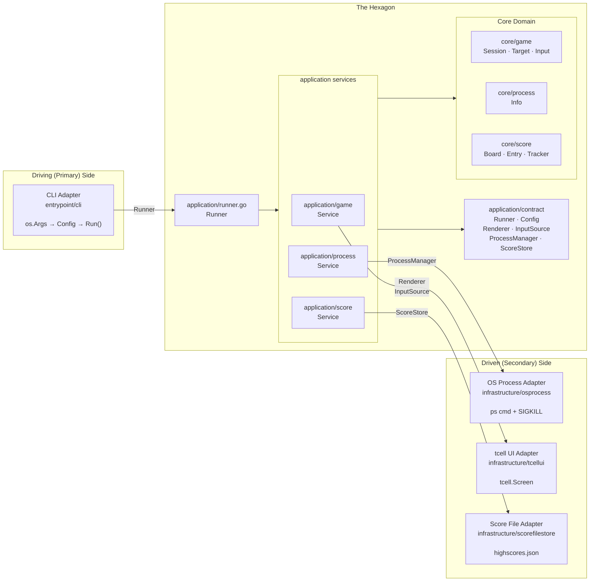
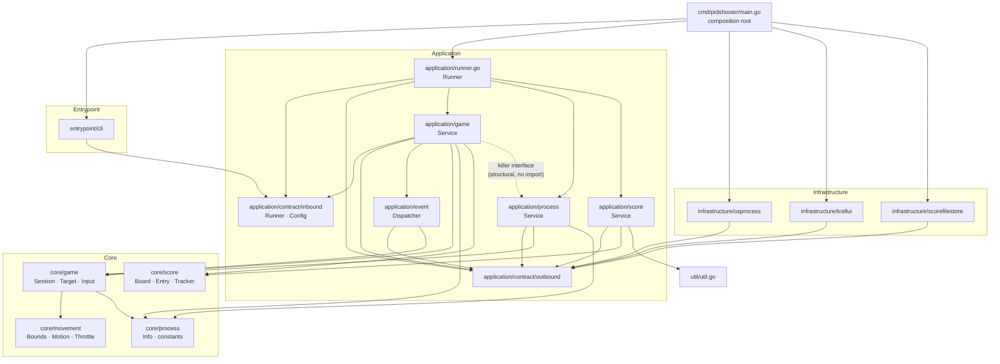

# Hexagonal Architecture — Design Record for pidshooter

*Originally a migration proposal (2026-06-26). Migration completed 2026-07-01. Further refactoring completed 2026-07-06: `domain` → `core`, `adapter` → `infrastructure`/`entrypoint`, `app` → `application`, port interfaces moved to `application/contract`. A second round of refactoring completed 2026-08-20: `Game` → `Session`, the inbound port renamed `GamePlay`/`Play()` → `Runner`/`Run()`, the single `GameService` split into three focused services (`application/game`, `application/process`, `application/score`) composed by a top-level `application.Runner`, and `outbound.Process` renamed `ProcessManager`. Sections 3–9 describe this current, live codebase. Sections 2, 10, and 11 document the original pre-refactor state and the reasoning behind the 2026-07 migration — kept as a design record. Section 13 documents the 2026-08 changes and their reasoning the same way.*

---

## Contents

1. [What hexagonal architecture means here](#1-what-hexagonal-architecture-means-here)
2. [Previous architecture: what works and what leaks](#2-previous-architecture-what-works-and-what-leaks)
3. [The three layers](#3-the-three-layers)
4. [Conceptual diagram](#4-conceptual-diagram)
5. [Package structure](#5-package-structure)
6. [Component-by-component mapping](#6-component-by-component-mapping)
7. [Port interfaces (contracts)](#7-port-interfaces-contracts)
8. [Detailed package dependency graph](#8-detailed-package-dependency-graph)
9. [Composition root (main.go)](#9-composition-root-maingo)
10. [What changed and why](#10-what-changed-and-why)
11. [Migration path](#11-migration-path)
12. [Trade-offs](#12-trade-offs)
13. [Further refactoring: service decomposition (2026-08)](#13-further-refactoring-service-decomposition-2026-08)

---

## 1. What hexagonal architecture means here

Hexagonal architecture (Ports & Adapters, Alistair Cockburn, 2005) separates software into three concentric zones:

| Zone | Responsibility | Rule |
|---|---|---|
| **Domain** | Business logic — what the application *is* | No imports from outer layers; no infrastructure |
| **Ports** | Contracts — what the domain *needs* or *exposes* | Interfaces only, owned by the application layer |
| **Adapters** | Infrastructure — how the world *connects* to the domain | Implements ports; imports libraries and OS APIs |

The "hexagon" is just the domain + its port interfaces. Everything outside is an adapter. There is no hexagonal shape; the name refers to the six notional faces Cockburn drew to show multiple interchangeable adapters around a single core.

Two kinds of adapters:

- **Driving (primary)** — they initiate action: the CLI parses `os.Args` and calls into the application.
- **Driven (secondary)** — they are called by the application service: OS process discovery, tcell rendering, JSON score storage.

---

## 2. Previous architecture: what works and what leaks

### What already followed the pattern

- `process.Finder` and `process.Info` were interfaces — `finder` was already an unexported implementation detail.
- `internal/testutil` existed for test doubles, meaning the seams were already being felt.
- `runner.go` separated the orchestration concern from `main.go`.
- `score`, `game`, and `process` were in distinct packages with clear responsibility labels.

### Where infrastructure leaked into the domain

| Location | Leak |
|---|---|
| `game/target.go: Kill()` | Called `os.FindProcess` + `syscall.SIGKILL` directly — the OS syscall was inside a domain entity |
| `game/loop.go: render()` | Called `tcell.Screen.SetContent` directly — rendering technology was baked into game logic |
| `game/loop.go: init()` | Created `tcell.NewScreen()` inside the game — screen lifecycle was the game's problem |
| `game/loop.go: run()` | Polled `g.screen.PollEvent()` inside the game loop — input source was hardwired |
| `score/score.go` | Called `os.ReadFile` / `os.WriteFile` directly — persistence technology was inside a domain type |

These were typical for a first implementation. Extracting each concern makes it independently testable and swappable without touching game logic.

---

## 3. The three layers

### Layer 1 — Core domain

Pure Go. No imports except the standard library, `internal/util`, and other core packages. Contains the game's invariants, entities, and value objects.

- **`core/game`** — `Session` pure state machine (targets, lifecycle, timer, confirmation, throttle), `Target` entity (embeds `process.Info` + `movement.Motion`), `State` enum (`Alive`/`Killing`/`Dead`), and `Input` — the intent-level gateway (`OnQuit`, `OnYes`, `OnClickAt`, …) the application layer's event dispatcher calls into.
- **`core/movement`** — `Vector`, `Motion`, `Bounds`, `Throttle` — pure physics/speed value objects, used by `core/game`.
- **`core/process`** — `Info` struct, `Find`/`Validate`, `ErrNoPatterns`, `MinPatternLength`/`MaxPatternLength` constants.
- **`core/score`** — `Board`, `Entry`, `Tracker`, ranking logic.

The core domain contains **no port interfaces**. It exposes data types that the contracts in `application/contract` reference. This keeps import cycles impossible: core never imports application or infrastructure.

### Layer 2 — Application service

One layer above the core. Defines the port interfaces (contracts) and implements the use-case: given a configuration, find processes, run a game, persist the score. Unlike the July design's single `GameService`, this responsibility is now split across three focused services, composed by one top-level `Runner`.

- **`application/contract/inbound/runner.go`** — `Runner` interface, `Config` struct.
- **`application/contract/outbound/*.go`** — `Renderer`, `InputSource`, `Lister`/`Killer`/`ProcessManager`, `ScoreStore` interfaces and their mirror data types (`FrameState`, `ProcessInfo`, `ScoreBoard`, …).
- **`application/event`** — `Dispatcher`, translating raw `InputEvent`s into calls on `core/game.Input`.
- **`application/game`** — `Service`, owning the game loop (`Play`): spawns a `core/game.Session`, ticks it at 20 FPS, dispatches input, and applies kill results. Knows nothing about score persistence or OS process termination — it depends on `application/process` only through an unexported `killer` interface it declares itself.
- **`application/process`** — `Service`, owning process discovery (`FindProcesses`) and verified termination (`Kill`).
- **`application/score`** — `Service`, owning score board load/record/print.
- **`application/runner.go`** — `Runner` struct (top-level `application` package), implementing `inbound.Runner`. Constructs and wires the three services together and orchestrates one full play: find processes → load score → play → record score → print results.

### Layer 3 — Adapters

One directory per integration point. Adapters import libraries; the core domain never does.

**Infrastructure adapters** (driven — the application services call them):

| Adapter | Contracts it satisfies | Technology |
|---|---|---|
| `infrastructure/osprocess` | `ProcessManager` (`Lister` + `Killer`) | `os/exec ps`, `os.FindProcess`, `syscall.SIGKILL` |
| `infrastructure/tcellui` | `Renderer`, `InputSource` | `github.com/gdamore/tcell/v2` |
| `infrastructure/scorefilestore` | `ScoreStore` | `encoding/json`, `os.ReadFile/WriteFile` |

**Entrypoint adapters** (driving — they call the application's inbound port):

| Adapter | Contract it calls | Technology |
|---|---|---|
| `entrypoint/cli` | `Runner` | `os.Args`, `github.com/spf13/cobra` |

---

## 4. Conceptual diagram



---

## 5. Package structure

```
pidshooter/
│
├── cmd/
│   └── pidshooter/
│       └── main.go                           # Composition root only — no logic
│
└── internal/
    │
    ├── core/                                 # Pure domain — no infrastructure imports
    │   ├── game/
    │   │   ├── session.go                    # Config · Session (pure state machine) · NewSession() · Start() · Update() · Stop()
    │   │   ├── lifecycle.go                  # lifecycle enum · atomicLifecycle
    │   │   ├── timer.go                      # timer · Expired() · Remaining()
    │   │   ├── confirmation.go               # confirmation · Pending() · Request() · Accept() · Cancel()
    │   │   ├── roster.go                     # roster · spawn() · move() · allDead() · hitAt() · available()
    │   │   ├── target.go                     # Target · State enum · NewTarget() · Tag() · Update() · Kill() · Reap()
    │   │   └── input.go                      # Input (intent gateway) · NewInput() · OnQuit()/OnYes()/OnClickAt()/…
    │   ├── movement/
    │   │   ├── bounds.go                     # Bounds · NewBounds() · bounce()
    │   │   ├── motion.go                     # Vector · Motion · NewMotion() · Move()
    │   │   └── throttle.go + speed.go        # Throttle · MinSpeed · MaxSpeed
    │   ├── process/
    │   │   └── process.go                    # Info struct · Find() · Validate() · MinPatternLength · MaxPatternLength
    │   └── score/
    │       ├── board.go                      # Board · NewBoard() · Add() · PrintHighScores()
    │       ├── entry.go                      # Entry
    │       └── tracker.go                    # Tracker · RecordKill()
    │
    ├── application/
    │   ├── contract/
    │   │   ├── inbound/runner.go             # Runner (interface) · Config
    │   │   └── outbound/*.go                 # Renderer · InputSource · Lister/Killer/ProcessManager · ScoreStore
    │   ├── event/
    │   │   └── dispatcher.go                 # Dispatcher · NewDispatcher() · Dispatch()
    │   ├── game/
    │   │   └── service.go                    # Service · NewService() · Play() · runLoop() · applyKills() · drainEvents() · killer (interface)
    │   ├── process/
    │   │   └── service.go                    # Service · NewService() · FindProcesses() · Kill()
    │   ├── score/
    │   │   └── service.go                    # Service · NewService() · LoadScoreBoard() · RecordScore() · PrintResults()
    │   └── runner.go                         # Runner · NewRunner() · Run()  (wires game/process/score together)
    │
    ├── entrypoint/                           # Driving adapters — call the application's inbound.Runner port
    │   └── cli/
    │       └── cli.go                        # CLI · NewCLI() · Run() · buildCommand() (cobra) · play()
    │
    ├── infrastructure/                       # Driven adapters — implement outbound ports
    │   ├── osprocess/
    │   │   └── osprocess.go                  # Process · NewProcess()  (implements ProcessManager)
    │   ├── scorefilestore/
    │   │   └── score_file_store.go           # Store · NewStore()
    │   └── tcellui/
    │       └── tcellui.go                    # UI · NewUI() (implements Renderer + InputSource)
    │
    ├── testutil/
    │   ├── capture/
    │   │   └── capture.go                    # Output() · Stderr() (stdout/stderr capture helpers)
    │   ├── fake/
    │   │   ├── process.go                    # Process (test double for ProcessManager)
    │   │   ├── store.go                      # Store (test double for ScoreStore)
    │   │   ├── renderer.go                   # Renderer (test double)
    │   │   └── inputsource.go                # InputSource (test double)
    │   └── fixture/
    │       ├── game.go                       # Game()/ConfirmGame()/PendingConfirmGame() — *core/game.Session builders
    │       └── process.go                    # Process()/Processes() — core/process.Info builders
    │
    └── util/
        └── util.go                           # FormatBytes() — pure leaf
```

---

## 6. Component-by-component mapping

### Pre-refactor → Current

| Pre-refactor location | Current location | Change |
|---|---|---|
| `internal/domain/process/process.go` | `internal/core/process/process.go` | Package path renamed; `Info` changed from interface to struct |
| `internal/domain/game/game.go` | `internal/core/game/game.go` | Removed renderer/events/killer fields; pure state machine; added `KillRequest` |
| `internal/domain/game/loop.go` | `internal/core/game/loop.go` | `render()` → `Frame()`; `update()` → `Update(w,h)`; `killTarget()` → `CompleteKill()` |
| `internal/domain/game/event_handler.go` | `internal/core/game/event_handler.go` | Returns `*KillRequest` instead of calling killer directly |
| `internal/domain/game/motion.go` | Merged into `internal/core/game/target.go` | `Motion` struct removed; `Position`/`Velocity` are `Vector` fields on `Target` |
| `internal/domain/game/target.go` | `internal/core/game/target.go` | Updated imports; absorbed motion logic |
| `internal/domain/game/session.go` | `internal/core/game/session.go` | Updated package path |
| `internal/domain/game/ports/driven/` | `internal/application/contract/outbound.go` + `internal/core/game/frame.go` + `internal/core/game/input.go` | Interfaces moved to contract; data types stayed in core/game |
| `internal/domain/game/ports/driving/` | `internal/application/contract/inbound.go` | Moved to application/contract |
| `internal/domain/score/score.go` | `internal/core/score/score.go` | Updated package path |
| `internal/app/runner.go` | `internal/application/runner.go` | Owns the game loop; handles KillRequest two-phase kill |
| `internal/adapter/driven/osprocess/` | `internal/infrastructure/osprocess/` | Package path renamed |
| `internal/adapter/driven/tcellui/` | `internal/infrastructure/tcellui/` | Package path renamed |
| `internal/adapter/driven/jsonscores/` | `internal/infrastructure/scorefilestore/` | Package path renamed; file renamed |
| `internal/adapter/driving/cli/` | `internal/entrypoint/cli/` | Package path renamed; uses `contract.GameService`/`contract.Config` |
| `cmd/pidshooter/main.go` | `cmd/pidshooter/main.go` | Updated imports; `tcellui.New` returns one `*UI` for both Renderer+EventSource |

---

## 7. Port interfaces (contracts)

All port interfaces live in `application/contract`, split by direction into `inbound` and `outbound` subpackages. In Go, the consumer (the application layer) defines the interfaces it needs. Infrastructure adapters satisfy them via structural typing — no explicit import of `contract` is needed in the adapter packages.

### `application/contract/inbound/runner.go`

```go
package inbound

// Config carries the user's intent for a game session.
type Config struct {
    Patterns    []string
    ConfirmMode bool
    Speed       float64
    TimeLimit   int
}

// Runner is the inbound port: the contract the delivery adapter calls.
type Runner interface {
    Run(cfg Config) error
}
```

### `application/contract/outbound/*.go`

```go
package outbound

// process.go
type Lister interface {
    List() ([]ProcessInfo, error)
    OwnPid() int
}

type Killer interface {
    LookupName(pid int) (string, error)
    Kill(pid int) (bool, error)
}

// ProcessManager is the outbound port for process discovery and termination on the host.
type ProcessManager interface {
    Lister
    Killer
}

// score.go
type ScoreStore interface {
    Load() (ScoreBoard, error)
    Save(board ScoreBoard) error
}

// ui.go
type Renderer interface {
    Init() error
    Cleanup()
    Size() (width, height int)
    Render(state FrameState)
}

// input.go
type InputSource interface {
    Events() <-chan InputEvent
}
```

### `application/runner.go` — wires the three services

```go
package application

type Runner struct {
    processSvc *process.Service
    gameSvc    *game.Service
    scoreSvc   *score.Service
}

func NewRunner(processMgr outbound.ProcessManager, store outbound.ScoreStore, renderer outbound.Renderer, events outbound.InputSource) *Runner {
    processSvc := process.NewService(processMgr)
    return &Runner{
        processSvc: processSvc,
        gameSvc:    game.NewService(processSvc, renderer, events), // processSvc satisfies game's unexported killer interface
        scoreSvc:   score.NewService(store),
    }
}

func (r *Runner) Run(cfg inbound.Config) error {
    processes, err := r.processSvc.FindProcesses(cfg.Patterns)
    if err != nil || len(processes) == 0 {
        return err
    }
    board, tracker, success := r.scoreSvc.LoadScoreBoard()
    result, err := r.gameSvc.Play(cfg, processes, tracker)
    if err != nil {
        return err
    }
    r.scoreSvc.RecordScore(board, result.LowestSpeed, cfg.TimeLimit, result.Duration, success)
    score.PrintResults(result.Duration, board)
    return nil
}
```

### `application/game/service.go` — the game loop

```go
package game

const frameDuration = time.Second / 20

// killer is declared by application/game itself — process.Service satisfies it
// structurally, so application/game never imports application/process.
type killer interface {
    Kill(target *game.Target) (killed, shouldReap bool, err error)
}

type Service struct {
    killer   killer
    renderer outbound.Renderer
    events   outbound.InputSource
    kills    chan killSignal
}

func (s *Service) Play(cfg inbound.Config, processes []process.Info, tracker *score.Tracker) (PlayResult, error) {
    gs := s.newGame(cfg, processes)
    endTime, err := s.runLoop(gs, tracker)
    if err != nil {
        return PlayResult{}, err
    }
    return PlayResult{Duration: endTime.Sub(gs.StartTime()).Seconds(), LowestSpeed: gs.Throttle().LowestSpeed()}, nil
}

func (s *Service) runLoop(gs *game.Session, tracker *score.Tracker) (time.Time, error) {
    s.renderer.Init()
    gs.Start(s.renderer.Size())
    // signal goroutine: SIGINT/SIGTERM/SIGTSTP → gs.Stop()
    // 20 FPS ticker loop
    for gs.IsRunning() {
        s.applyKills(tracker)
        s.drainEvents(evt, done)
        gs.Update(w, h)
        s.renderer.Render(buildFrame(gs, tracker))
        <-ticker.C
    }
    return time.Now(), nil
}

func (s *Service) drainEvents(d *event.Dispatcher, done <-chan struct{}) {
    // ev -> d.Dispatch(ev) -> *Target or nil
    // hit: go s.killer.Kill(target) -> s.kills <- killSignal{target, shouldReap}
}
```

---

## 8. Detailed package dependency graph

Arrows point in the direction of the import (`A → B` means A imports B).



**Key property:** the core packages (`core/game`, `core/movement`, `core/process`, `core/score`) have no arrows pointing *outward* to application, infrastructure, or entrypoint. Dependency only flows inward toward the core. `application/game`, `application/process`, and `application/score` also have no arrows *between each other* — the dotted edge from `appgame` to `appprocess` is not an import, it is `application/game` declaring a `killer` interface that `application/process.Service` happens to satisfy structurally.

**Why contracts live in application, not core:** Placing interface definitions in `application/contract` (rather than in the domain packages they reference) avoids a dependency inversion problem: if `core/game` defined `Renderer`, it would need to know about `FrameState` (fine, it already does conceptually), but any package importing `core/game` for the interface would also pull in the rendering contract. Keeping contracts in `application/contract` makes the application the single point of assembly.

---

## 9. Composition root (`main.go`)

In hexagonal architecture `main.go` is not logic — it is wiring. All wiring happens here and nowhere else.

```go
package main

import (
    "fmt"
    "os"

    "github.com/eirikur-ari/pidshooter/internal/application"
    "github.com/gdamore/tcell/v2"

    "github.com/eirikur-ari/pidshooter/internal/entrypoint/cli"
    "github.com/eirikur-ari/pidshooter/internal/infrastructure/osprocess"
    "github.com/eirikur-ari/pidshooter/internal/infrastructure/scorefilestore"
    "github.com/eirikur-ari/pidshooter/internal/infrastructure/tcellui"
)

func main() {
    if err := run(); err != nil {
        fmt.Fprintf(os.Stderr, "Error: %v\n", err)
        os.Exit(1)
    }
}

func run() error {
    proc, err := osprocess.NewProcess()
    if err != nil {
        return err
    }
    store := scorefilestore.NewStore()

    screen, err := tcell.NewScreen()
    if err != nil {
        return fmt.Errorf("failed to create screen: %w", err)
    }
    ui := tcellui.NewUI(screen) // *UI implements both Renderer and InputSource

    runner := application.NewRunner(proc, store, ui, ui) // wires process/game/score services together
    return cli.NewCLI(runner).Run(os.Args[1:])
}
```

---

## 10. What changed and why

### `Game` becomes a pure state machine

Originally `Game` held a `renderer game.Renderer`, `events game.EventSource`, and `killer game.ProcessKiller` and drove its own loop via `Play()`. This created an import-cycle risk: the domain owned the port interfaces, and infrastructure would import those ports from the domain.

The solution (Option 2 / "functional core, imperative shell"): `Game` contains only pure state. The application layer (`runner.go`) owns the loop, drains the event channel, calls the OS killer, and feeds the result back into the game via `CompleteKill()`.

**Kill flow (two-phase):**
1. `g.HandleEvent(ev)` returns `*KillRequest{Target}` — pure state change, no side effect
2. Application layer calls `s.killer.Kill(pid, name)` — OS side effect
3. On success: `g.CompleteKill(target)` — transitions target to Killing, records session stats
4. On failure: nothing — target stays Alive; no animation, no score credit

**Render flow:** `g.Frame()` returns a pure data snapshot; `s.renderer.Render(frame)` draws it.

### `motion.go` merged into `target.go`

The original design had a separate `Motion` struct. After the refactor, position and velocity are `Vector` fields directly on `Target`. The motion update logic lives in `Target.Update()`. This reduced file count without losing clarity since position/velocity are intrinsic to a target entity.

### `process.Info` changed from interface to struct

Originally `process.Info` was an interface with `Pid()`, `Name()`, `Rss()` accessor methods. It is now a plain struct with exported fields (`Pid int`, `Name string`, `Rss int64`). This simplification removes the need for a concrete implementation type (`osprocess.proc`) and lets test code construct `process.Info` literals directly without a constructor.

### Port interfaces moved from domain to application

The pre-refactor design placed port interfaces in `domain/game/ports/driven/` and `domain/game/ports/driving/`. The current design places them all in `application/contract/`. This means:
- Core packages have zero interface definitions → easier to reason about dependencies
- `application/contract` is the single authoritative location for "what does the game need from the outside world?"
- Infrastructure adapters satisfy contracts via Go's structural typing — no explicit import of `application/contract` needed in adapters

### Score I/O extracted to `scorefilestore` adapter

`score.Board` no longer calls `os.ReadFile` / `os.WriteFile`. File operations live in `infrastructure/scorefilestore`, which implements `contract.Store`. `Board` keeps ranking and high-score logic only.

### Event loop decoupled from tcell

`infrastructure/tcellui.UI` owns the poll goroutine. It delivers `game.InputEvent` values on a buffered channel. The game loop only sees `game.InputEvent` — no `tcell.EventMouse` or `tcell.EventKey`.

---

## 11. Migration path

The migration was done in stages, each with a passing test suite at the end.

```
Step 1  Extract ScoreStore interface
        Moved file I/O out of score.Board into scorefilestore adapter.

Step 2  Extract ProcessKiller interface
        Removed Kill() from Target. Added ProcessKiller interface.
        Moved os.FindProcess + syscall to osprocess adapter.

Step 3  Extract EventSource interface
        Defined game.InputEvent sealed interface.
        Moved PollEvent goroutine to tcellui.EventSource adapter.

Step 4  Extract Renderer interface
        Defined Renderer interface with Render(Frame) / Size() / Init() / Cleanup().
        Implemented tcellui.Renderer wrapping tcell.Screen.

Step 5  Reorganise packages
        domain/ → core/
        app/ → application/
        adapter/driven/ → infrastructure/
        adapter/driving/ → entrypoint/
        domain/game/ports/ → application/contract/ (interfaces) + core/game/ (data types)

Step 6  Pure state machine (Option 2)
        Removed renderer/events/killer fields from Game.
        Game loop moved entirely to application/runner.go.
        HandleEvent() returns *KillRequest instead of calling killer.
        CompleteKill() is the callback when the OS kill succeeds.

Step 7  Merge motion.go into target.go
        Motion struct removed; Vector fields on Target.

Step 8  Simplify process.Info
        Info changed from interface to struct.
        Removed osprocess.proc concrete implementation.
```

---

## 12. Trade-offs

### Benefits

- **Independent testability** — every layer can be tested in isolation. Core tests need no tcell, no OS, no file system.
- **Swappable adapters** — a new terminal library, a `/proc` reader, or SQLite score storage each require only one new adapter.
- **Clear dependency rule** — `grep -r "tcell" internal/core` must return nothing. The build enforces the architecture.
- **Functional core** — `Session.Update()` and the `Target`/`roster` methods it calls are pure state transitions. No side effects in the domain.
- **Thinner `main.go`** — wiring is explicit and all in one place; logic is zero.
- **Focused services** (since the 2026-08 split) — `application/game`, `application/process`, and `application/score` each have one reason to change. `application/game` can be read and tested without knowing scoring or OS process termination exist.

### Costs

- **More packages** — the structure is deeper. For a project of this size that overhead is real.
- **Two-phase kill adds indirection** — a reader following a bug from click to process exit now crosses more lines: `Dispatcher.Dispatch` returns a `*Target`, a goroutine calls `killer.Kill`, and the result comes back on a channel consumed by `applyKills`. Naming and tests compensate.
- **Frame allocation each tick** — building an `outbound.FrameState` value at 20 FPS adds a small allocation. Imperceptible, but not free.
- **Consumer-defined interface adds one more seam** — `application/game`'s unexported `killer` interface exists purely to keep `application/game` from importing `application/process`. It's one more indirection to trace when reading `drainEvents`, in exchange for a real compile-time guarantee that the two packages don't depend on each other.

---

## 13. Further refactoring: service decomposition (2026-08)

This section is a design record for the second refactoring pass, done incrementally across an interactive session in August 2026, on top of the July hexagonal migration described in sections 2–11 above.

### `Game` → `Session`

`core/game.Game` was renamed `Session`. `Game` was never a game in itself — it's the state machine for *one play-through* — so `Session` describes it more accurately and reads correctly as `game.Session`. `New` became `NewSession` (avoiding stutter while still being explicit at the call site), and `Step` became `Update` (the conventional name for a per-frame simulation advance, matching engines like Unity, and distinct from `IsRunning()` so the two don't read as a pair of predicates). The source file `game.go` was renamed `session.go` to match.

### The inbound port: `GamePlay` → `Runner`

The single-method inbound interface was renamed from `GamePlay`/`Play(cfg GamePlayConfig) error` to `Runner`/`Run(cfg Config) error`. `GamePlayConfig` became plain `Config` — the `inbound` package qualifier (`inbound.Config`) already disambiguates it from `core/game.Config`, so the prefix was redundant. `Runner` follows the same `-er` convention as `io.Reader`/`io.Closer`: a type named after what it *does*, satisfied by a type that performs the action named by its single method.

### One `GameService` → three focused services

The original `application/service.GameService` did everything: process discovery, the game loop, kill verification, and score board load/record/print, all behind one `Play` method. This was split into three services, each in its own subpackage, each with zero knowledge of the other two's persistence or OS concerns:

- **`application/game.Service`** — owns the game loop only. `Play(cfg, processes, tracker) (PlayResult, error)` takes already-discovered processes and an already-loaded `*score.Tracker` as parameters, and returns a `PlayResult{Duration, LowestSpeed}` instead of touching a score store directly.
- **`application/process.Service`** — owns `FindProcesses` and `Kill` (verify-then-terminate). `Kill` returns `(killed, shouldReap bool, err error)` instead of the old sentinel-error (`errAlreadyKilled`) pattern, so callers don't need to `errors.Is` against an error only meaningful within the old single service.
- **`application/score.Service`** — owns `LoadScoreBoard`, `RecordScore`, and the package-level `PrintResults`.
- **`application.Runner`** (top-level `application` package, `runner.go`) — constructs all three and orchestrates one full play: find processes → load score board → play → record score → print results. This is the logic that used to live inside `GameService.Play`.

`application/game` and `application/process` do not import one another. `application/game` declares its own minimal `killer` interface (`Kill(target *game.Target) (killed, shouldReap bool, err error)`) for the one thing it needs mid-loop — verifying and terminating a clicked target's OS process — and `process.Service` satisfies it structurally, with no import required in either direction. Score, by contrast, needed no such interface: `LoadScoreBoard`/`RecordScore` are called strictly *before* and *after* `Play`, not during it, so `Runner` can bookend the call entirely from outside `application/game` — a cleaner decoupling than `process.Kill`'s live, per-frame dependency allowed.

### `outbound.Process` → `ProcessManager`

The outbound port for OS process discovery/termination was renamed from `Process` to `ProcessManager`. "Process" was overloaded three ways in the codebase — the outbound port, `core/process.Info` (a process data record), and the new `application/process` package — and the port specifically *manages* processes (lists and kills them via the embedded `Lister`/`Killer`), which `ProcessManager` names directly.

### Component mapping: July structure → August structure

| July 2026 location | August 2026 location | Change |
|---|---|---|
| `core/game/game.go: Game` | `core/game/session.go: Session` | Renamed; `New` → `NewSession`, `Step` → `Update` |
| `application/contract/inbound.go: GamePlay, GamePlayConfig` | `application/contract/inbound/runner.go: Runner, Config` | Renamed; split into its own file |
| `application/contract/outbound.go: Process` | `application/contract/outbound/process.go: ProcessManager` | Renamed |
| `application/service/game.go: GameService` | `application/game/service.go: Service` + `application/process/service.go: Service` + `application/score/service.go: Service` + `application/runner.go: Runner` | Split into three services + one composing `Runner` |
| `application/service/converter.go` | `application/game/converter.go` + `application/process/converter.go` + `application/score/converter.go` | Split by which service consumes each converter function |
| `application/service/validation.go` | `application/process/validation.go` | Moved wholesale — validation was always process-specific |
| n/a | `internal/application/event/dispatcher.go` (renamed from `input.go`) | File renamed to match the type it defines (`Dispatcher`) |
