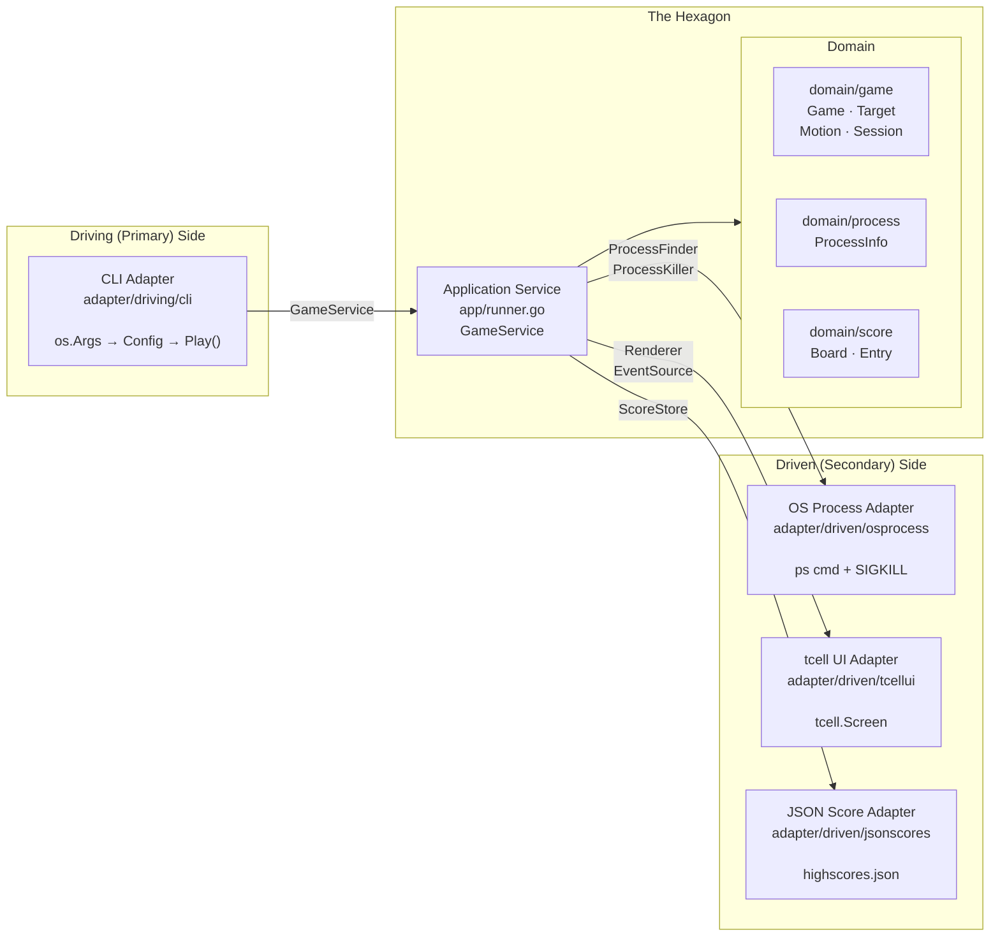
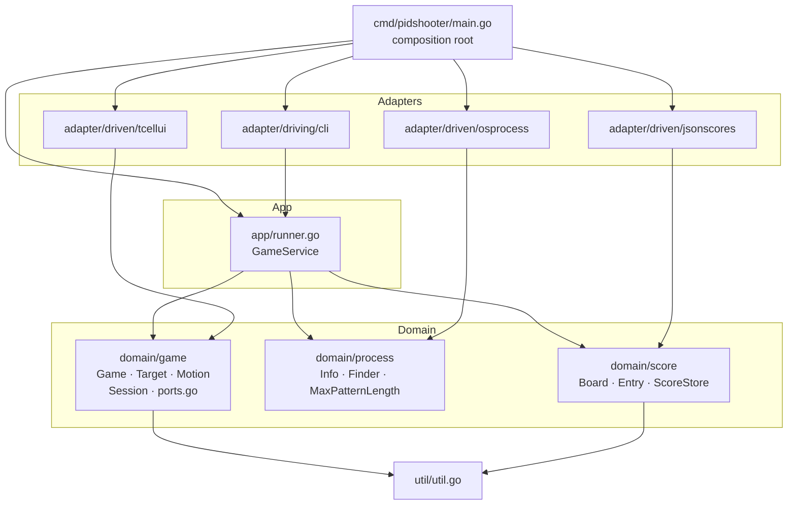

# Hexagonal Architecture — Design Record for pidshooter

*Originally a migration proposal (2026-06-26). Migration completed 2026-07-01. The structure described in sections 5–9 is now the live codebase. Sections 2, 10, and 11 document the pre-refactor state and the reasoning behind each change — kept as a design record.*

---

## Contents

1. [What hexagonal architecture means here](#1-what-hexagonal-architecture-means-here)
2. [Current architecture: what works and what leaks](#2-current-architecture-what-works-and-what-leaks)
3. [The three layers](#3-the-three-layers)
4. [Conceptual diagram](#4-conceptual-diagram)
5. [Proposed package structure](#5-proposed-package-structure)
6. [Component-by-component mapping](#6-component-by-component-mapping)
7. [Port interfaces (contracts)](#7-port-interfaces-contracts)
8. [Detailed package dependency graph](#8-detailed-package-dependency-graph)
9. [Composition root (main.go)](#9-composition-root-maingo)
10. [What changes and why](#10-what-changes-and-why)
11. [Migration path](#11-migration-path)
12. [Trade-offs](#12-trade-offs)

---

## 1. What hexagonal architecture means here

Hexagonal architecture (Ports & Adapters, Alistair Cockburn, 2005) separates software into three concentric zones:

| Zone | Responsibility | Rule |
|---|---|---|
| **Domain** | Business logic — what the application *is* | No imports from outer layers; no infrastructure |
| **Ports** | Contracts — what the domain *needs* or *exposes* | Interfaces only, owned by the domain side |
| **Adapters** | Infrastructure — how the world *connects* to the domain | Implements ports; imports libraries and OS APIs |

The "hexagon" is just the domain + its port interfaces. Everything outside is an adapter. There is no hexagonal shape; the name refers to the six notional faces Cockburn drew to show multiple interchangeable adapters around a single core.

Two kinds of adapters:

- **Driving (primary)** — they initiate action: the CLI parses `os.Args` and calls into the application.
- **Driven (secondary)** — they are called by the domain: OS process discovery, tcell rendering, JSON score storage.

---

## 2. Current architecture: what works and what leaks

### What already follows the pattern

- `process.Finder` and `process.Info` are interfaces — `finder` is already an unexported implementation detail.
- `internal/testutil` exists for test doubles, meaning the seams are already being felt.
- `runner.go` separates the orchestration concern from `main.go`.
- `score`, `game`, and `process` are in distinct packages with clear responsibility labels.

### Where infrastructure leaks into the domain

| Location | Leak |
|---|---|
| `game/target.go: Kill()` | Calls `os.FindProcess` + `syscall.SIGKILL` directly — the OS syscall is inside a domain entity |
| `game/loop.go: render()` | Calls `tcell.Screen.SetContent` directly — rendering technology is baked into game logic |
| `game/loop.go: init()` | Creates `tcell.NewScreen()` inside the game — screen lifecycle is the game's problem |
| `game/loop.go: run()` | Polls `g.screen.PollEvent()` inside the game loop — input source is hardwired |
| `score/score.go` | Calls `os.ReadFile` / `os.WriteFile` directly — persistence technology is inside a domain type |
| `runner.go` | Prints to stdout (`fmt.Printf`) — output side effects in the orchestrator |

These are not catastrophic — they are typical for a first implementation. The value of extracting them is that each concern becomes independently testable and swappable without touching game logic.

---

## 3. The three layers

### Layer 1 — Domain

Pure Go. No imports except the standard library and `internal/util`. Contains the game's invariants, entities, and value objects.

- **`domain/game`** — `Game` state machine, `Target` entity, `Motion` value object, `Session` value object, `TargetState` enum, and the *port interfaces* the game needs: `Renderer`, `EventSource`, `ProcessKiller`.
- **`domain/process`** — `ProcessInfo` value object and interface, `ProcessFinder` port.
- **`domain/score`** — `Board`, `Entry`, ranking logic, `ScoreStore` port.

### Layer 2 — Application service

One layer above the domain. Implements the use-case: given a configuration, find processes, run a game, persist the score. This is what was `runner.go`. It wires domain objects together and calls out through ports.

- **`app/runner.go`** — `GameService` struct implementing a `GameService` interface; orchestrates domain + driven ports.

### Layer 3 — Adapters

One adapters directory per integration point. Adapters import libraries; the domain never does.

**Driven adapters** (domain calls them):

| Adapter | Port it implements | Technology |
|---|---|---|
| `adapter/driven/osprocess` | `ProcessFinder`, `ProcessKiller` | `os/exec ps`, `os.FindProcess`, `syscall.SIGKILL` |
| `adapter/driven/tcellui` | `Renderer`, `EventSource` | `github.com/gdamore/tcell/v2` |
| `adapter/driven/jsonscores` | `ScoreStore` | `encoding/json`, `os.ReadFile/WriteFile` |

**Driving adapters** (they call the application service):

| Adapter | Port it drives | Technology |
|---|---|---|
| `adapter/driving/cli` | `GameService` | `os.Args`, `fmt`, `strconv` |

---

## 4. Conceptual diagram



---

## 5. Proposed package structure

```
pidshooter/
│
├── cmd/
│   └── pidshooter/
│       └── main.go                       # Composition root only — no logic
│
└── internal/
    │
    ├── domain/                           # The hexagon — pure business logic
    │   ├── game/
    │   │   ├── game.go                   # Game struct: state machine + constructor
    │   │   ├── session.go                # Session value object
    │   │   ├── target.go                 # Target entity (no Kill syscall)
    │   │   ├── motion.go                 # Motion value object (unchanged)
    │   │   ├── state.go                  # TargetState enum
    │   │   └── ports.go                  # Renderer, EventSource, ProcessKiller interfaces
    │   ├── process/
    │   │   └── process.go                # ProcessInfo interface + value; ProcessFinder interface
    │   └── score/
    │       └── score.go                  # Board, Entry, ranking; ScoreStore interface
    │
    ├── app/
    │   └── runner.go                     # GameService: use-case orchestrator
    │
    ├── adapter/
    │   ├── driven/
    │   │   ├── osprocess/
    │   │   │   └── adapter.go            # Implements ProcessFinder + ProcessKiller
    │   │   ├── tcellui/
    │   │   │   └── adapter.go            # Implements Renderer + EventSource
    │   │   └── jsonscores/
    │   │       └── adapter.go            # Implements ScoreStore
    │   └── driving/
    │       └── cli/
    │           └── cli.go                # Parses os.Args; calls GameService
    │
    └── util/
        └── util.go                       # FormatBytes — pure leaf, no change needed
```

---

## 6. Component-by-component mapping

### Current → Proposed

| Current location | New location | Change |
|---|---|---|
| `internal/process/info.go` | `internal/domain/process/process.go` | Rename package path; logic unchanged |
| `internal/process/finder.go` | `internal/domain/process/process.go` + `internal/adapter/driven/osprocess/adapter.go` | `Finder` interface stays in domain; `finder` impl moves to adapter |
| `internal/game/game.go` | `internal/domain/game/game.go` | Remove screen field; inject Renderer/EventSource/ProcessKiller |
| `internal/game/loop.go` | Split: domain logic stays in `domain/game/game.go`; tcell calls move to `adapter/driven/tcellui/adapter.go` |
| `internal/game/event_handler.go` | Domain event-handling logic stays in `domain/game/game.go`; tcell event types move to adapter |
| `internal/game/target.go` | `internal/domain/game/target.go` | Remove `Kill()` method; state machine and Label unchanged |
| `internal/game/motion.go` | `internal/domain/game/motion.go` | No change |
| `internal/game/session.go` | `internal/domain/game/session.go` | No change |
| `internal/score/score.go` | `internal/domain/score/score.go` + `internal/adapter/driven/jsonscores/adapter.go` | Board/Entry ranking stays in domain; file I/O moves to adapter |
| `internal/runner/runner.go` | `internal/app/runner.go` | Rewritten to use port interfaces instead of concrete types |
| `cmd/pidshooter/main.go` | `cmd/pidshooter/main.go` | Rewritten as composition root |
| `internal/testutil/` | `internal/testutil/` | Unchanged (already test doubles for ports) |
| `internal/util/util.go` | `internal/util/util.go` | Unchanged |

---

## 7. Port interfaces (contracts)

These interfaces live in the domain packages. In Go, the consumer defines the interface it needs.

### `domain/game/ports.go`

```go
package game

// Renderer draws the current game state to the display.
// The domain describes what to show; the adapter decides how.
type Renderer interface {
    Render(frame Frame)
    Size() (width, height int)
    Init() error
    Cleanup()
}

// Frame is the complete game state snapshot passed to the Renderer each tick.
type Frame struct {
    Targets   []TargetView
    HUD       HUDState
    StatusBar StatusState
}

type TargetView struct {
    X, Y    int
    Label   string
    Killing bool
}

type HUDState struct {
    FreedMem  int64
    Kills     int
    HighScore int
}

type StatusState struct {
    Alive        int
    Speed        float64
    TimeLimit    int
    TimeLeft     int // seconds, 0 = no limit
    Confirming   *ConfirmState
}

type ConfirmState struct {
    PID  int
    Name string
}

// EventSource delivers input events from the user.
// The domain defines the event types; the adapter translates from its source.
type EventSource interface {
    Events() <-chan InputEvent
}

// InputEvent is a sealed interface — only domain-defined types satisfy it.
type InputEvent interface{ inputEvent() }

type ClickEvent  struct{ X, Y int }
type KeyEvent    struct{ Key KeyCode; Ch rune }
type ResizeEvent struct{}

func (ClickEvent)  inputEvent() {}
func (KeyEvent)    inputEvent() {}
func (ResizeEvent) inputEvent() {}

// KeyCode mirrors the small subset of tcell keys the game actually uses,
// expressed as domain constants — the adapter maps from tcell.Key.
type KeyCode int

const (
    KeyNone    KeyCode = iota
    KeyEscape
    KeyCtrlC
    KeyCtrlZ
)

// ProcessKiller sends the kill signal to a process by PID.
type ProcessKiller interface {
    Kill(pid int) error
}
```

### `domain/process/process.go`

```go
package process

// Info describes a single running process.
type Info interface {
    Pid() int
    Name() string
    Rss() int64
}

// Finder discovers processes on the host.
type Finder interface {
    List() ([]Info, error)
    Find(patterns []string) ([]Info, error)
}

const MaxPatternLength = 256
```

### `domain/score/score.go`

```go
package score

import "time"

// Store persists and retrieves the score board.
type Store interface {
    Load() (*Board, error)
    Save(board *Board) error
}

// Board and Entry contain pure ranking logic — no I/O.
type Board struct { /* same as today */ }
type Entry struct { /* same as today */ }

// HighScore, Add, etc. — same as today, no file calls.
```

### `app/runner.go` — the application service

```go
package app

import (
    "github.com/eirikur-ari/pidshooter/internal/domain/game"
    "github.com/eirikur-ari/pidshooter/internal/domain/process"
    "github.com/eirikur-ari/pidshooter/internal/domain/score"
)

// GameService is the driving port: what the CLI adapter calls.
type GameService interface {
    Play(cfg Config) error
}

// Config carries user intent — mirroring the current runner.Config.
type Config struct {
    Patterns    []string
    ConfirmMode bool
    Speed       float64
    TimeLimit   int
}

// GameService implements GameService by wiring domain objects + driven ports.
type GameService struct {
    finder   process.Finder
    killer   game.ProcessKiller
    store    score.Store
    renderer game.Renderer
    events   game.EventSource
}

func NewGameService(
    finder   process.Finder,
    killer   game.ProcessKiller,
    store    score.Store,
    renderer game.Renderer,
    events   game.EventSource,
) *GameService { /* ... */ }

func (s *GameService) Play(cfg Config) error {
    processes, err := s.finder.Find(cfg.Patterns)
    // ...
    board, _ := s.store.Load()
    g := game.New(processes, cfg.ConfirmMode, cfg.Speed, cfg.TimeLimit, s.killer, s.renderer, s.events)
    result, err := g.Play(board.HighScore())
    // ...
    board.Add(toEntry(result, cfg))
    _ = s.store.Save(board)
    return nil
}
```

---

## 8. Detailed package dependency graph

Arrows point in the direction of the import (`A → B` means A imports B).



**Key property:** the domain packages (`domain/game`, `domain/process`, `domain/score`) have no arrows pointing *outward* to adapters or app. Dependency only flows inward toward the domain.

---

## 9. Composition root (`main.go`)

In hexagonal architecture `main.go` is not logic — it is wiring. All the wiring happens here and nowhere else.

```go
package main

import (
    "fmt"
    "os"

    "github.com/gdamore/tcell/v2"

    "github.com/eirikur-ari/pidshooter/internal/adapter/driven/jsonscores"
    "github.com/eirikur-ari/pidshooter/internal/adapter/driven/osprocess"
    "github.com/eirikur-ari/pidshooter/internal/adapter/driven/tcellui"
    "github.com/eirikur-ari/pidshooter/internal/adapter/driving/cli"
    "github.com/eirikur-ari/pidshooter/internal/app"
)

func main() {
    // 1. Build driven adapters
    finder := osprocess.NewFinder()
    killer := osprocess.NewKiller()
    store  := jsonscores.NewStore()

    screen, err := tcell.NewScreen()
    if err != nil {
        fmt.Fprintf(os.Stderr, "Error: %v\n", err)
        os.Exit(1)
    }
    renderer := tcellui.NewRenderer(screen)
    events   := tcellui.NewEventSource(screen)

    // 2. Build application service
    service := app.NewGameService(finder, killer, store, renderer, events)

    // 3. Build driving adapter and run
    if err := cli.New(service).Run(os.Args[1:]); err != nil {
        fmt.Fprintf(os.Stderr, "Error: %v\n", err)
        os.Exit(1)
    }
}
```

---

## 10. What changes and why

### `Target.Kill()` is removed

Currently `Target` embeds `process.Info` and calls `os.FindProcess` + `syscall.SIGKILL`. A domain entity should not perform OS syscalls. The `Kill()` method moves entirely to `osprocess.Killer`, which implements `game.ProcessKiller`. The game loop calls `g.killer.Kill(target.Pid())` instead.

**Effect:** `target.go` no longer imports `os`, `syscall`, or any OS package. Unit tests for Target need no OS.

### `render()` becomes a data push

Currently `loop.go: render()` calls `tcell.Screen.SetContent` in a loop. In the new model the domain `Game.render()` method builds a `Frame` value (pure data: what targets exist, where they are, what the HUD says) and calls `g.renderer.Render(frame)`. The `tcellui.Renderer` adapter translates that frame to tcell calls.

**Effect:** the game loop can be unit-tested by injecting a spy renderer that records frames. Switching to a different terminal library (bubbletea, termbox, even a headless test screen) requires only a new adapter.

### Score I/O extracted to `jsonscores` adapter

`score.Board` currently calls `os.ReadFile` / `os.WriteFile` via `Load()` / `Save()`. Those file operations move to `jsonscores.Store`, which implements `score.Store`. The `Board` type keeps the ranking and high-score logic.

**Effect:** `domain/score` tests are pure in-memory. Testing score persistence means testing `jsonscores.Store` in isolation with a temp directory.

### Event loop decoupled from tcell

`loop.go: run()` polls `g.screen.PollEvent()` in a goroutine. In the new design the `tcellui.EventSource` adapter owns that goroutine and delivers `game.InputEvent` values on a channel. The game loop only sees `InputEvent` values — no `tcell.EventMouse` or `tcell.EventKey`.

**Effect:** the event-handling tests (`event_handler_test.go`) can inject synthetic events without needing a simulation screen.

### `runner.go` becomes a pure orchestrator

The application service (`app/runner.go`) drives the use-case but holds no infrastructure references — only port interfaces. It can be tested by injecting fake adapters for every port, with zero tcell or OS involvement.

---

## 11. Migration path

The migration can be done incrementally without breaking any existing tests.

```
Step 1  Extract ScoreStore interface
        Move file I/O out of score.Board into a new jsonscores adapter.
        Board.Save() / Board.Load() become Store.Save() / Store.Load().
        runner.go accepts a score.Store argument.

Step 2  Extract ProcessKiller interface
        Remove Kill() from Target. Add game.ProcessKiller interface.
        Move os.FindProcess + syscall to osprocess adapter.
        Game accepts a ProcessKiller at construction.

Step 3  Extract EventSource interface
        Define game.InputEvent sealed interface with ClickEvent / KeyEvent / ResizeEvent.
        Move PollEvent goroutine to tcellui.EventSource adapter.
        Game.run() accepts a <-chan InputEvent.

Step 4  Extract Renderer interface
        Define game.Renderer interface with Render(Frame) / Size() / Init() / Cleanup().
        Implement tcellui.Renderer wrapping tcell.Screen.
        Game.render() builds a Frame and calls g.renderer.Render(frame).

Step 5  Reorganise packages
        Move domain types to domain/game, domain/process, domain/score.
        Move adapters to adapter/driven/*, adapter/driving/cli.
        Move orchestration to app/runner.go.
        Rewrite main.go as composition root.

Step 6  Simplify testutil
        FakeFinder and FakeProcessInfo remain; add FakeKiller, FakeRenderer,
        FakeEventSource for the new ports. All test doubles implement domain interfaces.
```

Each step is a self-contained refactor with a passing test suite at the end.

---

## 12. Trade-offs

### Benefits

- **Independent testability** — every layer can be tested in isolation. Domain tests need no tcell, no OS, no file system.
- **Swappable adapters** — the game could render to a web UI or a different terminal library by writing one new adapter. Scores could persist to SQLite. Processes could come from a `/proc` reader instead of `ps`.
- **Clear dependency rule** — `grep -r "tcell" internal/domain` must return nothing. The build enforces the architecture.
- **Thinner `main.go`** — wiring is explicit and all in one place; logic is zero.

### Costs

- **More packages** — the structure is deeper. For a project of this size that overhead is real. Five files in `game/` become ~10 files across `domain/game`, `adapter/driven/tcellui`, and `app/`.
- **Frame serialisation overhead** — building a `Frame` value each tick adds a small allocation. At 20 FPS on a terminal game this is imperceptible, but it is not free.
- **Indirection** — a reader following a bug from tcell input to game state now crosses two package boundaries (adapter → domain via EventSource, domain → adapter via Renderer). Naming and docs need to compensate.

### Recommendation

For a project at this scale the full hexagonal split of driven ports is worthwhile primarily for `ScoreStore` and `ProcessKiller` — those are the two places where infrastructure concerns (file I/O, OS signals) currently sit inside domain types and block unit testing. The `Renderer`/`EventSource` split is architecturally correct but adds the most structural overhead for the least immediate gain; it could be deferred to a second pass or implemented only if a second renderer (e.g. web, headless test) is needed.
