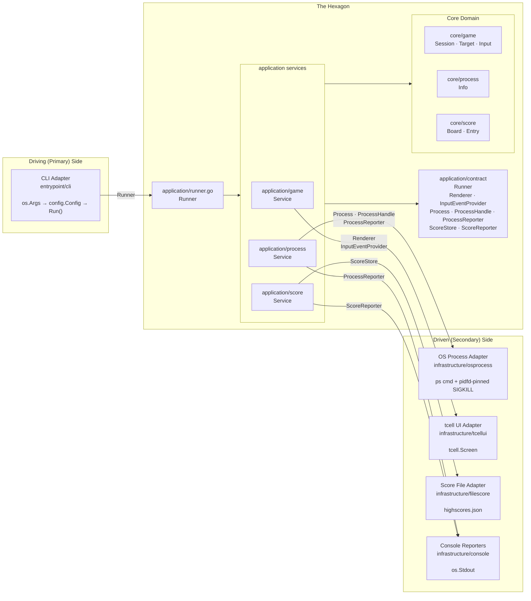
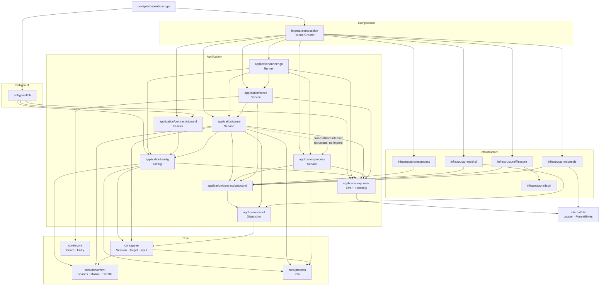

# Hexagonal Architecture — Design Record for pidshooter

*Originally a migration proposal (2026-06-26). Migration completed 2026-07-01. Further refactoring completed 2026-07-06: `domain` → `core`, `adapter` → `infrastructure`/`entrypoint`, `app` → `application`, port interfaces moved to `application/contract`. A second round of refactoring completed 2026-08-20: `Game` → `Session`, the inbound port renamed `GamePlay`/`Play()` → `Runner`/`Run()`, the single `GameService` split into three focused services (`application/game`, `application/process`, `application/score`) composed by a top-level `application.Runner`, and `outbound.Process` renamed `ProcessManager`. A third round completed 2026-09-22, covering a full pass over every open review finding (see `docs/leftovers.md`): the composition root moved out of `main.go` into its own `internal/composition` package, `outbound.ProcessManager`'s `Lister`/`Killer` split was superseded by a single PID-pinning `Process`/`ProcessHandle` pair, `outbound.ProcessReporter`/`ScoreReporter` ports replaced direct `fmt.Printf` calls, `cobra` was removed in favor of hand-rolled flag parsing, a structured `apperror` package now classifies every error by code and severity, and several domain-safety and naming fixes landed in `core/game`/`core/score`. Sections 3–9 and 14 describe this current, live codebase. Sections 2, 10, and 11 document the original pre-refactor state and the reasoning behind the 2026-07 migration — kept as a design record. Section 13 documents the 2026-08 changes and section 14 documents the 2026-09 changes the same way.*

---

## Contents

1. [What hexagonal architecture means here](#1-what-hexagonal-architecture-means-here)
2. [Previous architecture: what works and what leaks](#2-previous-architecture-what-works-and-what-leaks)
3. [The three layers](#3-the-three-layers)
4. [Conceptual diagram](#4-conceptual-diagram)
5. [Package structure](#5-package-structure)
6. [Component-by-component mapping](#6-component-by-component-mapping)
7. [Port interfaces (contracts)](#7-port-interfaces-contracts)
8. [Detailed package dependency graph](#8-detailed-package-dependency-graph)
9. [Composition root](#9-composition-root)
10. [What changed and why](#10-what-changed-and-why)
11. [Migration path](#11-migration-path)
12. [Trade-offs](#12-trade-offs)
13. [Further refactoring: service decomposition (2026-08)](#13-further-refactoring-service-decomposition-2026-08)
14. [Further refactoring: ports hardening & composition split (2026-09)](#14-further-refactoring-ports-hardening--composition-split-2026-09)

---

## 1. What hexagonal architecture means here

Hexagonal architecture (Ports & Adapters, Alistair Cockburn, 2005) separates software into three concentric zones:

| Zone | Responsibility | Rule |
|---|---|---|
| **Domain** | Business logic — what the application *is* | No imports from outer layers; no infrastructure |
| **Ports** | Contracts — what the domain *needs* or *exposes* | Interfaces only, owned by the application layer |
| **Adapters** | Infrastructure — how the world *connects* to the domain | Implements ports; imports libraries and OS APIs |

The "hexagon" is just the domain + its port interfaces. Everything outside is an adapter. There is no hexagonal shape; the name refers to the six notional faces Cockburn drew to show multiple interchangeable adapters around a single core.

Two kinds of adapters:

- **Driving (primary)** — they initiate action: the CLI parses `os.Args` and calls into the application.
- **Driven (secondary)** — they are called by the application service: OS process discovery, tcell rendering, JSON score storage.

---

## 2. Previous architecture: what works and what leaks

### What already followed the pattern

- `process.Finder` and `process.Info` were interfaces — `finder` was already an unexported implementation detail.
- `internal/testutil` existed for test doubles, meaning the seams were already being felt.
- `runner.go` separated the orchestration concern from `main.go`.
- `score`, `game`, and `process` were in distinct packages with clear responsibility labels.

### Where infrastructure leaked into the domain

| Location | Leak |
|---|---|
| `game/target.go: Kill()` | Called `os.FindProcess` + `syscall.SIGKILL` directly — the OS syscall was inside a domain entity |
| `game/loop.go: render()` | Called `tcell.Screen.SetContent` directly — rendering technology was baked into game logic |
| `game/loop.go: init()` | Created `tcell.NewScreen()` inside the game — screen lifecycle was the game's problem |
| `game/loop.go: run()` | Polled `g.screen.PollEvent()` inside the game loop — input source was hardwired |
| `score/score.go` | Called `os.ReadFile` / `os.WriteFile` directly — persistence technology was inside a domain type |

These were typical for a first implementation. Extracting each concern makes it independently testable and swappable without touching game logic.

---

## 3. The three layers

### Layer 1 — Core domain

Pure Go. No imports except the standard library and other core packages. Contains the game's invariants, entities, and value objects. Nothing in `core` imports `internal/util`, `application`, or `infrastructure` — confirmed zero outward edges.

- **`core/game`** — `Session`, a pure state machine (targets via an internal `roster`, `lifecycle` state, `timer`, `confirmation`, `throttle`); `Target` entity, holding `process.Info` and `movement.Motion` as ordinary **named** fields (not embedded — deliberately, so neither type's methods or fields are promoted onto `Target`; see §14 for why); `State` enum (`Alive`/`Killing`/`Fleeing`/`Dead`); and `Input`, the intent-level gateway (`OnQuit`, `OnYes`, `OnClickAt`, …) the application layer's event dispatcher calls into.
- **`core/movement`** — `Vector`, `Motion`, `Bounds`, `Throttle`, `speed` — pure physics/speed value objects, used by `core/game`.
- **`core/process`** — `Info` struct (`PID`, `Name`, `Rss`, `UID`), `Info.IsProtected()`/`IsKillableBy()`, `Find()`, and the `Validate*` family (`ValidateProcesses`, `ValidateName`, `ValidatePatterns`).
- **`core/score`** — `Board`, `Entry`, ranking logic (`Entry.beats`, `Entry.isScore`). There is no separate `Tracker` type here any more — per-session kill/failure/dud bookkeeping during a live game (`killTracker`) is an `application/game`-level concern now, not a domain type; `core/score` only knows about persisted, ranked `Entry` values.

The core domain contains **no port interfaces**. It exposes data types that the contracts in `application/contract` reference. This keeps import cycles impossible: core never imports application or infrastructure.

### Layer 2 — Application service

One layer above the core. Defines the port interfaces (contracts) and implements the use-case: given a configuration, find processes, run a game, persist the score. Responsibility is split across three focused services, composed by one top-level `Runner`, plus two small cross-cutting packages (`apperror`, `config`) shared by everything above `core`.

- **`application/config`** — `Config` struct (`Patterns`, `ConfirmMode`, `Speed`, `TimeLimit`, `IncludeRoot`) and its `Validate()`. Lives in its own package now, not on the `inbound` port — `inbound.Runner.Run` takes a `config.Config` directly.
- **`application/apperror`** — `Code`/`Severity` enums, an `Error` type carrying both, and `Handle(err)`, the single place that decides whether an error is logged-and-swallowed (`Warning`/`Error` severity) or returned up to the caller (`Fatal`). Every application-layer failure is classified through this, so `entrypoint/cli` never has to know *why* an error is fatal, only that `Handle` already decided.
- **`application/contract/inbound/runner.go`** — `Runner` interface only (`Run(cfg config.Config) error`).
- **`application/contract/outbound/*.go`** — `Renderer`, `InputEventProvider`, `Process`/`ProcessHandle`, `ProcessReporter`, `ScoreStore`, `ScoreReporter` interfaces and their mirror data types (`FrameViewState`, `ProcessInfo`, `ScoreBoard`, `ScoreSummary`, …). Full source in §7.
- **`application/input`** — `Dispatcher`, translating raw `EventDispatcher` values (`ClickEvent`, `QuitEvent`, `ConfirmEvent`, `SpeedEvent`) into calls on `core/game.Input`. (Renamed from `application/event` — the package now holds the event *types* themselves, not just the dispatcher, so `event` stopped fitting.)
- **`application/game`** — `Service`, owning the game loop (`Play`): spawns a `core/game.Session`, ticks it at 20 FPS, dispatches input, verifies and applies kill results via its own unexported `processKiller` interface, and waits (up to a bounded grace period) for any kill still in flight when the session stops before returning. Also owns `killTracker` — the live, per-session score/failure/dud bookkeeping — and the pure `converter.go` mapping functions that build `outbound.FrameViewState` each tick. Knows nothing about score persistence.
- **`application/process`** — `Service`, owning process discovery (`FindProcesses`, reporting the match count via an injected `outbound.ProcessReporter`) and verified termination (`Kill`, pinning the target PID before re-verifying its name to close the discovery-to-kill TOCTOU window).
- **`application/score`** — `Service`, owning score board load/record/report, reporting results via an injected `outbound.ScoreReporter` instead of printing directly.
- **`application/runner.go`** — `Runner` struct (top-level `application` package), implementing `inbound.Runner`. Takes three *already-constructed* collaborators (`NewRunner(processSvc *process.Service, scoreSvc *score.Service, gameSvc *game.Service)`) — it doesn't see a single raw outbound port itself, since each sub-service owns exactly the ports it needs. Orchestrates one full play: find processes → load score → play → record score → report results, with every failure routed through `apperror.Handle`.

### Layer 3 — Adapters

One directory per integration point. Adapters import libraries; the core domain never does.

**Infrastructure adapters** (driven — the application services call them):

| Adapter | Contracts it satisfies | Technology |
|---|---|---|
| `infrastructure/osprocess` | `Process`, `ProcessHandle` | `os/exec ps`, `os.FindProcess` (pidfd-backed on Linux 5.3+) |
| `infrastructure/tcellui` | `Renderer` (via `*TUI`), `InputEventProvider` (via the unexported `*inputEvents`, obtained through `TUI.InputEvents()`) | `github.com/gdamore/tcell/v2` |
| `infrastructure/filescore` | `ScoreStore` | `encoding/json`, `internal/infrastructure/fsutil` for atomic writes |
| `infrastructure/console` | `ScoreReporter`, `ProcessReporter` | `os.Stdout` |

`infrastructure` also holds `fsutil` — a leaf helper package, not an adapter: it implements no port, is never constructed at the composition root, and is imported by an adapter (`filescore`, for config-directory resolution and atomic file writes) rather than wired there directly. It's kept under `infrastructure/` rather than promoted to a top-level package like `internal/util`, specifically *because* it touches the filesystem — `internal/util` is safe for anything to import (even `core`, in principle) only because it's pure Go with no OS access; giving a filesystem-touching helper the same top-level standing would blur that signal and invite a future core→filesystem leak.

There is no adapter for the `Logger`-shaped diagnostic output any more. `internal/util.Logger` (`Warn`/`Error` to `os.Stderr`) is called directly by `apperror.Handle` — a deliberate, accepted exception to the port-boundary rule, since diagnostic output is cross-cutting and nobody swaps or asserts on it, unlike the score/process reporters above, which report core, business-meaningful output a test can reasonably want to assert on.

**Entrypoint adapters** (driving — they call the application's inbound port):

| Adapter | Contract it calls | Technology |
|---|---|---|
| `entrypoint/cli` | `Runner` (via a `runnerCreator` interface it declares itself) | `os.Args`, hand-rolled flag parsing (`flag.FlagSet` + a `flagSplitter`) — no third-party CLI framework |

---

## 4. Conceptual diagram



---

## 5. Package structure

```
pidshooter/
│
├── cmd/
│   └── pidshooter/
│       └── main.go                           # Thin entrypoint: builds composition.RunnerCreator + cli.Program, maps errors to exit codes — no wiring logic
│
└── internal/
    │
    ├── core/                                 # Pure domain — no infrastructure imports, no outward edges at all
    │   ├── game/
    │   │   ├── session.go                    # lifecycle enum (pending/running/stopped) · Config · Session (pure state machine) · NewSession() · Start() · Update() · IsRunning() · Stop()
    │   │   ├── timer.go                      # timer · newTimer(limitSeconds, now func() time.Time) — clock injected explicitly · Expired() · Remaining() · SecondsLeft()
    │   │   ├── confirmation.go               # confirmation · Pending() · Request() · Accept() · Cancel()
    │   │   ├── roster.go                     # roster · spawn() · move() · allDead() · hitAt() · available()
    │   │   ├── target.go                     # Target (named Info/Motion fields, not embedded) · State enum (Alive/Killing/Fleeing/Dead) · NewTarget() · Tag() · Update() · Kill() · Reap() · FireShot()/CeaseFire()
    │   │   └── input.go                      # Input (intent gateway) · NewInput() · OnQuit()/OnYes()/OnNo()/OnSpeedUp()/OnSpeedDown()/OnClickAt()
    │   ├── movement/
    │   │   ├── bounds.go                     # WindowSize · ChromeSize · Bounds · NewBounds() · bounce()
    │   │   ├── motion.go                     # Vector · Motion · NewMotion() · Move()
    │   │   ├── speed.go                      # speed (unexported) · newSpeed() · Current()/Lowest()/Set()
    │   │   └── throttle.go                   # Throttle · MinSpeed/MaxSpeed · NewThrottle() · Speed()/Increase()/Decrease()/ValidateSpeed()
    │   ├── process/
    │   │   └── info.go                       # Info struct · NewInfo() · IsProtected() · IsKillableBy() · Find() · ValidateProcesses()/ValidateName()/ValidatePatterns()
    │   └── score/
    │       ├── board.go                      # Board · NewBoard() (routes every entry through Add) · Add() · IsNewHighScore() · sortByRank() (sort.SliceStable)
    │       └── entry.go                      # Entry · beats() · isScore() (Kills>0 && FreedMem>=0 — filters hand-edited/corrupt data)
    │
    ├── application/
    │   ├── apperror/
    │   │   └── apperror.go                   # Code · Severity · Error · NewError() · Handle() — classifies and routes every application-layer failure
    │   ├── config/
    │   │   └── config.go                     # Config{Patterns, ConfirmMode, Speed, TimeLimit, IncludeRoot} · Validate()
    │   ├── contract/
    │   │   ├── inbound/runner.go             # Runner (interface)
    │   │   └── outbound/*.go                 # Renderer · InputEventProvider · Process/ProcessHandle/ProcessReporter · ScoreStore/ScoreReporter · NotFoundError/CorruptedDataError
    │   ├── input/
    │   │   ├── dispatcher.go                 # Dispatcher · NewDispatcher() · Dispatch()
    │   │   └── event.go                      # EventDispatcher (interface) · ClickEvent · QuitEvent · ConfirmEvent · SpeedEvent
    │   ├── game/
    │   │   ├── service.go                    # Service · NewService() · Play() · runLoop() · frameLoop() · awaitOutstandingKills() · killOrReap() · processKiller (consumer-defined interface)
    │   │   ├── kill_tracker.go               # killTracker · KillFailure · KillDud — live per-session bookkeeping
    │   │   └── converter.go                  # toFrameViewState() · toTargetViewState() · toHUDViewState() · toStatusViewState() · toConfirmViewState()
    │   ├── process/
    │   │   ├── service.go                    # Service{proc, reporter} · NewService() · FindProcesses() · Kill()
    │   │   └── converter.go                  # toProcessInfo() · toProcessInfos()
    │   ├── score/
    │   │   ├── service.go                    # Service{store, reporter} · NewService() · LoadScoreBoard() · RecordScore() · ReportResults()
    │   │   └── converter.go                  # ToEntry() · toBoard() · toScoreBoard() · toScoreSummary()
    │   └── runner.go                         # Runner{processSvc, gameSvc, scoreSvc} · NewRunner(processSvc, scoreSvc, gameSvc) · Run()
    │
    ├── composition/                          # The actual composition root — pure wiring, no behavior
    │   └── runner_creator.go                 # RunnerCreator · NewRunnerCreator() · Create() — builds every adapter and service, returns an inbound.Runner
    │
    ├── entrypoint/                           # Driving adapters — call the application's inbound.Runner port
    │   └── cli/
    │       ├── program.go                    # Program · NewProgram() · Run() · runnerCreator (interface) — hand-rolled flag parsing, no cobra
    │       ├── flag_splitter.go              # flagSplitter · split() — separates patterns from flags before flag.Parse
    │       └── error.go                      # ArgumentError
    │
    ├── infrastructure/                       # Driven adapters — implement outbound ports
    │   ├── console/
    │   │   ├── score_reporter.go             # ScoreReporter · NewScoreReporter()  (implements outbound.ScoreReporter)
    │   │   └── process_reporter.go           # ProcessReporter · NewProcessReporter()  (implements outbound.ProcessReporter)
    │   ├── filescore/
    │   │   └── file_score.go                 # fileScore · NewFileScore()  (implements outbound.ScoreStore) — schema-versioned JSON, atomic writes via fsutil
    │   ├── fsutil/
    │   │   └── fsutil.go                     # ConfigDir() · WriteFileAtomic() — shared leaf helper, no port, no adapter
    │   ├── osprocess/
    │   │   ├── process.go                    # process · NewProcess()  (implements outbound.Process) — ps-backed discovery
    │   │   └── process_handle.go             # processHandle  (implements outbound.ProcessHandle) — pins a pid across verify-then-kill
    │   └── tcellui/                          # implements outbound.Renderer (*TUI) and outbound.InputEventProvider (*inputEvents)
    │       ├── tui.go                        # TUI · NewTUI() · Init()/Cleanup()/WindowSize()/ChromeSize()/Render()/InputEvents()
    │       ├── input_events.go               # inputEvents (unexported) · Events() — returned by TUI.InputEvents(), shares TUI's poller
    │       ├── poller.go                     # poller · poll()/stop()/events()
    │       ├── renderer.go                   # renderer · render()/beginFrame()/drawFrame()/endFrame()
    │       ├── hud.go                        # hud · draw() and its text-budgeting helpers
    │       ├── statusbar.go                  # statusBar · draw()/text()/confirmPromptText()/playStatusText()
    │       ├── target.go                     # target (drawing helper, distinct from core/game.Target) · draw()
    │       ├── animation.go                  # killAnimation · fleeAnimation · frame()
    │       └── translator.go                 # translator · translateEvent() — tcell events → application/input event types
    │
    ├── testutil/
    │   ├── fake/                             # Test doubles for every outbound port + inbound.Runner + RunnerCreator
    │   ├── fixture/
    │   │   ├── game.go                       # Game()/ConfirmGameSession()/PendingConfirmGameSession() — *core/game.Session builders
    │   │   └── process.go                    # Process()/Processes() — core/process.Info builders
    │   └── helper/
    │       └── helper.go                     # UnsetEnv() — shared test env helper
    │
    └── util/
        ├── logger.go                          # Logger · Warn()/Error() to os.Stderr — called directly by apperror, not an adapter
        └── util.go                            # FormatBytes() — pure leaf
```

---

## 6. Component-by-component mapping

### Pre-refactor → July 2026

*(This table is a historical record of the original hexagonal migration. Column two reflects the codebase immediately after that migration, not today's structure — see §13 and §14 for what changed since.)*

| Pre-refactor location | July 2026 location | Change |
|---|---|---|
| `internal/domain/process/process.go` | `internal/core/process/process.go` | Package path renamed; `Info` changed from interface to struct |
| `internal/domain/game/game.go` | `internal/core/game/game.go` | Removed renderer/events/killer fields; pure state machine; added `KillRequest` |
| `internal/domain/game/loop.go` | `internal/core/game/loop.go` | `render()` → `Frame()`; `update()` → `Update(w,h)`; `killTarget()` → `CompleteKill()` |
| `internal/domain/game/event_handler.go` | `internal/core/game/event_handler.go` | Returns `*KillRequest` instead of calling killer directly |
| `internal/domain/game/motion.go` | Merged into `internal/core/game/target.go` | `Motion` struct removed; `Position`/`Velocity` are `Vector` fields on `Target` |
| `internal/domain/game/target.go` | `internal/core/game/target.go` | Updated imports; absorbed motion logic |
| `internal/domain/game/session.go` | `internal/core/game/session.go` | Updated package path |
| `internal/domain/game/ports/driven/` | `internal/application/contract/outbound.go` + `internal/core/game/frame.go` + `internal/core/game/input.go` | Interfaces moved to contract; data types stayed in core/game |
| `internal/domain/game/ports/driving/` | `internal/application/contract/inbound.go` | Moved to application/contract |
| `internal/domain/score/score.go` | `internal/core/score/score.go` | Updated package path |
| `internal/app/runner.go` | `internal/application/runner.go` | Owns the game loop; handles KillRequest two-phase kill |
| `internal/adapter/driven/osprocess/` | `internal/infrastructure/osprocess/` | Package path renamed |
| `internal/adapter/driven/tcellui/` | `internal/infrastructure/tcellui/` | Package path renamed |
| `internal/adapter/driven/jsonscores/` | `internal/infrastructure/scorefilestore/` | Package path renamed; file renamed |
| `internal/adapter/driving/cli/` | `internal/entrypoint/cli/` | Package path renamed; uses `contract.GameService`/`contract.Config` |
| `cmd/pidshooter/main.go` | `cmd/pidshooter/main.go` | Updated imports; `tcellui.New` returns one `*UI` for both Renderer+InputSource |

---

## 7. Port interfaces (contracts)

All port interfaces live in `application/contract`, split by direction into `inbound` and `outbound` subpackages. In Go, the consumer (the application layer) defines the interfaces it needs. Infrastructure adapters satisfy them via structural typing — no explicit import of `contract` is needed in the adapter packages.

### `application/contract/inbound/runner.go`

```go
package inbound

import "github.com/eirikur-ari/pidshooter/internal/application/config"

// Runner is an inbound port: the contract an inbound adapter calls.
type Runner interface {
    // Run executes with the given configuration, returning an error when something happens.
    Run(cfg config.Config) error
}
```

`Config` is no longer nested inside the `inbound` package — it's its own top-level `application/config` package, since both `entrypoint/cli` and `application/runner.go` need to build and validate one before a `Runner` even exists.

### `application/contract/outbound/process.go`

```go
package outbound

// ProcessInfo describes a single process discovered on the host.
type ProcessInfo struct {
    UID   int
    PID   int
    Rss   int64
    State string
    Name  string
}

// ProcessHandle references a specific process obtained via Process.Pin,
// pinning its identity so a later Kill call cannot be redirected to a
// different process that has since reused the same PID.
type ProcessHandle interface {
    Kill() error
    Release() error
}

// Process is the outbound port for process discovery and termination on the host.
type Process interface {
    Discover() ([]ProcessInfo, error)
    OwnPID() int
    OwnUID() int
    LookupName(pid int) (string, error)
    Pin(pid int) (ProcessHandle, error)
}

// ProcessReporter is the outbound port for reporting how many processes
// matched the requested search patterns.
type ProcessReporter interface {
    Report(count int, patterns []string)
}
```

This supersedes the August design's `Lister`/`Killer` split composed into `ProcessManager`. The single `Process` interface plus a separate `Pin`-returned `ProcessHandle` exists to close a real security gap: `Pin` obtains an OS handle to a PID *before* the caller re-verifies its name, so a PID recycled by the OS between verification and `Kill` can't be silently signaled in the original process's place (on Linux 5.3+, Go's stdlib transparently backs this with a pidfd; on macOS, the residual bare-PID-signaling window is a documented, accepted risk — see `osprocess.process.Pin`'s doc comment). `ProcessReporter` is new: `application/process.Service.FindProcesses` used to `fmt.Printf` its match count directly; it now reports through this port instead, implemented by `infrastructure/console`.

### `application/contract/outbound/score.go`

```go
package outbound

import "time"

type ScoreEntry struct {
    Kills    int
    Duds     int
    FreedMem int64
    Speed    float64
    Time     int
    Duration float64
    Date     time.Time
}

type ScoreBoard struct {
    Scores []ScoreEntry
}

// ScoreStore is the outbound port for persisting and retrieving the score board.
type ScoreStore interface {
    Load() (ScoreBoard, error)
    Save(board ScoreBoard) error
}

// ScoreSummary is the view representation of a session's outcome and the
// board's current high scores, for reporting via ScoreReporter.
type ScoreSummary struct {
    Kills        int
    Duds         int
    FreedMem     int64
    Duration     float64
    NewHighScore bool
    Entries      []ScoreEntry
}

// ScoreReporter is the outbound port for reporting session results and the high score table to the user.
type ScoreReporter interface {
    Report(summary ScoreSummary)
}
```

`ScoreReporter` is new since August: `application/score.Service` used to print the game-over summary and high-score table itself; that's now `infrastructure/console.ScoreReporter`'s job.

### `application/contract/outbound/ui.go`

```go
package outbound

type FrameViewState struct {
    Targets   []TargetViewState
    HUD       HUDViewState
    StatusBar StatusViewState
}

type TargetViewState struct {
    X, Y              int
    Tag               string
    Killing           bool
    Fleeing           bool
    AnimationProgress float64
}

type HUDViewState struct {
    FreedMem  int64
    Kills     int
    HighScore int
}

type StatusViewState struct {
    Alive      int
    Speed      float64
    TimeLeft   *int // nil if untimed
    Confirming *ConfirmViewState
}

type ConfirmViewState struct {
    PID  int
    Name string
}

type WindowSize struct{ Width, Height int }
type ChromeSize struct{ Top, Bottom int }

// Renderer is the outbound port for rendering.
type Renderer interface {
    Init() error
    Cleanup()
    WindowSize() WindowSize
    ChromeSize() ChromeSize
    Render(state FrameViewState)
}
```

Every one of these view-state types now uses the `ViewState` suffix consistently (`FrameState`/`HUDState`/`StatusState` were renamed from bare `State` — see §14). `StatusViewState` also collapsed what used to be two `int` fields (`TimeLimit`, `TimeLeft`, with a "meaningful only when `TimeLimit > 0`" precondition) into a single `TimeLeft *int`, nil meaning untimed — matching `Confirming`'s existing nilable-pointer idiom in the same struct.

### `application/contract/outbound/input.go` and `error.go`

```go
package outbound

import "github.com/eirikur-ari/pidshooter/internal/application/input"

// InputEventProvider is the outbound port for user input events.
type InputEventProvider interface {
    Events() <-chan input.EventDispatcher
}
```

```go
package outbound

// NotFoundError indicates the requested resource does not exist.
type NotFoundError struct{}

func (NotFoundError) Error() string { return "not found" }

// CorruptedDataError indicates persisted data was retrieved successfully
// but could not be parsed as valid data.
type CorruptedDataError struct {
    Message string
}

func (e CorruptedDataError) Error() string { /* ... */ return e.Message }
```

`InputEventProvider` is the August design's `InputSource` renamed to match `application/input` (renamed from `application/event`). `NotFoundError`/`CorruptedDataError` are sentinel value-type errors any `ScoreStore`/`Process` implementation can return, matched via `errors.As` — they didn't exist as ported error types in August; store/process failures were plain wrapped errors.

### `application/runner.go` — wires the three services

```go
package application

type Runner struct {
    processSvc *process.Service
    gameSvc    *game.Service
    scoreSvc   *score.Service
}

func NewRunner(processSvc *process.Service, scoreSvc *score.Service, gameSvc *game.Service) *Runner {
    return &Runner{processSvc: processSvc, gameSvc: gameSvc, scoreSvc: scoreSvc}
}

func (r *Runner) Run(cfg config.Config) error {
    if err := cfg.Validate(); err != nil {
        return err
    }
    processes, err := r.processSvc.FindProcesses(cfg.Patterns, cfg.IncludeRoot)
    if err != nil {
        return apperror.Handle(err)
    }
    board, highScore, loadErr := r.scoreSvc.LoadScoreBoard()
    if err := apperror.Handle(loadErr); err != nil {
        return err
    }
    result, err := r.gameSvc.Play(cfg, processes, highScore)
    if err != nil {
        return apperror.Handle(err)
    }
    r.logKillFailures(result.KillFailures)
    r.logDuds(result.Duds)
    entry := score.ToEntry(result, cfg.TimeLimit)
    if err := apperror.Handle(r.scoreSvc.RecordScore(board, entry, loadErr)); err != nil {
        return err
    }
    r.scoreSvc.ReportResults(result.Duration, result.Kills, len(result.Duds), result.FreedMem, board)
    return nil
}
```

The August version of `NewRunner` took four raw outbound ports (`processMgr`, `store`, `renderer`, `events`) and built `process.Service`/`game.Service`/`score.Service` internally. That construction now happens at the composition root instead (§9); `NewRunner` takes the three already-built services directly, so it never touches a raw port itself, and every failure routes through `apperror.Handle` rather than being returned bare.

### `application/game/service.go` — the game loop

```go
package game

const frameDuration = time.Second / 20
const defaultKillGracePeriod = 5 * time.Second

// processKiller is declared by application/game itself — process.Service
// satisfies it structurally, so application/game never imports application/process.
type processKiller interface {
    Kill(pid int, name string, protected bool) (shouldReap bool, err error)
}

type Service struct {
    killer          processKiller
    renderer        outbound.Renderer
    events          outbound.InputEventProvider
    killGracePeriod time.Duration
}

func (s *Service) Play(cfg config.Config, processes []process.Info, highScore int) (PlayResult, error) {
    session := game.NewSession(processes, game.Config{Confirm: cfg.ConfirmMode, Speed: cfg.Speed, TimeLimit: cfg.TimeLimit})
    tracker := newKillTracker(highScore)
    endTime, err := s.runLoop(session, tracker)
    // ... build and return PlayResult
}

func (s *Service) frameLoop(session *game.Session, tracker *killTracker, dispatcher *input.Dispatcher, termSignal <-chan struct{}, done <-chan struct{}) error {
    // 20 FPS ticker loop: applyKillSignals, drainEventQueue (spawns killOrReap
    // goroutines), session.Update, renderer.Render, then select on the ticker
    // or termSignal (which calls session.Stop() from this same goroutine —
    // no separate signal-handling goroutine touches Session concurrently).
    // On exit, awaitOutstandingKills blocks (up to killGracePeriod) for any
    // still-in-flight kill so it isn't lost from the score.
}
```

The shape is close to August's, with three additions: `killGracePeriod`-bounded shutdown draining (`awaitOutstandingKills`, so a kill that lands right as the session stops isn't silently dropped), the `processKiller` interface's `Kill` signature gained a `protected bool` argument (root-owned/PID-≤1 process protection, threaded from `core/process.Info.IsProtected`/`IsKillableBy`), and the OS-signal watcher (`registerTermSignalWatcher`) funnels its signal into `frameLoop`'s own `select` rather than a separate goroutine calling `Session.Stop()` — `core/game.Session`'s lifecycle field is a plain, non-atomic value as a result (see §14).

---

## 8. Detailed package dependency graph

Arrows point in the direction of the import (`A → B` means A imports B).



**Key property:** the core packages (`core/game`, `core/movement`, `core/process`, `core/score`) have no arrows pointing *outward* at all — not even to `internal/util`. Dependency only flows inward toward the core. `application/game` and `application/process` still have no arrows *between each other* — the dotted edge is not an import, it is `application/game` declaring a `processKiller` interface that `application/process.Service` happens to satisfy structurally. New since August: `internal/composition` is the actual composition root (§9) — `main.go` now only imports `composition` and `cli`, nothing else.

**Why contracts live in application, not core:** Placing interface definitions in `application/contract` (rather than in the domain packages they reference) avoids a dependency inversion problem: if `core/game` defined `Renderer`, it would need to know about `FrameViewState` (fine, it already does conceptually), but any package importing `core/game` for the interface would also pull in the rendering contract. Keeping contracts in `application/contract` makes the application the single point of assembly.

---

## 9. Composition root

In hexagonal architecture the composition root is not logic — it is wiring. As of the 2026-09 refactor, that wiring lives in its own package, `internal/composition`, rather than in `main.go` directly — `main.go` is now just two calls deep.

```go
// cmd/pidshooter/main.go
package main

func main() {
    err := run()
    os.Exit(exitCode(err))
}

func run() error {
    creator := composition.NewRunnerCreator()
    program := cli.NewProgram(creator)
    return program.Run(os.Args[1:])
}
```

```go
// internal/composition/runner_creator.go
package composition

// RunnerCreator constructs the application.Runner and every outbound
// adapter it needs.
type RunnerCreator struct{}

func NewRunnerCreator() RunnerCreator { return RunnerCreator{} }

// Create builds a Runner, along with every adapter it depends on.
func (RunnerCreator) Create() (inbound.Runner, error) {
    proc, err := osprocess.NewProcess()
    if err != nil {
        return nil, err
    }
    store, err := filescore.NewFileScore()
    if err != nil {
        return nil, err
    }
    screen, err := tcell.NewScreen()
    if err != nil {
        return nil, fmt.Errorf("failed to create screen: %w", err)
    }
    ui := tcellui.NewTUI(screen)

    processSvc := process.NewService(proc, console.NewProcessReporter())
    scoreSvc := score.NewService(store, console.NewScoreReporter())
    gameSvc := game.NewService(processSvc, ui, ui.InputEvents())

    return application.NewRunner(processSvc, scoreSvc, gameSvc), nil
}
```

`entrypoint/cli.Program` never imports `internal/composition` directly — it depends on a small `runnerCreator interface { Create() (inbound.Runner, error) }` it declares itself, and `Create()` is only called once argument parsing and `config.Config` validation have both already succeeded (`Program`'s own doc comment states this explicitly), so a fallible or expensive construction (opening the terminal screen, resolving the score file path) never runs for `--help`, a parse error, or a rejected configuration.

This split — `composition.RunnerCreator` doing all adapter/service construction, `main.go` doing nothing but wiring `composition` to `cli` and mapping the result to an exit code — was itself the subject of a design discussion during the 2026-09 pass: `RunnerCreator.Create()` must stay pure wiring with no behavioral decisions (see §14's note on `Renderer.Init`/`Cleanup` ownership, which was deliberately kept *out* of this file for exactly that reason).

---

## 10. What changed and why

### `Game` becomes a pure state machine

Originally `Game` held a `renderer game.Renderer`, `events game.EventSource`, and `killer game.ProcessKiller` and drove its own loop via `Play()`. This created an import-cycle risk: the domain owned the port interfaces, and infrastructure would import those ports from the domain.

The solution (Option 2 / "functional core, imperative shell"): `Game` contains only pure state. The application layer (`runner.go`) owns the loop, drains the event channel, calls the OS killer, and feeds the result back into the game via `CompleteKill()`.

**Kill flow (two-phase):**
1. `g.HandleEvent(ev)` returns `*KillRequest{Target}` — pure state change, no side effect
2. Application layer calls `s.killer.Kill(pid, name)` — OS side effect
3. On success: `g.CompleteKill(target)` — transitions target to Killing, records session stats
4. On failure: nothing — target stays Alive; no animation, no score credit

**Render flow:** `g.Frame()` returns a pure data snapshot; `s.renderer.Render(frame)` draws it.

### `motion.go` merged into `target.go`

The original design had a separate `Motion` struct. After the refactor, position and velocity are `Vector` fields directly on `Target`. The motion update logic lives in `Target.Update()`. This reduced file count without losing clarity since position/velocity are intrinsic to a target entity.

### `process.Info` changed from interface to struct

Originally `process.Info` was an interface with `Pid()`, `Name()`, `Rss()` accessor methods. It is now a plain struct with exported fields (`Pid int`, `Name string`, `Rss int64`). This simplification removes the need for a concrete implementation type (`osprocess.proc`) and lets test code construct `process.Info` literals directly without a constructor.

### Port interfaces moved from domain to application

The pre-refactor design placed port interfaces in `domain/game/ports/driven/` and `domain/game/ports/driving/`. The current design places them all in `application/contract/`. This means:
- Core packages have zero interface definitions → easier to reason about dependencies
- `application/contract` is the single authoritative location for "what does the game need from the outside world?"
- Infrastructure adapters satisfy contracts via Go's structural typing — no explicit import of `application/contract` needed in adapters

### Score I/O extracted to `scorefilestore` adapter

`score.Board` no longer calls `os.ReadFile` / `os.WriteFile`. File operations live in `infrastructure/scorefilestore`, which implements `contract.Store`. `Board` keeps ranking and high-score logic only.

### Event loop decoupled from tcell

`infrastructure/tcellui.UI` owns the poll goroutine. It delivers `outbound.InputEvent` values on a buffered channel. The game loop only sees `outbound.InputEvent` — no `tcell.EventMouse` or `tcell.EventKey`.

---

## 11. Migration path

The migration was done in stages, each with a passing test suite at the end.

```
Step 1  Extract ScoreStore interface
        Moved file I/O out of score.Board into scorefilestore adapter.

Step 2  Extract ProcessKiller interface
        Removed Kill() from Target. Added ProcessKiller interface.
        Moved os.FindProcess + syscall to osprocess adapter.

Step 3  Extract EventSource interface
        Defined game.InputEvent sealed interface.
        Moved PollEvent goroutine to tcellui.EventSource adapter.

Step 4  Extract Renderer interface
        Defined Renderer interface with Render(Frame) / Size() / Init() / Cleanup().
        Implemented tcellui.Renderer wrapping tcell.Screen.

Step 5  Reorganise packages
        domain/ → core/
        app/ → application/
        adapter/driven/ → infrastructure/
        adapter/driving/ → entrypoint/
        domain/game/ports/ → application/contract/ (interfaces) + core/game/ (data types)

Step 6  Pure state machine (Option 2)
        Removed renderer/events/killer fields from Game.
        Game loop moved entirely to application/runner.go.
        HandleEvent() returns *KillRequest instead of calling killer.
        CompleteKill() is the callback when the OS kill succeeds.

Step 7  Merge motion.go into target.go
        Motion struct removed; Vector fields on Target.

Step 8  Simplify process.Info
        Info changed from interface to struct.
        Removed osprocess.proc concrete implementation.
```

---

## 12. Trade-offs

### Benefits

- **Independent testability** — every layer can be tested in isolation. Core tests need no tcell, no OS, no file system.
- **Swappable adapters** — a new terminal library, a `/proc` reader, or SQLite score storage each require only one new adapter.
- **Clear dependency rule** — `grep -r "tcell" internal/core` must return nothing. The build enforces the architecture.
- **Functional core** — `Session.Update()` and the `Target`/`roster` methods it calls are pure state transitions. No side effects in the domain.
- **Thinner composition root** — as of 2026-09, `main.go` doesn't even do the wiring itself any more; `internal/composition` does, and `main.go` is two function calls and an exit-code map.
- **Focused services** (since the 2026-08 split) — `application/game`, `application/process`, and `application/score` each have one reason to change. `application/game` can be read and tested without knowing scoring or OS process termination exist.

### Costs

- **More packages** — the structure is deeper. For a project of this size that overhead is real.
- **Two-phase kill adds indirection** — a reader following a bug from click to process exit now crosses more lines: `Dispatcher.Dispatch` returns a `*Target`, a goroutine calls `killer.Kill`, and the result comes back on a channel consumed by `applyKillSignal`. Naming and tests compensate.
- **Frame allocation each tick** — building an `outbound.FrameViewState` value at 20 FPS adds a small allocation. Imperceptible, but not free.
- **Consumer-defined interface adds one more seam** — `application/game`'s unexported `processKiller` interface exists purely to keep `application/game` from importing `application/process`. It's one more indirection to trace when reading `drainEventQueue`, in exchange for a real compile-time guarantee that the two packages don't depend on each other.

---

## 13. Further refactoring: service decomposition (2026-08)

This section is a design record for the second refactoring pass, done incrementally across an interactive session in August 2026, on top of the July hexagonal migration described in sections 2–11 above.

### `Game` → `Session`

`core/game.Game` was renamed `Session`. `Game` was never a game in itself — it's the state machine for *one play-through* — so `Session` describes it more accurately and reads correctly as `game.Session`. `New` became `NewSession` (avoiding stutter while still being explicit at the call site), and `Step` became `Update` (the conventional name for a per-frame simulation advance, matching engines like Unity, and distinct from `IsRunning()` so the two don't read as a pair of predicates). The source file `game.go` was renamed `session.go` to match.

### The inbound port: `GamePlay` → `Runner`

The single-method inbound interface was renamed from `GamePlay`/`Play(cfg GamePlayConfig) error` to `Runner`/`Run(cfg Config) error`. `GamePlayConfig` became plain `Config` — the `inbound` package qualifier (`inbound.Config`) already disambiguates it from `core/game.Config`, so the prefix was redundant. `Runner` follows the same `-er` convention as `io.Reader`/`io.Closer`: a type named after what it *does*, satisfied by a type that performs the action named by its single method.

### One `GameService` → three focused services

The original `application/service.GameService` did everything: process discovery, the game loop, kill verification, and score board load/record/print, all behind one `Play` method. This was split into three services, each in its own subpackage, each with zero knowledge of the other two's persistence or OS concerns:

- **`application/game.Service`** — owns the game loop only. `Play(cfg, processes, tracker) (PlayResult, error)` takes already-discovered processes and an already-loaded `*score.Tracker` as parameters, and returns a `PlayResult{Duration, LowestSpeed}` instead of touching a score store directly.
- **`application/process.Service`** — owns `FindProcesses` and `Kill` (verify-then-terminate). `Kill` returns `(killed, shouldReap bool, err error)` instead of the old sentinel-error (`errAlreadyKilled`) pattern, so callers don't need to `errors.Is` against an error only meaningful within the old single service.
- **`application/score.Service`** — owns `LoadScoreBoard`, `RecordScore`, and the package-level `PrintResults`.
- **`application.Runner`** (top-level `application` package, `runner.go`) — constructs all three and orchestrates one full play: find processes → load score board → play → record score → print results. This is the logic that used to live inside `GameService.Play`.

`application/game` and `application/process` do not import one another. `application/game` declares its own minimal `killer` interface (`Kill(target *game.Target) (killed, shouldReap bool, err error)`) for the one thing it needs mid-loop — verifying and terminating a clicked target's OS process — and `process.Service` satisfies it structurally, with no import required in either direction. Score, by contrast, needed no such interface: `LoadScoreBoard`/`RecordScore` are called strictly *before* and *after* `Play`, not during it, so `Runner` can bookend the call entirely from outside `application/game` — a cleaner decoupling than `process.Kill`'s live, per-frame dependency allowed.

### `outbound.Process` → `ProcessManager`

The outbound port for OS process discovery/termination was renamed from `Process` to `ProcessManager`. "Process" was overloaded three ways in the codebase — the outbound port, `core/process.Info` (a process data record), and the new `application/process` package — and the port specifically *manages* processes (lists and kills them via the embedded `Lister`/`Killer`), which `ProcessManager` names directly.

### Component mapping: July structure → August structure

| July 2026 location | August 2026 location | Change |
|---|---|---|
| `core/game/game.go: Game` | `core/game/session.go: Session` | Renamed; `New` → `NewSession`, `Step` → `Update` |
| `application/contract/inbound.go: GamePlay, GamePlayConfig` | `application/contract/inbound/runner.go: Runner, Config` | Renamed; split into its own file |
| `application/contract/outbound.go: Process` | `application/contract/outbound/process.go: ProcessManager` | Renamed |
| `application/service/game.go: GameService` | `application/game/service.go: Service` + `application/process/service.go: Service` + `application/score/service.go: Service` + `application/runner.go: Runner` | Split into three services + one composing `Runner` |
| `application/service/converter.go` | `application/game/converter.go` + `application/process/converter.go` + `application/score/converter.go` | Split by which service consumes each converter function |
| `application/service/validation.go` | `application/process/validation.go` | Moved wholesale — validation was always process-specific |
| n/a | `internal/application/event/dispatcher.go` (renamed from `input.go`) | File renamed to match the type it defines (`Dispatcher`) |

---

## 14. Further refactoring: ports hardening & composition split (2026-09)

This section is a design record for the third refactoring pass: a full review of every open finding accumulated across `docs/cli-findings.md`, `docs/code-review.md`, `docs/fable-review.md`, and `docs/security-issues.md`, consolidated into `docs/leftovers.md` and worked through end to end on the `review-old-findings` branch. That document still holds the finding-by-finding detail (evidence, exact reasoning, regression tests); this section summarizes the architectural shape of what changed and why, at the same level of detail as §13.

### The composition root moved out of `main.go`

`cmd/pidshooter/main.go` no longer constructs a single adapter or service. All of that moved into a new `internal/composition` package (`RunnerCreator.Create()`), which `main.go` calls through a two-line `run()`. This wasn't done in isolation — it was a deliberate consequence of confirming that `RunnerCreator.Create()`'s job is *only* wiring, with no behavior of its own. That distinction mattered directly for a separate decision (below): where `Renderer.Init`/`Cleanup` should be called from.

### `outbound.ProcessManager`'s `Lister`/`Killer` split → `Process`/`ProcessHandle`

August's `ProcessManager` embedded two smaller interfaces, `Lister` (`List`, `OwnPid`) and `Killer` (`LookupName`, `Kill`). That's gone: `Process` (`Discover`, `OwnPID`, `OwnUID`, `LookupName`, `Pin`) is one interface, and `Pin` returns a separate `ProcessHandle` (`Kill`, `Release`). The real motivation was closing a TOCTOU security gap: pinning an OS handle to a PID *before* re-verifying its name means a PID recycled between verification and kill can't be silently redirected — the old `Killer.Kill(pid int)` re-resolved the PID at kill time with no such pinning. `OwnUID` and root-owned-process filtering (`core/process.Info.IsKillableBy`, a new `--include-root` flag) were added in the same pass, addressing a "no safeguard against running as root" finding.

### `ProcessReporter` and `ScoreReporter` ports replace direct printing

`application/process.Service.FindProcesses` used to `fmt.Printf` its match count directly, and `application/score.Service` used to print the game-over summary and score table itself — both bypassing every outbound port, unlike everything else the application layer does. Both are now injected ports (`outbound.ProcessReporter`, `outbound.ScoreReporter`), implemented by the new `infrastructure/console` package. Getting this right took an actual design discussion (worth recording, since it generalizes): the litmus test settled on was *would a test plausibly want to assert on this, or could it plausibly need a different backend* — if yes, it earns a port (`ProcessReporter`/`ScoreReporter` both did); if it's cross-cutting diagnostic output nobody swaps or asserts on, it doesn't need one and can stay a direct call, which is why `apperror.Handle`'s `Warn`/`Error` output through `internal/util.Logger` was deliberately *not* ported. `application/process.Service.FindProcesses` itself ended up owning the `ProcessReporter` call directly (not `Runner`, which was tried and reverted) — the report is squarely process-discovery's own business, and giving `Runner` a raw port to hold added nothing.

### `Target` no longer embeds `process.Info`/`movement.Motion`

`core/game.Target` used to embed both types anonymously, which promoted their fields *and methods* onto `Target` itself — including `Motion.Move(bounds, speed, tagWidth)`, fully bypassing the `State`-gated movement `Target.Update()` was supposed to be the only path through. Any code holding a `*Target` could call `target.Move(...)` directly and reposition a `Dead`/`Killing`/`Fleeing` target, unguarded. The fix was to convert both to ordinary named fields (`Info process.Info`, `Motion movement.Motion`) rather than shadow the promoted method with a same-named one — shadowing was tried first and rejected as too fragile (it silently depends on two methods staying named identically forever, with no compiler error if that drifts). Named fields make the unwanted surface a compile error instead of a convention: `target.Move(...)`/`target.PID`/`target.Position` simply don't exist as expressions any more; callers go through `target.Info.PID` / `target.Motion.Position` explicitly, or through `Target`'s own gated methods.

### `core/game/lifecycle.go` removed; `sync/atomic` dropped from `core`

`Session.state` used to be an `atomicLifecycle` wrapping `atomic.Int32`, justified by a signal-handling goroutine that called `Session.Stop()` concurrently with the frame loop's own reads. Tracing the actual current call sites showed that goroutine no longer exists — `application/game/service.go`'s `frameLoop` already funnels the OS-signal channel into its own single-goroutine `select` and calls `Stop()` synchronously from there, so there was no concurrent access left to guard against (confirmed with `go test -race`, before and after). `lifecycle`'s type and consts moved into `session.go` (the only file that uses them) and `Session.state` is now a plain field.

### `timer` takes its clock explicitly

`core/game.timer` used to default `now func() time.Time` to `time.Now` lazily inside `Start()`/`Remaining()`, and tests reached in to overwrite `now`/`start` as unexported fields after construction. `newTimer(limitSeconds int, now func() time.Time)` now requires the clock as a constructor argument; a `nil` clock is no longer a reachable state, so the lazy-default branches were deleted. Tests inject a small `fakeClock` (`now()`, `advance(d)`) instead of mutating fields post-construction. The tick-driven alternative (route a time delta through `Session.Update` instead of injecting a clock function at all) was considered and rejected as disproportionate to the finding — it would have meant changing `Session.Update`'s public signature and moving wall-clock reads into the frame loop, for a problem that was really about one constructor.

### View-state naming and `StatusViewState` idiom

`outbound.FrameState`/`HUDState`/`StatusState` were renamed to `FrameViewState`/`HUDViewState`/`StatusViewState`, converging on `ViewState` (the form `TargetViewState`/`ConfirmViewState` already used) rather than the majority `State` — `core/game` already has its own domain `State` type (`Alive`/`Killing`/`Fleeing`/`Dead`), and a bare `*State` name on a rendering value risked reading as a reference to that unrelated concept. Separately, `StatusViewState.TimeLimit`/`TimeLeft` (two `int`s, with a "meaningful only when `TimeLimit > 0`" precondition) collapsed into one `TimeLeft *int` — nil meaning untimed — matching `Confirming *ConfirmViewState`'s existing nilable-pointer idiom in the same struct.

### `core/score.Board` rejects non-scores and normalizes on load

`Board.Add` used to accept any `Entry`, including a zero-kill session (quitting instantly used to still create and persist a 0-kill scoreboard entry). `Entry.isScore()` (`Kills > 0 && FreedMem >= 0`) now gates both `Add` and `NewBoard` — `NewBoard` builds its board by routing every persisted entry through `Add`, so a hand-edited or corrupted-but-parseable score file gets filtered, ranked, and capped at load time instead of staying wrong until the next session's `Add`. `sortByRank` also switched from `sort.Slice` to `sort.SliceStable`, closing an unspecified-tie-order gap (never observed to actually misorder anything in this Go version, but no longer relying on that being true).

### `cobra` removed

`entrypoint/cli` no longer depends on `github.com/spf13/cobra`. Flag parsing is hand-rolled: a `flagSplitter` separates positional patterns from flags before handing the rest to the stdlib `flag.FlagSet`, since patterns and flags can otherwise intermix in a way `flag.Parse` alone can't disambiguate.

### `apperror` — structured, classified errors

Every application-layer error now carries a `Code` (what kind of failure) and a `Severity` (`Fatal`/`Error`/`Warning`/`Unknown`), wrapped in a single `apperror.Error` type. `apperror.Handle(err)` is the one place that decides whether a failure is logged-and-swallowed or returned up to the caller — `application/runner.go` routes essentially every call through it, and `entrypoint/cli` never has to re-derive severity from an error's shape.

### Component mapping: August structure → September structure

| August 2026 location | September 2026 location | Change |
|---|---|---|
| `cmd/pidshooter/main.go` (did all wiring) | `internal/composition/runner_creator.go: RunnerCreator` | Wiring extracted; `main.go` now just calls `composition.NewRunnerCreator()` |
| `application/contract/outbound/process.go: Lister, Killer, ProcessManager` | `application/contract/outbound/process.go: Process, ProcessHandle` | Split superseded by a single interface + a `Pin`-returned handle |
| `application/process/service.go` (printed match count directly) | `application/process/service.go` + `infrastructure/console/process_reporter.go: ProcessReporter` | Match-count reporting moved behind a new port |
| `application/score/service.go` (printed results directly) | `application/score/service.go` + `infrastructure/console/score_reporter.go: ScoreReporter` | Result reporting moved behind a new port |
| `application/event/` | `application/input/` | Renamed — the package now holds the event types too, not just the dispatcher |
| `application/contract/outbound.go: InputSource` | `application/contract/outbound/input.go: InputEventProvider` | Renamed to match `application/input` |
| `core/game/target.go: Target` (embeds `process.Info`, `movement.Motion`) | `core/game/target.go: Target` (named `Info`, `Motion` fields) | Un-embedded to stop promoting `Motion.Move` and `Info`'s fields |
| `core/game/lifecycle.go: atomicLifecycle` | `core/game/session.go: lifecycle` (plain field) | File removed; `sync/atomic` dropped from `core` entirely |
| `core/game/timer.go: newTimer(limitSeconds)` (lazy `time.Now` default) | `core/game/timer.go: newTimer(limitSeconds, now func() time.Time)` | Clock injected explicitly, required at construction |
| `application/contract/outbound/ui.go: FrameState, HUDState, StatusState` | `application/contract/outbound/ui.go: FrameViewState, HUDViewState, StatusViewState` | Renamed for suffix consistency |
| `application/contract/outbound/ui.go: StatusState.TimeLimit, TimeLeft int` | `application/contract/outbound/ui.go: StatusViewState.TimeLeft *int` | Two-int optional value collapsed into one nilable pointer |
| n/a (no sentinel error types) | `application/contract/outbound/error.go: NotFoundError, CorruptedDataError` | New value-type sentinel errors for `ScoreStore`/`Process` failures |
| n/a (plain errors, ad hoc severity handling) | `application/apperror/apperror.go: Code, Severity, Error, Handle()` | New package; classifies and routes every application-layer failure |
| `entrypoint/cli/cli.go` (cobra-based) | `entrypoint/cli/program.go` + `flag_splitter.go` | `cobra` removed; hand-rolled flag parsing |
| `infrastructure/scorefilestore/score_file_store.go` | `infrastructure/filescore/file_score.go` | Renamed; gained schema versioning and atomic writes |
| `infrastructure/stderrlog/stderrlog.go: Logger` | `internal/util/logger.go: Logger` (called directly, not an adapter) | Not ported — deliberate exception, see the `ProcessReporter`/`ScoreReporter` note above |
| `infrastructure/tcellui/tcellui.go: UI` (one file, one type, both ports) | `infrastructure/tcellui/*.go: TUI` + unexported `inputEvents` (9 files) | Decomposed by concern; `Renderer` and `InputEventProvider` now separate types sharing one poller |
