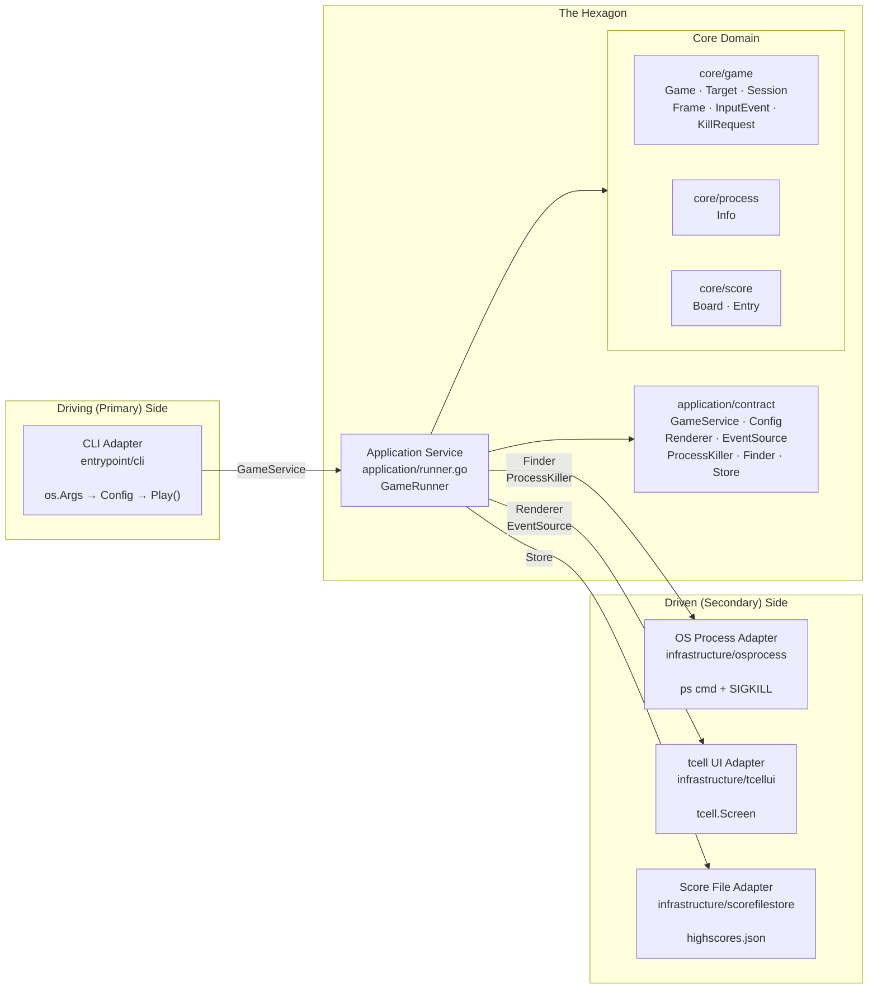
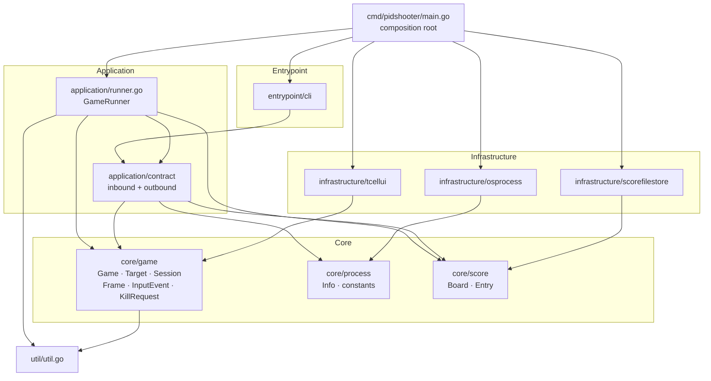

# Hexagonal Architecture — Design Record for pidshooter

*Originally a migration proposal (2026-06-26). Migration completed 2026-07-01. Further refactoring completed 2026-07-06: `domain` → `core`, `adapter` → `infrastructure`/`entrypoint`, `app` → `application`, port interfaces moved to `application/contract`. The structure described in sections 3–9 is now the live codebase. Sections 2, 10, and 11 document the pre-refactor state and the reasoning behind each change — kept as a design record.*

---

## Contents

1. [What hexagonal architecture means here](#1-what-hexagonal-architecture-means-here)
2. [Previous architecture: what works and what leaks](#2-previous-architecture-what-works-and-what-leaks)
3. [The three layers](#3-the-three-layers)
4. [Conceptual diagram](#4-conceptual-diagram)
5. [Package structure](#5-package-structure)
6. [Component-by-component mapping](#6-component-by-component-mapping)
7. [Port interfaces (contracts)](#7-port-interfaces-contracts)
8. [Detailed package dependency graph](#8-detailed-package-dependency-graph)
9. [Composition root (main.go)](#9-composition-root-maingo)
10. [What changed and why](#10-what-changed-and-why)
11. [Migration path](#11-migration-path)
12. [Trade-offs](#12-trade-offs)

---

## 1. What hexagonal architecture means here

Hexagonal architecture (Ports & Adapters, Alistair Cockburn, 2005) separates software into three concentric zones:

| Zone | Responsibility | Rule |
|---|---|---|
| **Domain** | Business logic — what the application *is* | No imports from outer layers; no infrastructure |
| **Ports** | Contracts — what the domain *needs* or *exposes* | Interfaces only, owned by the application layer |
| **Adapters** | Infrastructure — how the world *connects* to the domain | Implements ports; imports libraries and OS APIs |

The "hexagon" is just the domain + its port interfaces. Everything outside is an adapter. There is no hexagonal shape; the name refers to the six notional faces Cockburn drew to show multiple interchangeable adapters around a single core.

Two kinds of adapters:

- **Driving (primary)** — they initiate action: the CLI parses `os.Args` and calls into the application.
- **Driven (secondary)** — they are called by the application service: OS process discovery, tcell rendering, JSON score storage.

---

## 2. Previous architecture: what works and what leaks

### What already followed the pattern

- `process.Finder` and `process.Info` were interfaces — `finder` was already an unexported implementation detail.
- `internal/testutil` existed for test doubles, meaning the seams were already being felt.
- `runner.go` separated the orchestration concern from `main.go`.
- `score`, `game`, and `process` were in distinct packages with clear responsibility labels.

### Where infrastructure leaked into the domain

| Location | Leak |
|---|---|
| `game/target.go: Kill()` | Called `os.FindProcess` + `syscall.SIGKILL` directly — the OS syscall was inside a domain entity |
| `game/loop.go: render()` | Called `tcell.Screen.SetContent` directly — rendering technology was baked into game logic |
| `game/loop.go: init()` | Created `tcell.NewScreen()` inside the game — screen lifecycle was the game's problem |
| `game/loop.go: run()` | Polled `g.screen.PollEvent()` inside the game loop — input source was hardwired |
| `score/score.go` | Called `os.ReadFile` / `os.WriteFile` directly — persistence technology was inside a domain type |

These were typical for a first implementation. Extracting each concern makes it independently testable and swappable without touching game logic.

---

## 3. The three layers

### Layer 1 — Core domain

Pure Go. No imports except the standard library, `internal/util`, and other core packages. Contains the game's invariants, entities, and value objects.

- **`core/game`** — `Game` pure state machine, `Target` entity (with embedded position/velocity vectors), `Session` value object, `TargetState` enum, `KillRequest`, and all rendering/input data types (`Frame`, `InputEvent`, etc.).
- **`core/process`** — `Info` struct and `MinPatternLength`/`MaxPatternLength` constants.
- **`core/score`** — `Board`, `Entry`, ranking logic.

The core domain contains **no port interfaces**. It exposes data types that the contracts in `application/contract` reference. This keeps import cycles impossible: core never imports application or infrastructure.

### Layer 2 — Application service

One layer above the core. Defines the port interfaces (contracts) and implements the use-case: given a configuration, find processes, run a game, persist the score.

- **`application/contract/inbound.go`** — `GameService` interface, `Config` struct.
- **`application/contract/outbound.go`** — `Renderer`, `EventSource`, `ProcessKiller`, `Finder`, `Store` interfaces.
- **`application/runner.go`** — `GameRunner` struct implementing `GameService`; orchestrates core + outbound ports.

### Layer 3 — Adapters

One directory per integration point. Adapters import libraries; the core domain never does.

**Infrastructure adapters** (driven — the application service calls them):

| Adapter | Contracts it satisfies | Technology |
|---|---|---|
| `infrastructure/osprocess` | `Finder`, `ProcessKiller` | `os/exec ps`, `os.FindProcess`, `syscall.SIGKILL` |
| `infrastructure/tcellui` | `Renderer`, `EventSource` | `github.com/gdamore/tcell/v2` |
| `infrastructure/scorefilestore` | `Store` | `encoding/json`, `os.ReadFile/WriteFile` |

**Entrypoint adapters** (driving — they call the application service):

| Adapter | Contract it calls | Technology |
|---|---|---|
| `entrypoint/cli` | `GameService` | `os.Args`, `fmt`, `strconv` |

---

## 4. Conceptual diagram



---

## 5. Package structure

```
pidshooter/
│
├── cmd/
│   └── pidshooter/
│       └── main.go                           # Composition root only — no logic
│
└── internal/
    │
    ├── core/                                 # Pure domain — no infrastructure imports
    │   ├── game/
    │   │   ├── game.go                       # Game (pure state machine) · New() · Init() · Running() · Stop()
    │   │   ├── loop.go                       # Update() · Frame() · CompleteKill() · timeRemaining()
    │   │   ├── event_handler.go              # HandleEvent() · handleMouseClick() · handleKeyPress()
    │   │   ├── frame.go                      # Frame · TargetView · HUDState · StatusState · ConfirmState
    │   │   ├── input.go                      # InputEvent · ClickEvent · KeyEvent · ResizeEvent · KeyCode
    │   │   ├── session.go                    # Session · RecordKill() · accessors
    │   │   └── target.go                     # Target · Vector · TargetState · NewTarget() · Label() · Update() · Contains() · StartKillAnim()
    │   ├── process/
    │   │   └── process.go                    # Info struct · MinPatternLength · MaxPatternLength
    │   └── score/
    │       └── score.go                      # Board · Entry · Add() · HighScore() · PrintHighScore() · PrintScores()
    │
    ├── application/
    │   ├── contract/
    │   │   ├── inbound.go                    # GameService (interface) · Config
    │   │   └── outbound.go                   # Renderer · EventSource · ProcessKiller · Finder · Store
    │   └── runner.go                         # GameRunner · NewGameRunner() · Play() · runLoop() · drainEvents()
    │
    ├── entrypoint/                           # Driving adapters — call the application service
    │   └── cli/
    │       └── cli.go                        # CLI · New() · Run() · parseArgs()
    │
    ├── infrastructure/                       # Driven adapters — called by the application service
    │   ├── osprocess/
    │   │   └── osprocess.go                  # Finder · Killer · NewFinder() · NewKiller()
    │   ├── scorefilestore/
    │   │   └── score_file_store.go           # Store · NewStore()
    │   └── tcellui/
    │       └── tcellui.go                    # UI · New() (implements Renderer + EventSource)
    │
    ├── testutil/
    │   ├── capture/
    │   │   └── capture.go                    # Output() · Stderr() (stdout/stderr capture helpers)
    │   └── fake/
    │       ├── finder.go                     # Finder (test double)
    │       ├── killer.go                     # Killer (test double)
    │       └── store.go                      # Store (test double)
    │
    └── util/
        └── util.go                           # FormatBytes() — pure leaf
```

---

## 6. Component-by-component mapping

### Pre-refactor → Current

| Pre-refactor location | Current location | Change |
|---|---|---|
| `internal/domain/process/process.go` | `internal/core/process/process.go` | Package path renamed; `Info` changed from interface to struct |
| `internal/domain/game/game.go` | `internal/core/game/game.go` | Removed renderer/events/killer fields; pure state machine; added `KillRequest` |
| `internal/domain/game/loop.go` | `internal/core/game/loop.go` | `render()` → `Frame()`; `update()` → `Update(w,h)`; `killTarget()` → `CompleteKill()` |
| `internal/domain/game/event_handler.go` | `internal/core/game/event_handler.go` | Returns `*KillRequest` instead of calling killer directly |
| `internal/domain/game/motion.go` | Merged into `internal/core/game/target.go` | `Motion` struct removed; `Position`/`Velocity` are `Vector` fields on `Target` |
| `internal/domain/game/target.go` | `internal/core/game/target.go` | Updated imports; absorbed motion logic |
| `internal/domain/game/session.go` | `internal/core/game/session.go` | Updated package path |
| `internal/domain/game/ports/driven/` | `internal/application/contract/outbound.go` + `internal/core/game/frame.go` + `internal/core/game/input.go` | Interfaces moved to contract; data types stayed in core/game |
| `internal/domain/game/ports/driving/` | `internal/application/contract/inbound.go` | Moved to application/contract |
| `internal/domain/score/score.go` | `internal/core/score/score.go` | Updated package path |
| `internal/app/runner.go` | `internal/application/runner.go` | Owns the game loop; handles KillRequest two-phase kill |
| `internal/adapter/driven/osprocess/` | `internal/infrastructure/osprocess/` | Package path renamed |
| `internal/adapter/driven/tcellui/` | `internal/infrastructure/tcellui/` | Package path renamed |
| `internal/adapter/driven/jsonscores/` | `internal/infrastructure/scorefilestore/` | Package path renamed; file renamed |
| `internal/adapter/driving/cli/` | `internal/entrypoint/cli/` | Package path renamed; uses `contract.GameService`/`contract.Config` |
| `cmd/pidshooter/main.go` | `cmd/pidshooter/main.go` | Updated imports; `tcellui.New` returns one `*UI` for both Renderer+EventSource |

---

## 7. Port interfaces (contracts)

All port interfaces live in `application/contract`. In Go, the consumer (the application layer) defines the interfaces it needs. Infrastructure adapters satisfy them via structural typing — no explicit import of `contract` is needed in the adapter packages.

### `application/contract/inbound.go`

```go
package contract

type Config struct {
    Patterns    []string
    ConfirmMode bool
    Speed       float64
    TimeLimit   int
}

type GameService interface {
    Play(cfg Config) error
}
```

### `application/contract/outbound.go`

```go
package contract

import (
    "github.com/eirikur-ari/pidshooter/internal/core/game"
    "github.com/eirikur-ari/pidshooter/internal/core/process"
    "github.com/eirikur-ari/pidshooter/internal/core/score"
)

type Renderer interface {
    Init() error
    Cleanup()
    Size() (width, height int)
    Render(frame game.Frame)
}

type EventSource interface {
    Events() <-chan game.InputEvent
}

// ProcessKiller verifies the process name before sending SIGKILL (TOCTOU guard).
type ProcessKiller interface {
    Kill(pid int, name string) error
}

type Finder interface {
    List() ([]process.Info, error)
    Find(patterns []string) ([]process.Info, error)
}

type Store interface {
    Load() (*score.Board, error)
    Save(board *score.Board) error
}
```

### `application/runner.go` — the application service

```go
package application

const frameDuration = time.Second / 20

type GameRunner struct {
    finder   contract.Finder
    killer   contract.ProcessKiller
    store    contract.Store
    renderer contract.Renderer
    events   contract.EventSource
}

func NewGameRunner(finder, killer, store, renderer, events) *GameRunner

func (s *GameRunner) Play(cfg contract.Config) error {
    processes, _ := s.finder.Find(cfg.Patterns)
    board, _     := s.store.Load()
    g := game.New(processes, cfg.ConfirmMode, cfg.Speed, cfg.TimeLimit)
    g.SetHighScore(board.HighScore())
    s.runLoop(g)
    // persist + display score
}

func (s *GameRunner) runLoop(g *game.Game) error {
    s.renderer.Init()
    g.Init(w, h)
    // signal goroutine: SIGINT/SIGTERM/SIGTSTP → g.Stop()
    // 20 FPS ticker loop
    for g.Running() {
        s.drainEvents(g)
        g.Update(w, h)
        s.renderer.Render(g.Frame())
        <-ticker.C
    }
}

func (s *GameRunner) drainEvents(g *game.Game) {
    for ev := range events channel {
        if req := g.HandleEvent(ev); req != nil {
            if s.killer.Kill(req.Target.Pid, req.Target.Name) == nil {
                g.CompleteKill(req.Target)
            }
        }
    }
}
```

---

## 8. Detailed package dependency graph

Arrows point in the direction of the import (`A → B` means A imports B).



**Key property:** the core packages (`core/game`, `core/process`, `core/score`) have no arrows pointing *outward* to application, infrastructure, or entrypoint. Dependency only flows inward toward the core.

**Why contracts live in application, not core:** Placing interface definitions in `application/contract` (rather than in the domain packages they reference) avoids a dependency inversion problem: if `core/game` defined `Renderer`, it would need to know about `Frame` (fine, it already does), but any package importing `core/game` for the interface would also pull in the rendering contract. Keeping contracts in `application/contract` makes the application the single point of assembly.

---

## 9. Composition root (`main.go`)

In hexagonal architecture `main.go` is not logic — it is wiring. All wiring happens here and nowhere else.

```go
package main

import (
    "fmt"
    "os"

    "github.com/gdamore/tcell/v2"

    "github.com/eirikur-ari/pidshooter/internal/application"
    "github.com/eirikur-ari/pidshooter/internal/entrypoint/cli"
    "github.com/eirikur-ari/pidshooter/internal/infrastructure/osprocess"
    "github.com/eirikur-ari/pidshooter/internal/infrastructure/scorefilestore"
    "github.com/eirikur-ari/pidshooter/internal/infrastructure/tcellui"
)

func main() {
    finder, _ := osprocess.NewFinder()
    killer, _ := osprocess.NewKiller()
    store      := scorefilestore.NewStore()

    screen, _ := tcell.NewScreen()
    ui         := tcellui.New(screen)   // *UI implements both Renderer and EventSource

    service := application.NewGameRunner(finder, killer, store, ui, ui)
    cli.New(service).Run(os.Args[1:])
}
```

---

## 10. What changed and why

### `Game` becomes a pure state machine

Originally `Game` held a `renderer game.Renderer`, `events game.EventSource`, and `killer game.ProcessKiller` and drove its own loop via `Play()`. This created an import-cycle risk: the domain owned the port interfaces, and infrastructure would import those ports from the domain.

The solution (Option 2 / "functional core, imperative shell"): `Game` contains only pure state. The application layer (`runner.go`) owns the loop, drains the event channel, calls the OS killer, and feeds the result back into the game via `CompleteKill()`.

**Kill flow (two-phase):**
1. `g.HandleEvent(ev)` returns `*KillRequest{Target}` — pure state change, no side effect
2. Application layer calls `s.killer.Kill(pid, name)` — OS side effect
3. On success: `g.CompleteKill(target)` — transitions target to Killing, records session stats
4. On failure: nothing — target stays Alive; no animation, no score credit

**Render flow:** `g.Frame()` returns a pure data snapshot; `s.renderer.Render(frame)` draws it.

### `motion.go` merged into `target.go`

The original design had a separate `Motion` struct. After the refactor, position and velocity are `Vector` fields directly on `Target`. The motion update logic lives in `Target.Update()`. This reduced file count without losing clarity since position/velocity are intrinsic to a target entity.

### `process.Info` changed from interface to struct

Originally `process.Info` was an interface with `Pid()`, `Name()`, `Rss()` accessor methods. It is now a plain struct with exported fields (`Pid int`, `Name string`, `Rss int64`). This simplification removes the need for a concrete implementation type (`osprocess.proc`) and lets test code construct `process.Info` literals directly without a constructor.

### Port interfaces moved from domain to application

The pre-refactor design placed port interfaces in `domain/game/ports/driven/` and `domain/game/ports/driving/`. The current design places them all in `application/contract/`. This means:
- Core packages have zero interface definitions → easier to reason about dependencies
- `application/contract` is the single authoritative location for "what does the game need from the outside world?"
- Infrastructure adapters satisfy contracts via Go's structural typing — no explicit import of `application/contract` needed in adapters

### Score I/O extracted to `scorefilestore` adapter

`score.Board` no longer calls `os.ReadFile` / `os.WriteFile`. File operations live in `infrastructure/scorefilestore`, which implements `contract.Store`. `Board` keeps ranking and high-score logic only.

### Event loop decoupled from tcell

`infrastructure/tcellui.UI` owns the poll goroutine. It delivers `game.InputEvent` values on a buffered channel. The game loop only sees `game.InputEvent` — no `tcell.EventMouse` or `tcell.EventKey`.

---

## 11. Migration path

The migration was done in stages, each with a passing test suite at the end.

```
Step 1  Extract ScoreStore interface
        Moved file I/O out of score.Board into scorefilestore adapter.

Step 2  Extract ProcessKiller interface
        Removed Kill() from Target. Added ProcessKiller interface.
        Moved os.FindProcess + syscall to osprocess adapter.

Step 3  Extract EventSource interface
        Defined game.InputEvent sealed interface.
        Moved PollEvent goroutine to tcellui.EventSource adapter.

Step 4  Extract Renderer interface
        Defined Renderer interface with Render(Frame) / Size() / Init() / Cleanup().
        Implemented tcellui.Renderer wrapping tcell.Screen.

Step 5  Reorganise packages
        domain/ → core/
        app/ → application/
        adapter/driven/ → infrastructure/
        adapter/driving/ → entrypoint/
        domain/game/ports/ → application/contract/ (interfaces) + core/game/ (data types)

Step 6  Pure state machine (Option 2)
        Removed renderer/events/killer fields from Game.
        Game loop moved entirely to application/runner.go.
        HandleEvent() returns *KillRequest instead of calling killer.
        CompleteKill() is the callback when the OS kill succeeds.

Step 7  Merge motion.go into target.go
        Motion struct removed; Vector fields on Target.

Step 8  Simplify process.Info
        Info changed from interface to struct.
        Removed osprocess.proc concrete implementation.
```

---

## 12. Trade-offs

### Benefits

- **Independent testability** — every layer can be tested in isolation. Core tests need no tcell, no OS, no file system.
- **Swappable adapters** — a new terminal library, a `/proc` reader, or SQLite score storage each require only one new adapter.
- **Clear dependency rule** — `grep -r "tcell" internal/core` must return nothing. The build enforces the architecture.
- **Functional core** — `Game.HandleEvent()`, `Game.Update()`, and `Game.Frame()` are pure functions on pure state. No side effects in the domain.
- **Thinner `main.go`** — wiring is explicit and all in one place; logic is zero.

### Costs

- **More packages** — the structure is deeper. For a project of this size that overhead is real.
- **Two-phase kill adds indirection** — a reader following a bug from click to process exit now crosses more lines. The `KillRequest` return value and `CompleteKill` callback are a seam; naming and tests compensate.
- **Frame allocation each tick** — building a `Frame` value at 20 FPS adds a small allocation. Imperceptible, but not free.
